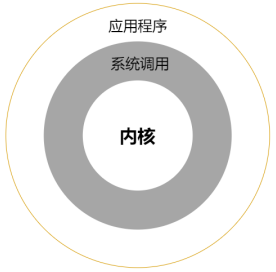

 
**应用编程**

___

[TOC]

___

## 入门篇

本篇作为 Linux 应用开发入门篇，主要为大家讲解 Linux 应用开发过程当中会用到的基础入门知识，譬
如 Linux 文件 IO 操作、高级 IO 操作、文件属性、系统信息获取与设置、进程、进程间通信、线程以及信号等基础应用编程知识，为后面学习提高篇、进阶篇章节内容打下坚实的基础

为了更好的学习本篇内容，推荐大家购买《Linux/UNIX 系统编程手册》、《UNIX 环境高级编程》等这类书籍作为自己的学习参考资料，都是笔者认为写的非常好的 Linux 应用开发类书籍，同样这些书籍也是笔者编写本文档所使用的主要参考资料，所以强烈建议大家购买

### 应用编程概念

应用编程也称为系统编程。以下学习何为系统调用；何为库函数；应用程序的 main()函数；应用程序开发环境的介绍

#### 系统调用

系统调用（system call）是 Linux 内核提供给应用层的应用编程接口（API）。通过系统调用，Linux 应用程序可以请求内核以自己的名义执行某些事情，譬如打开磁盘中的文件、读写文件、关闭文件以及控制其它硬件外设

通过系统调用 API，应用层可以实现与内核的交互，其关系可通过下图简单描述：

