 <font size="7"><center>**C++**</center></font>

___

[TOC]

___

## <font color="1E90FF">一、基础语法</font> {#基础语法}

#### <font color="1E90FF">类class</font>

1. 关键字`class`类是一种构造类型，其成员可以是变量或者函数；函数可以在类里面定义，也可以在类外面定义；通过类定义出来的变量叫作对象；创建对象的过程叫作实例化
1. `::`表示作用域运算符或解引用；`:` 使用在类的继承，和构造函数初始化
1. 没用关键字修饰的变量，默认是`private`属性的
1. 用关键字`public` `protected` `private`修饰的函数和变量在自身类里可以相互调用，无区别，对于派生类和对象则有区别
1. 在类里(或者在同一作用域里)函数名相同，但是形参不同的函数叫做<font color="yellow">重载函数</font>。对象调用重载函数时，会根据形参的不同来判断调用的是哪个重载函数；析构函数不可被重载，构造函数可以被重载

> 函数重载条件：①同一作用域 ②函数名相同 ③形参不同
> 注意，返回值不能作为重载的条件

#### <font color="1E90FF">new分配堆内存</font>

1. `int *a = new int(6);`其中`new int(6)`会返回6的地址。`delete a;`释放。指针a的地址在栈区，6的地址在堆区
1. `int *arr = new int[6];` `new int[6]`会返回数组首地址。`delete[] arr;`释放。
1. `char *str = new char[10];` `new char[10]`会返回数组首地址。`delete[] str;`释放数组。
>注：释放数组要加 [ ]

#### <font color="1E90FF">引用&</font>

1. `int &b = a;`这时进行`b = 10`操作，就相当于`a = 10`操作。`int &b=a`相当于`int *const b = &a`
1. 引用在定义时必须初始化，且初始化后不可更改指向，但可以赋值(因为 * const 修饰禁止修改指针)
1. 函数`void swap(&a，&b)`，调用时写法为`swap(c，d)`，此时`a`和`b`修改值会反馈给`c`和`d`

#### <font color="1E90FF">函数默认形参</font>

1. 函数形参可以设置默认值，例如`void func(int a, int b=10)`，调用时为`func(30)`或`func(30，50)`（覆盖）
1. 某个形参设置默认值后，该形参后面的形参都必须要有默认值（默认形参是从右边开始初始化的）
1. 函数声明中的形参和函数定义中的形参，只能其中一个写默认形参（防止声明和定义的默认形参不相同）

#### <font color="1E90FF">函数占位形参</font>

1. 例如void func(int a，int)；调用时为func(30，1)；
1. 调用函数时，占位形参和普通形参一样，必须填写
1. 默认形参就是占位形参(当函数内部没有用到默认形参时)

#### <font color="1E90FF">类的默认函数</font>

C++ 编译器至少给一个类添加4个函数：

1. 默认无参构造函数（空函数体）
1. 默认拷贝构造函数（浅拷贝）
1. 默认析构函数（空函数体）
1. 默认重载赋值运算符函数 operator=（浅拷贝）

> 默认重载赋值运算符函数就是用在类与类之间的赋值

  
### <font color="1E90FF">1.1 构造函数和析构函数</font>

1. 构造函数和~析构函数是名称与类名相同，且没有返回值的函数。在实例化对象时若没有定义构造函数和析构函数，则会默认定义一个空的构造函数和析构函数
1. 构造函数有形参，可以被重载；析构函数无形参，不可被重载
1. 构造函数：实例化对象的一瞬间就会自动依次先后执行基类和派生类的构造函数
1. 析构函数：当对象生命周期结束时就会自动依次先后执行派生类和基类的析构函数
1. 定义对象同时传参给构造函数。①Dog dog1(4)；②Dog *dog2 = new Dog(5.5)
1. 定义对象后再传参给构造重载函数。①dog1.dog1_func(4)；②dog2->dog2_func(5.5)
1. 构造函数可以初始化类的成员变量，即<font color="yellow">初始化列表</font>。注意初始化与赋值不同，这意味着const修饰的成员也可以初始化

```C++
#include <iostream>
#include <string>
using namespace std;

class Base {
public:
    Base(string n, int a);
private:
    string m_name;
    int m_age;
};
Base::Base(string n, int a):m_name(n), m_age(a) {
    cout << m_name << endl;
    cout << m_age << endl;
}

int main()
{
    Base t1("linux", 200);
    return 0;
}
```

8. 实例化对象时会先调用基类的构造函数，再调用派生类的构造函数；结束对象时先析构派生类再析构基类

### <font color="1E90FF">1.2 拷贝构造函数</font>

1. 构造函数中，若形参为本类引用，则为拷贝构造函数
1. 编译器会自动给一个类添加无参构造函数、有参构造函数、拷贝构造函数。当手动添加拷贝构造函数时，编译器不再添加默认无参和有参构造函数。当手动添加有参构造函数时，编译器不再添加默认无参构造函数
1. 编译器自动添加的拷贝构造函数会复制形参给自己
1. 拷贝构造函数中，使用赋值号直接将形参(类)的指针成员复制，叫作浅拷贝（注：默认拷贝构造函数就是这样）
1. 拷贝构造函数中，在堆区new空间给形参(类)的指针成员，叫作深拷贝(需要手动new)

<div align=center>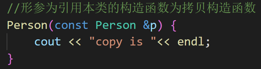</div>
.
<div align=center>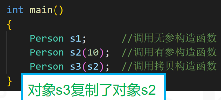</div>

### <font color="1E90FF">1.3 继承</font>

#### <font color="1E90FF">单继承</font>

1. 对象只能访问`public`成员
1. `public`继承时，派生类的成员只能访问基类中的`public`和`protected`，派生类的对象只能访问基类中的`public`成员
1. `protected`继承时，派生类的成员只能访问基类中`public`和`protected`，派生类的对象不能访问基类中的任何成员
1. `private`继承时，派生类的成员只能访问基类中的`public`和`protected`，派生类的对象不能访问基类中的任何成员
1. 
    - `protected`继承时，基类中`public`和`protected`继承到派生类变为`protected`
    - `private`继承时，基类中`public`和`protected`继承到派生类变为`private`(如下图)
    - 任何继承都无法访问基类的`private`成员
    - 所以只有`public`继承时派生类的对象才能访问基类的`public`成员

<div align=center></div>

6. 派生类以任何方式继承基类的同时，也会继承基类的全部内存大小（注：静态成员不会增加类的内存。函数以及函数内部的局部变量也不会增加类的内存，因为是运行时分配）

<div align=center>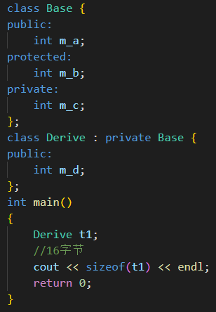</div>

7. 实例化对象时会先调用<font color="yellow">基类</font>的构造函数，再调用<font color="yellow">派生类</font>的构造函数；结束对象时先析构派生类再析构基类
8. 若派生类成员与基类成员同名，派生类优先级高。会屏蔽基类<font color="yellow">所有同名成员</font>(包括所有同名重载函数和同名静态成员)。只能使用作用域符号特指才能调用基类成员
9. 当静态成员同名时，既可以通过对象访问基类的静态成员，也可以通过类名访问基类的静态成员。使用类名访问可以不用实例化对象

```C++
#include <iostream>
using namespace std;

class Base {
public:
    int m_a;
    static int m_b;
    Base();
    void func();

};
//类外初始化静态成员变量
int Base::m_b = 100;
Base::Base() {
    m_a = 10;
}
void Base::func() {
    cout << "Base_func" << endl;
}

class Derive:public Base {
public:
    //派生类成员与基类同名
    int m_a;
    static int m_b;
    Derive();
    void func();
};
int Derive::m_b = 200;
Derive::Derive() {
    m_a = 20;
}
void Derive::func() {
    cout << "Derive_func" << endl;
}

int main()
{
    Derive t1;
    //若派生类成员与基类成员同名，则屏蔽基类成员
    cout << t1.m_a << endl;                 //20
    //使用作用域符号特指调用基类成员变量
    cout << t1.Base::m_a << endl;           //10

    //若派生类成员与基类成员同名，则屏蔽基类成员（包括重载函数和静态成员）
    t1.func();                              //Derive_func
    //使用作用域符号特指调用基类成员函数
    t1.Base::func();                        //Base_func

    //静态成员可以通过类名直接访问，可以不定义对象
    cout << Derive::m_b << endl;            //200
    cout << Derive::Base::m_b << endl;      //100
    cout << Base::m_b << endl;              //100

    return 0;
}
```

#### <font color="1E90FF">多继承</font>

- 不推荐使用多继承

<div align=center>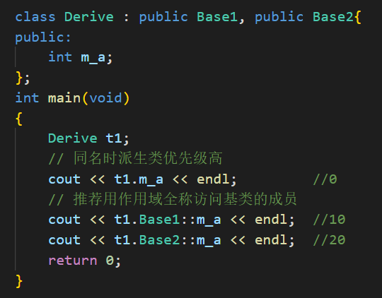</div>

#### <font color="1E90FF">菱形继承</font>

- 当`D`多继承了`B`和`C`，且`B`和`C`都继承了`A`，这时就形成了菱形继承

<div align=center>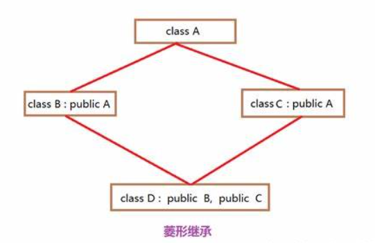</div>

#### <font color="1E90FF">虚继承 virtual</font>

在菱形继承中，`A`是相同的一份，`D`可以通过`B`或者`C`来反问`A`，没有一个标准。虚继承则可以使`B` `C` `D`指向相同的一份`A`，则`A`叫做虚基类

1. 虚继承时，`Base1`内自动创建一个指向`Base`的指针
2. 虚继承时，`Base1`的大小为1个指向`Base`的指针 + `Base`的大小
3. 实继承时`Base1`的大小为`Base`的大小
4. 此时`Derive`的大小为2个指向`Base`的指针 + `Base`的大小

<div align=center>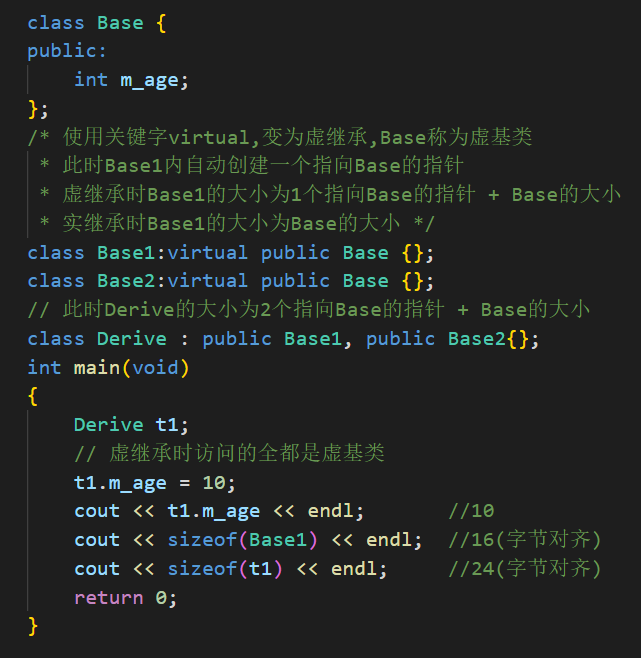</div>

### <font color="1E90FF">1.4 向上转型</font> {#向上转型}


类是一种数据类型，也可以发生数据类型转换，不过这种转换只有在基类和派生类之间才有意义，并且只能将派生类赋值给基类，包括将派生类对象赋值给基类对象、将派生类指针赋值给基类指针、将派生类引用赋值给基类引用，称为<font color="yellow">向上转型</font>（Upcasting）。相应地，将基类赋值给派生类称为向下转型（Downcasting）。

#### <font color="1E90FF">将派生类对象赋值给基类对象</font>

将派生类对象`B`赋值给基类对象`A`时，只会将派生类对象`B`中的基类的成员变量赋值给基类对象`A`。且只能用派生类对象给基类对象赋值，而不能用基类对象给派生类对象赋值。

赋值的本质是将现有的数据写入已分配好的内存中，对象的内存只包含了成员变量，不包含成员函数，所以<font color="yellow">对象之间的赋值仅仅是成员变量的赋值，不包括成员函数</font>。虽然有 `基类 = 派生类` 这样的赋值过程，但是<font color="yellow">基类调用的始终是基类的自身的函数</font>

<div align=center>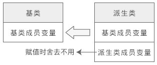</div>
.
<div align=center>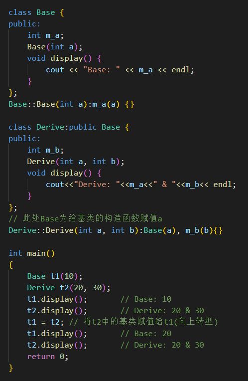</div>

#### <font color="1E90FF">将派生类指针赋值给基类指针</font>

将派生类指针`B`赋值给基类指针`A`时，此时基类指针`A`指向派生类`B`内的基类地址（实际是A == B）。相当于限制该指针只能调用派生类中基类的成员（注：只有使用虚函数时（即[多态](#多态)），基类才可以调用派生类的成员函数）

<div align=center>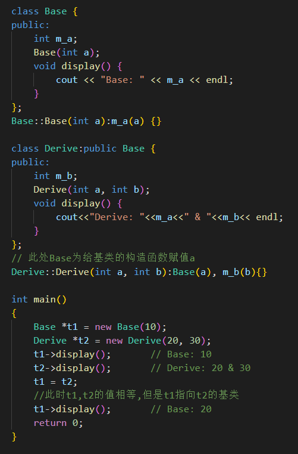</div>

### <font color="1E90FF">1.5 多态</font> {#多态}

封装、继承和多态是C++面向对象三大特征。多态分为两类:

- 静态多态：函数重载（函数重载和运算符重载）属于静态多态，复用函数名
- 动态多态：派生类和虚函数实现运行时多态

静态多态的函数地址在编译阶段确定，动态多态的函数地址在运行阶段确定

#### <font color="1E90FF">动态多态满足条件为</font>

1. <font color="yellow">派生类要重写基类的虚函数</font>（注：重写即函数名和形参都要一样）
2. <font color="yellow">基类的指针或引用执行派生类的虚函数</font>

>注：在函数前加`virtual`即为虚函数。例如：virtual void func()
>构造函数不能是虚函数，因为派生类不能继承基类的构造函数，将构造函数声明为虚函数没有意义

#### <font color="1E90FF">动态多态的原理</font>

当基类创建虚函数的同时会创建一个占4字节的指针`vfptr`，指向虚函数表`vftable`，该虚函数表内记录着基类的虚函数地址`&Animal::speak`。当派生类继承基类时，指针`vfptr`和虚函数表`vftable`都会继承过来。当派生类重写虚函数时，虚函数表内由原来记录基类的虚函数地址`&Animal::speak`变为记录派生类的虚函数地址`&Cat::speak`。所以向上转型后，当基类调用虚函数时，因为虚函数表记录着派生类的虚函数地址，所以总是会调用派生类的虚函数
> 注：当实例化一个对象时，有一个派生类，派生类里面包含着一个基类

```C++
#include <iostream>
using namespace std;

class Animal {
public:
    // 加virtual关键字变为虚函数
    virtual void speak() {
        cout << "Animal speak" << endl;
    }
};
class Cat:public Animal {
public:
    // 派生类重写虚函数
    virtual void speak() {
        cout << "Cat speak" << endl;
    }
};

void do_speak(Animal &animal) {
    // 基类执行派生类的虚函数
    animal.speak();
}

int main()
{
    Cat cat;
    do_speak(cat);  //打印cat speak
    return 0;
}
```

#### <font color="1E90FF">使用多态创建计算器案例</font>

<div align=center>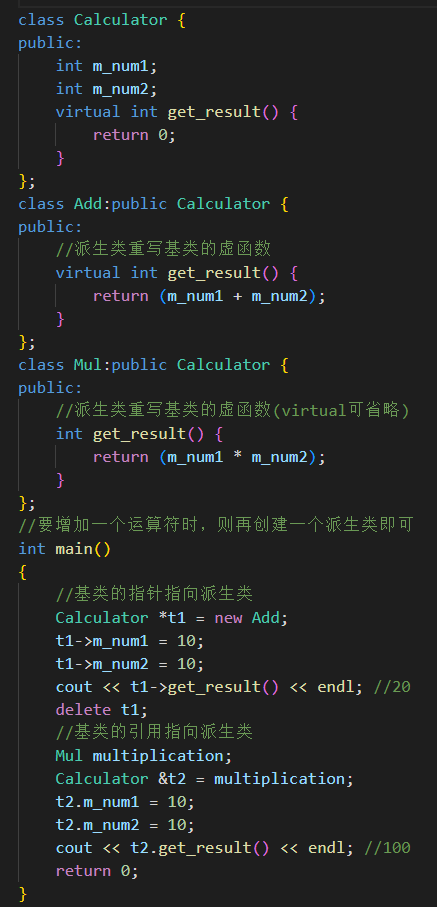</div>

上面的代码中，当`t1`指向不同的派生类对象`new Add;`或`new Mul;`时，`t1->get_result();`执行的结果是不一样的。<font color="yellow">同一条语句可以执行不同的操作，这就是多态</font>
C++提供多态的目的是通过基类指针对所有派生类（包括直接派生和间接派生）的成员变量和成员函数进行全方位的访问，尤其是成员函数。如果没有多态，我们只能通过[向上转型](#向上转型)访问派生类的成员变量

#### <font color="1E90FF">纯虚函数和抽象类</font>

一般我们不实例化基类对象，所以将基类变为抽象类，抽象类不可实例化对象（但可以实例化指针）。只要类中有了纯虚函数，那么这个类就是抽象类。抽象类的作用是防止我们实例化基类，以及提醒我们重写派生类的纯虚函数

1. <font color="yellow">在虚函数后面加`= 0`即为纯虚函数；当类中有了纯虚函数，这个类就被称为抽象类</font>
2. 抽象类无法实例化对象（Base t1；错误  ——  Base *t1；正确）
3. 派生类必须重写抽象类（基类）的纯虚函数，否则派生类也是纯虚函数，无法实例化对象

```C++
#include <iostream>
using namespace std;

class Base {
public:
    //纯虚函数
    virtual void display() = 0;
/* 此时Base为抽象类，即Base无法实例化对象
 * 且派生类必须重写Base的纯虚函数 */
};

class Derive1:public Base {
public:
    void display();
};
void Derive1::display() {
    cout << "Derive1" << endl;
}

class Derive2:public Base {
public:
    void display();
};
void Derive2::display() {
    cout << "Derive2" << endl;
}

int main()
{
    Base *t1 = new Derive1;
    t1->display();      //Derive1

    t1 = new Derive2;
    t1->display();      //Derive2

    return 0;
}
```

<div align=center>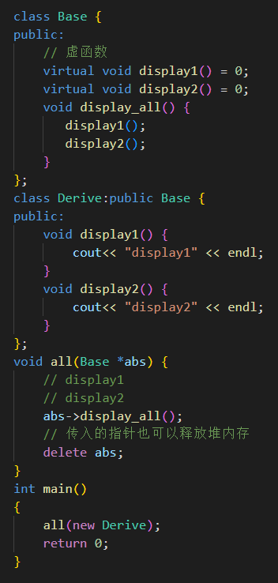</div>

```C++
#include <iostream>
using namespace std;
//线
class Line{
public:
    Line(float len);
    virtual float area() = 0;
    virtual float volume() = 0;
protected:
    float m_len;
};
Line::Line(float len): m_len(len){ }

//矩形（虽然重写了area()，但未重写纯虚函数volume()，所以Rec也是抽象类）
class Rec: public Line{
public:
    Rec(float len, float width);
    float area();
protected:
    float m_width;
};
Rec::Rec(float len, float width): Line(len), m_width(width){ }
float Rec::area(){ return m_len * m_width; }

//长方体
class Cuboid: public Rec{
public:
    Cuboid(float len, float width, float height);
    float area();
    float volume();
protected:
    float m_height;
};
Cuboid::Cuboid(float len, float width, float height): Rec(len, width), m_height(height){ }
float Cuboid::area(){ return 2 * ( m_len*m_width + m_len*m_height + m_width*m_height); }
float Cuboid::volume(){ return m_len * m_width * m_height; }

//正方体
class Cube: public Cuboid{
public:
    Cube(float len);
    float area();
    float volume();
};
Cube::Cube(float len): Cuboid(len, len, len){ }
float Cube::area(){ return 6 * m_len * m_len; }
float Cube::volume(){ return m_len * m_len * m_len; }
int main(){
    Line *p = new Cuboid(10, 20, 30);
    cout<<"The area of Cuboid is "<<p->area()<<endl;
    cout<<"The volume of Cuboid is "<<p->volume()<<endl;
  
    p = new Cube(15);
    cout<<"The area of Cube is "<<p->area()<<endl;
    cout<<"The volume of Cube is "<<p->volume()<<endl;
    return 0;
}
```

- `Line`是一个抽象类，也是最底层的基类，在`Line`类中定义了两个纯虚函数 area() 和 volume()
- 在`Rec`类中，实现了`area()`的函数体。但没有实现继承来的 `volume()`的函数体，所以`Rec`也是抽象类，不能被实例化
- 在实际开发中，你可以定义一个抽象基类，只完成部分功能，未完成的功能交给派生类去实现（谁派生谁实现）。这部分未完成的功能，往往是基类不需要的，或者在基类中无法实现的。虽然抽象基类没有完成，但是却强制要求派生类完成，这就是抽象基类的"霸王条款"

```C++

#include <iostream>

using namespace std;
//CPU抽象类
class CPU { 
public:
    virtual void calculate() = 0;
};
//内存条抽象类
class Memory { 
public:
    virtual void storage() = 0;
};
//电脑派生类(作用是让基类执行派生类的虚函数)
class Computer {
public:
    Computer(CPU *cpu, Memory *mem);
    ~Computer();
    void work();
private:
    CPU *m_cpu;
    Memory *m_mem;
};
//此处传入的形参应该是指向派生类的基类指针
Computer::Computer(CPU *cpu, Memory *mem):m_cpu(cpu),m_mem(mem){}
//基类指针执行派生类的虚函数,即多态
void Computer::work(){
    m_cpu->calculate();
    m_mem->storage();
}
//释放传入的派生类的指针
Computer::~Computer(){
    if (m_cpu != NULL) {
        delete m_cpu;
        m_cpu = NULL;
    }
    if (m_mem != NULL) {
        delete m_mem;
        m_mem = NULL;
    }
}
//Intel厂商
class Intel_cpu:public CPU {
public:
    virtual void calculate() {
        cout << "CPU work of Intel" << endl;
    }
};
class Intel_memory:public Memory {
public:
    virtual void storage() {
        cout << "memory work of Intel" << endl;
    }
};
//Lenovo厂商
class Lenovo_cpu:public CPU {
public:
    virtual void calculate() {
        cout << "CPU work of Lenovo" << endl;
    }
};
class Lenovo_memory:public Memory {
public:
    virtual void storage() {
        cout << "memory work of Lenovo" << endl;
    }
};

int main()
{
    CPU *intel_cpu = new Intel_cpu;
    Memory *intel_mem = new Intel_memory;
    Computer *computer1 = new Computer(intel_cpu, intel_mem);
    computer1->work();  //打印CPU/memory work of Intel
    delete computer1;
    cout << "---------------------" << endl;
    Computer *computer2 = new Computer(new Lenovo_cpu, new Lenovo_memory);
    computer2->work();  // 打印CPU/memory work of Lenovo
    delete computer2;

    return 0;
}
```

#### <font color="1E90FF">虚析构</font>

当发生[向上转型](#向上转型)时，即派生类指针赋值给基类指针时，delete 释放基类并不会调用派生类的析构函数。因为这里的析构函数是非虚函数，通过指针访问非虚函数时，编译器会根据指针的类型来确定要调用的函数。例如`Base *p;`是基类的指针，所以不管它指向基类的对象还是派生类的对象，始终都是调用基类的析构函数。若`Derive *p;`是派生类的指针，编译器会根据它的类型匹配到派生类的析构函数，在执行派生类的析构函数时，又会调用基类的析构函数，这个过程是隐式完成的

将基类的析构函数声明为虚函数后，派生类的析构函数也会自动成为虚函数。这个时候编译器会忽略指针的类型，而根据指针的指向来选择函数。也就是说，指针指向基类对象就调用基类函数，指针指向派生类对象就调用派生类函数

<div align=center>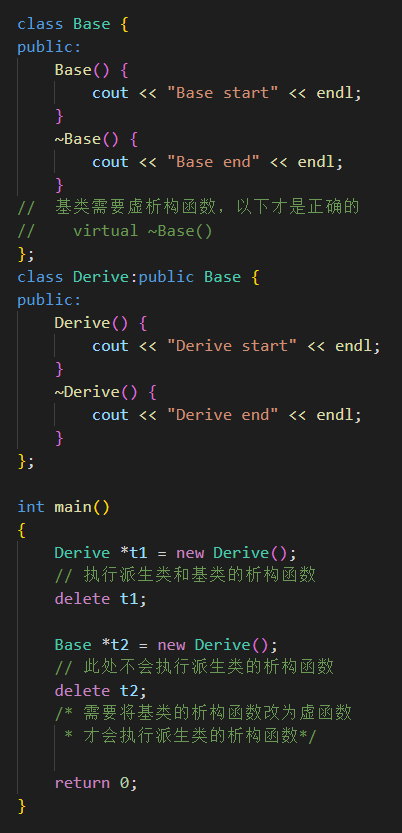</div>

在实际开发中，我们必须将最底层的基类的析构函数声明为虚函数，否则就有内存泄露的风险

>注：多继承时，只要最底层基类的析构函数声明为虚函数即可

### <font color="1E90FF">1.6 命名空间 namespace</font> {#1.4}

大型软件由多名程序员共同开发，不可避免地会出现变量或函数的命名冲突。为了解决合作开发时的命名冲突问题，C++ 引入了命名空间的概念

1. 命名空间就是全局变量，命名空间`A`内的成员可以和命名空间`B`内的成员重名
1. 关键字`using`的功能是设置默认命名空间，无`using`关键字则是临时展开某个成员

早期的 C++ 使用的是C语言的库。例如，`stdio.h` `stdlib.h` `string.h` 等头文件。后来 C++ 开发了一些新的库，增加了自己的头文件，例如，`iostream.h`，`fstream.h` 等。再后来 C++ 引入了命名空间的概念，在原来库的基础上稍加修改后，将类、函数、宏等都纳入命名空间`std`(standard 标准命名空间)中。在`std`中将 C++ 旧头文件去掉后缀`.h` 。例如，`iostream` `fstream`。对于原来的C语言头文件去掉后缀`.h`且名字前添加`c`字母，例如`cstdio` `cstdlib` `cstring`。可以发现，对于不带`.h`的头文件都位于命名空间`std`中，使用时需要声明命名空间`std`

 <center>

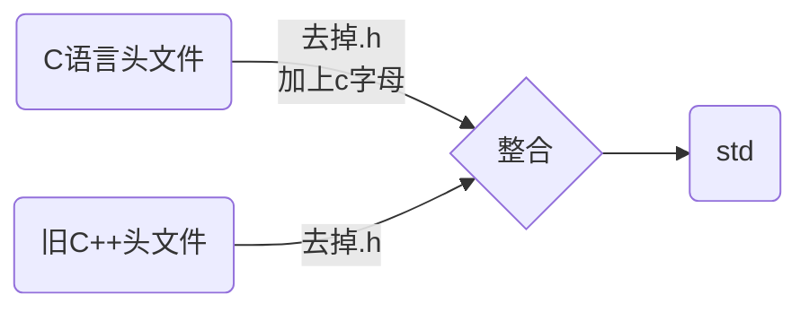

</center>

```C++
#include <iostream>

//默认使用命名空间std中的所有库
using namespace std;
//默认使用命名空间std中的cout库
using std::cout;

namespace first {
    void func(void) {
        //特指使用std的endl成员
        cout << "first" << std::endl;
    }
}
namespace second {
    namespace third {
        void func(void) {}
    }
}

//默认使用命名空间first中的所有库
using namespace first;
//默认使用命名空间first中的func()函数
using first::func;
int main()
{
    //默认调用first里的func()函数
    func();
    //特指使用second中third中的func()函数
    second::third::func();

    return 0;
}
```

```C++
#include <iostream>
using namespace std;

namespace my_space {
    int global = 10;
}

int global = 20;
using namespace my_space;
int main()
{
    //局部变量>全局变量>命名空间
    int global = 30;
    cout << global << endl;             //30
    cout << ::global << endl;           //20（全局变量）
    cout << my_space::global << endl;   //10

    return 0;
}
```

### <font color="1E90FF">1.7 静态成员变量和静态成员函数（static）</font> {#1.5}

1. <font color="yellow">静态成员函数</font>：**只能访问静态成员变量**（因为当有多个对象时静态函数能确定静态变量却不能确定动态变量）（注：[常对象只能调用常函数](#a2)）<a id="a1"></a>）
1. <font color="yellow">静态成员变量</font>：必须在类内声明，类外初始化（静态成员函数随意）
1. 静态变量在编译阶段分配内存
1. 类的成员变量存储在栈区，类的静态成员变量、函数都存储在全局区
1. 静态成员变量和函数在全局区，仅有一份，所有实例化出的对象共享这一份

```C++
#include <iostream>
using namespace std;

class Base {
public:
    static int m_a;
    //静态函数只能访问静态变量
    static void func(); 
};
void Base::func() {
    m_a = 6;
    cout << m_a << endl;
}
//类内声明，类外初始化
int Base::m_a = 9;

int main()
{
    Base t1;

    //通过对象访问静态变量和函数
    cout << t1.m_a << endl;     //9
    t1.func();                  //6

    //通过类名访问静态变量和函数
    cout << Base::m_a << endl;  //6
    Base::func();               //6

    return 0;
}
```

6. 空类在栈区仅占一个字节
7. 静态成员变量、静态成员函数和普通函数都不属于类的对象，即不增加类的对象的内存大小

```C++
#include <iostream>
using namespace std;

class Base {
public:
    //静态变量不属于类的对象
    static int m_a;
    //任何函数不属于类的对象
    void func(); 
};
void Base::func() {
    m_a = 6;
    cout << m_a << endl;
}
//类内声明，类外初始化
int Base::m_a = 9;

int main()
{
    Base t1;
    //空类在栈区仅占1字节
    cout << sizeof(t1) << endl;     //1

    return 0;
}
```

### <font color="1E90FF">1.8 this 指针</font> {#this指针}

1. 任何非静态成员函数都默认有`this`指针，且`this`指向调用该非静态成员函数的对象。例如`Person t1; t7.func(10)`。`func`内部的`this`指针指向`&t1`，`*this`表示`t1`
1. 空指针可以调用不含this的成员（因为空指针没有实体，就没有this）

```C++
class Person {
public:
    int a;
    //返回this本体，相当于Person &m = *this;
    Person& func() {
        this->a += 10;
        return *this;
    }
    //返回新对象new，相当于Person m = *this;即将*this的数据赋值给 m 并返回
    Person func() {
        this->a += 10;
        return *this;
    }
}
```

<div align=center>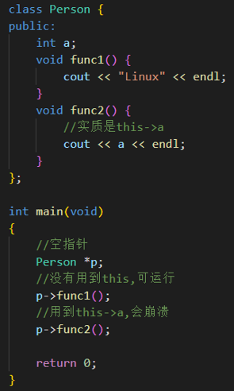</div>

3. `this`的原型是`Person *const this`，在函数后面加`const`叫<font color="yellow">常函数</font>，则`this`变为`const Person *const this`，常函数仅仅是用来描述`this`指针的
4. `const Person t1`，在对象定义时加`const`叫<font color="yellow">常对象</font>。**常对象只能调用常函数**（注：[静态成员函数只能访问静态成员变量](#a1)）<a id="a2"></a>（const 修饰普通变量叫常变量）

```C++
class Base {
public:
    int a;
    mutable int b;
    //常函数
    void func() const {
        //不可修改常函数中this指向的数据
        this->a = 100;
        //除非该数据加了mutable关键字
        this->b = 100;
    }
};
```

### <font color="1E90FF">1.9 友元 friend</font> {#友元}

1. 全局函数声明为友元，则该全局函数就可以访问该类的所有成员变量和函数（包括private成员）
1. 类A声明为类B的友元，则类A的全部成员函数可以访问类B的所有成员变量和函数（包括private成员）
1. 类A的成员函数声明为类B的友元，则该函数可以访问类B的所有成员变量和函数（包括private成员）
1. 类或者函数A需要调用类B的 private 成员，则要在类B中将A声明为友元。一般不建议把整个类声明为友元类，而只将某些成员函数声明为友元函数，这样更安全一些

<center>全局函数声明为友元</center>

```C++
class Base {
//全局函数声明为友元
friend void func(Base &p);
private:
    int m_a;
};
//全局函数形参为类的指针或引用
//p可修改类Base的private成员
void func(Base &p) {
    p.m_a = 200;
}
```

<center>类声明为友元</center>

```C++
#include <iostream>
#include <string>
using namespace std;

//给Base声明声明Derive
class Derive;

class Base {
//类声明为友元
friend class Derive;
public:
    Base();
private:
    string m_name;
};
Base::Base() {
    this->m_name = "Linux";
}

class Derive {
public:
    void show(Base *b);
};
//友元类的成员函数可修改Base的成员变量
void Derive::show(Base *b) {
    b->m_name = "China";
    cout << b->m_name << endl;
}

int main()
{
    Base *t1 = new Base;
    Derive *t2 = new Derive;
    t2->show(t1);

    delete t1;
    delete t2;
    return  0;
}
```

<center>成员函数声明为友元</center>

```C++
#include <iostream>
using namespace std;

class Info;

//友元成员函数的类要放在前面
class Student {
public:
    void show(Info *info);
};

class Info {
//成员函数声明为友元
friend void Student::show(Info *info);
public:
    Info(string n, int a);
private:
    string m_name;
    int m_age;
};
/*----------所有类的成员函数放在后面实现-----------*/
Info::Info(string n, int a):m_name(n), m_age(a) {}

void Student::show(Info *info) {
    cout << info->m_name << " is " << info->m_age << endl;
}

int main()
{
    Student t1;
    Info t2("linus", 200);
    t1.show(&t2);   //linus is 200

    return 0;
}
```

### <font color="1E90FF">1.10 运算符重载</font> {#运算符重载}

当运算符不仅可以实现`int`类型运算，还可以实现类对象的运算，则被称为<font color="yellow">运算符重载</font>。运算符重载其实就是定义一个函数，在函数体内实现想要的功能，当用到该运算符时，编译器会自动调用这个函数。也就是说，运算符重载本质上是函数重载

运算符重载的格式为：
>返回值类型`operator`运算符号 (形参表列) {
>  TODO
>}

运算符重载一般用于类对象之间的运算，`operator`是关键字，用于定义重载运算符的函数

#### <font color="1E90FF">成员函数重载运算符</font>

```C++
#include <iostream>
#include <string>
using namespace std;

class Person {
public:
    Person();
    Person(string n, int h);

    //operator是运算符重载关键字
    //成员函数有this指针，所以只传一个实参
    Person operator+(const Person &a) const;
    //重载运算符的重载函数
    Person operator+(int b);
    void display() const;
private:
    string m_name;
    int m_height;
};

Person::Person() { }
Person::Person(string n, int h): m_name(n), m_height(h) {}

//重载加运算符
Person Person::operator+(const Person &a) const{
    Person b;
    b.m_name = this->m_name;
    b.m_height = this->m_height + a.m_height;
    return b;
}
//重载运算符的重载函数
Person Person::operator+(int b) {
    Person temp;
    temp.m_name = this->m_name;
    temp.m_height = this->m_height + b;
    return temp;
}

void Person::display() const{
    cout << m_name;
    cout << "--> height: " << m_height <<endl;
}

int main()
{
    Person t1("Li", 150);
    Person t2("Hong", 160);
    Person t3;
//80%的运算符都是自左向右运算
//编译器检测到+号左边t1是一个Person对象，就会调用t1的成员函数operator+()将+号右边的t2作为实参
    t3 = t1 + t2;   //自动转换为 t3 = t1.operator+(t2);
    t3.display();   //Li--> height: 310
//编译器检测到+号左边t1是一个Person对象，就会调用t1的成员函数operator+()将+号右边的int作为实参
    t3 = t1 + 10;   //自动转换为 t3 = t1.operator+(10);
    t3.display();   //Li--> height: 160

    return 0;
}
```

#### <font color="1E90FF">全局函数重载运算符</font>

```C++
#include <iostream>
#include <string>
using namespace std;

class Person {
public:
    Person();
    Person(string n, int h);

    //将全局函数声明为友元
    //全局函数无this指针，需要传2个实参
    friend Person operator+(const Person &a, const Person &b);
    friend Person operator+(Person &a, int num);
    void display() const;
private:
    string m_name;
    int m_height;
};

Person::Person() { }
Person::Person(string n, int h): m_name(n), m_height(h) { }

//重载加+运算符（用到了private成员，故需要声明为友元）
Person operator+(const Person &a, const Person &b) {
    Person c;
    c.m_name = a.m_name + b.m_name;
    c.m_height = a.m_height + b.m_height;
    return c;
}
Person operator+(Person &a, int num) {
    Person temp;
    temp.m_name = a.m_name;
    temp.m_height = a.m_height + num;
    return temp;
}

void Person::display() const{
    cout << m_name;
    cout << " --> height: " << m_height << endl;
}

int main()
{
    Person t1("Li", 150);
    Person t2("Hong", 150);
    Person t3;
//80%的运算符都是自左向右运算
//编译器检测到+号左边t1是一个Person对象，就会调用t1的成员函数operator+()将t1和t2作为实参
    t3 = t1 + t2;   //自动转换为 t3 = operator+(t1, t2);
    t3.display();   //LiHong --> height: 300
//编译器检测到+号左边t1是一个Person对象，就会调用t1的成员函数operator+()将t1和10作为实参
    t3 = t1 + 10;   //自动转换为 t3 = operator+(t1, 10);
    t3.display();   //LiHong --> height: 160

    return 0;
}
```

#### <font color="1E90FF">左移运算符重载</font>

左移运算符只能用全局函数重载

```C++
#include <iostream>
#include <string>
using namespace std;

#if 0
//如果用成员函数定义重载左移运算符<<
void Base::operator<<(ostream &out) {
    TODO
}
//调用时会转化为 a.operator<<(out)，最终是 a << out，显然是错误的
cout << t1;
//所以左移运算符只能用全局函数重载
#endif


class Person {
public:
    Person(int h);
    friend ostream& operator<<(ostream &out, Person &p);
private:
    int m_height;
};
Person::Person(int h): m_height(h) {}

//左移运算符只能用全局函数重载
ostream& operator<<(ostream &out, Person &p) {
    out << p.m_height;
    //若不返回cout，则无法再接endl
    return out;
}

int main()
{
    Person t1(165);
    cout << t1 << endl; //165
    return 0;
}
```

#### <font color="1E90FF">递增运算符重载</font>

左加加返回引用（自身），右加加返回数值

```C++
#include <iostream>
using namespace std;

class Base {
friend ostream& operator<<(ostream &out, Base b);
public:
    Base(int n);
    //重载前置++
    Base& operator++();
    //重载后置++
    //int代表占位参数，用来区分后置++
    Base operator++(int);
private:
    int m_num;
};
Base::Base(int n):m_num(n) {}

//成员函数重载前置++
Base& Base::operator++() {
    m_num++;
    return *this;
}
//成员函数重载后置++
Base Base::operator++(int) {
    Base temp = *this;
    m_num++;
    return temp;
}
//标准的左移运算符不能运算类对象，故需重载左移运算符
//全局函数重载左移运算符<<
ostream& operator<<(ostream &out, Base b) {
    out << b.m_num;
    return out;
}

int main()
{
    Base t1(1);
    //t1是类对象，故需重载 <<
    cout << ++t1 << endl; //2

    return 0;
}
```

#### <font color="1E90FF">赋值运算符重载</font>


默认重载赋值运算符函数就是用在类与类之间的赋值，是浅拷贝。我们需要手动重载赋值运算符进行深拷贝

```C++
#include <iostream>
using namespace std;

class Base {
public:
//当成员变量有指针时，重载赋值运算符需要深拷贝（默认的是浅拷贝）
    int *m_age;
    Base(int a);
    Base& operator=(Base &b);
    ~Base();
};
Base::Base(int a) {
    m_age = new int(a);
}
Base::~Base() {
    if (m_age != NULL) {
        delete m_age;
        m_age = NULL;
    }
}

//重载赋值运算符（深拷贝）
//this就是t1
Base& Base::operator=(Base &b) {
    if (m_age != NULL) {
        delete m_age;
        m_age = NULL;
    }
    m_age = new int(*b.m_age);
    return *this;
}

int main()
{
    Base t1(10);
    Base t2(20);
    Base t3(30);
    t1 = t2 = t3;
    cout << *t1.m_age << endl;  //30

    return 0;
}
```

#### <font color="1E90FF">关系运算符重载</font>

```C++
#include <iostream>
#include <string>
using namespace std;

class Base {
public:
    Base(string n);
    bool operator==(Base &b);
    bool operator!=(Base &b);
private:
    string m_name;
};
Base::Base(string n):m_name(n) {}
//重载关系运算符 ==
bool Base::operator==(Base &b) {
    if (this->m_name == b.m_name)
        return true;
    return false;
}
//重载关系运算符 !=
bool Base::operator!=(Base &b) {
    if (this->m_name != b.m_name)
        return true;
    return false;
}

int main()
{
    Base t1("linux");
    Base t2("linux");
    Base t3("China");
    if (t1 == t2)
        cout << "t1 == t2" << endl;
    if (t1 != t3)
        cout << "t1 != t3" << endl;
}
```

#### <font color="1E90FF">函数调用运算符重载</font>

由于函数调用运算符重载后的使用方式和普通函数很像，因此称为仿函数

```C++
#include <iostream>
#include <string>
using namespace std;

class Base {
public:
    void operator()(string s);
    int operator()(int num1, int num2);
};
//重载函数调用运算符
void Base::operator()(string s) {
    cout << s << endl;
}
//重载函数调用运算符
int Base::operator()(int num1, int num2) {
    return num1 + num2;
}

int main()
{
    Base t1;
    //函数调用运算符重载和普通函数用法相同，因此又称仿函数
    t1("linux");                    //linux
    cout << t1(3, 6) << endl;       //9
    //匿名函数对象。相当于临时创建一个对象并调用其重载函数调用运算符，然后释放
    cout << Base()(5, 6) << endl;   //11
    return 0;
}
```

### <font color="1E90FF">1.11 string</font>

`string`类完全可以代替C语言中的字符串数组和字符串指针，使用`string`类需要包含头文件`<string>`

```C++
#include <iostream>
#include <string>
#include <string.h>

using namespace std;

int main()
{
    // string的结尾没有'\0'
    string t1 = "Linux";

    // string定义的对象可以直接相互赋值,不需要使用strcpy函数
    string t2 = t1;
    // 初始化string类的构造函数
    string t3(3, 'S');          // 3个S
    string t3("China");         // China
    string t3(t1);              // Linux    
    // 按数组下标来访问string字符串
    t1[0] = 'C';
    // string可以用 + 运算符和append()成员函数来任意字符串拼接
    char char_str[] = "ABC";
    string t4 = t1 + "China" + char_str + 'T';
    t4 += "bhlk";
    t4.append("C++");
    // 调用成员函数length()和size(),返回字符串长度(无'\0)
    cout << t1.length() << endl;
    cout << t1.size() << endl;
    // 为了使用C语言中的fopen()函数打开文件,必须调用成员函数c_str(),将string字符串转换为C风格的字符串
    FILE *fp = fopen(t1.c_str(), "r+");
    // 成员函数insert(n, str),表示插入字符串str,从string的下标 n 前面
    t1.insert(0, "bhlk");
    // 成员函数erase(n, m),表示删除 m 个字符,从string的下标 n 开始(若 m 大于string则删除 n 后所有)
    // erase(n),表示删除所有字符,从string的下标 n 开始
    t1.erase(4, 5);
    // 成员函数substr(n, m),表示提取返回 m 个字符,从string的下标 n 开始(若 m 大于string则提取 n 后所有)
    // 成员函数substr(n),表示提取返回所有字符,从string的下标 n 开始
    cout << t1.substr(2, 1) << endl;
    // 成员函数find(str, n)，表示查找并返回第1次出现字符串 str 的下标值,从string的下标 n 开始
    // 成员函数find(str)，表示查找并返回第1次出现字符串 str 的下标值，从头开始
    t1 = "Linux China";
    cout << t1.find("Ch") << endl;  // 结果返回6
    cout << t1.find("Ca") << endl;  // 未找到则返回-1
    cout << t1.rfind("n") << endl;  // rfind表示从右往左查找，结果返回2
    // 成员函数replace(n, m, str)，表示从n号元素开始的m个字符，替换为str
    t1 = "Linux";
    str1.replace(0, 2, "China");    // 结果为Chinanux

    return 0;
}
```

### <font color="1E90FF">1.12 文件操作</font> {#文件操作}

C++对文件操作需要包含头文件`<fstream>`。文件类型分为两种：

1. 文本文件。文件以文本的ASCII码形式存储在计算机中
1. 二进制文件。文件以文本的二进制形式存储在计算机中

`ofstream`表示写操作；`ifstream`表示读操作；`fstream`表示读写操作（`f`表示file）

<center>读写ASCII码文件示例</center>

```C++
#include <iostream>
#include <string>
#include <fstream> //文件操作头文件

using namespace std;

int main()
{
    //创建流对象
    ofstream ofs;
    //指定写入的文件路径，以及out方式打开
    ofs.open("test.txt", ios::out);
    //利用 << 向文件中写数据
    ofs << "Linux" << endl;
    ofs << "China" << endl;
    //关闭文件
    ofs.close();

    string buf;
    ifstream ifs;
    //指定读取的文件路径，以及in方式打开
    ifs.open("test.txt", ios::in);
    //is_open() 返回0即文件打开失败，返回1即打开成功
    if (!ifs.is_open()) {
        cout << "file oepn failed" << endl;
    }
    //读取数据（getline()函数会将ifs读取到buf中）
    while (getline(ifs, buf)) {
        cout << buf << endl;
    }
    //关闭文件
    ifs.close();

    return 0;
}
```

___

## <font color="1E90FF">二、模板 template</font> {#模板}

<font color="yellow">C++ 除了面向对象的编程思想，还有一个泛型编程思想</font>

泛型程序设计（generic programming），指的是算法只要实现一遍，就能适用于多种数据类型。泛型程序设计最成功的应用就是 C++ 的标准模板库STL（Standard Template Library，标准模板库）。在 C++ 中，模板分为<font color="yellow">函数模板</font>和<font color="yellow">类模板</font>两种

所谓函数模板，实际上是建立一个通用函数，它所用到的数据的类型（包括返回值类型、形参类型、局部变量类型）可以不具体指定，而是用一个虚拟的类型来代替（实际上是用一个标识符来占位），等发生函数调用时再根据传入的实参来逆推出真正的类型。这个通用函数就称为<font color="yellow">函数模板</font>（Function Template）

- `template`是定义函数模板的关键字
- `typename`是另外一个关键字（可以使用`class`替代关键字`typename`），用来声明具体的<font color="yellow">类型参数</font>，类型参数一般是`T`。从整体上看，`template<typename T>` 被称为模板头

学习模板并不是为了写模板，而是在STL中能够用系统提供的模板

<font color="yellow">即使整个模板中没有出现`T`，编译器也必须要知道模板函数和模板类的类型参数`T`的数据类型。无论是通过自动推断`T`的类型还是指明`T`的类型</font>

### <font color="1E90FF">2.1 函数模板</font>

#### <font color="1E90FF">函数模板基础</font>

函数模板的类型参数 T 有自动类型推导和指明类型两种模式

```C++
#include <iostream>
#include <string.h>
using namespace std;

//函数模板定义
template<typename T> void func_swap(T &a, T &b) {
    T temp = a;
    a = b;
    b = temp;
}

//若T2不在形参中，则需要在调用函数模板的时候指明数据类型
template<typename T1, typename T2> 
void func2(T1 a) {
    T2 b;
}

int main(void)
{
//1、自动推断T的数据类型
    int a = 2, b = 8;
    //a和b交换
    func_swap(a, b);    //形参是引用，需要传入变量，不能直接传入数字或字符串

    string str1 = "Linux", str2 = "China";
    //str1和str2交换
    func_swap(str1, str2);

//2、指明T的数据类型
    //给函数指明数据类型。T1的类型是int，T2的类型是string
    func2<int, string>(10);

    return 0;
}
```

#### <font color="1E90FF">函数模板重载</font>

```C++
#include <iostream>
#include <string.h>
using namespace std;

#include <iostream>
using namespace std;

// 函数名相同，形参不同的成员函数，称为重载函数
template<class T> void Swap(T &a, T &b);  //模板1：交换基本类型的值
template<typename T> void Swap(T a[], T b[], int len);  //模板2：交换两个数组
void printArray(int arr[], int len);  //打印每个数组元素
int main(){
//交换基本类型的值
    int m = 10, n = 99;
    Swap(m, n);  //匹配模板1
    cout<<m<<", "<<n<<endl;

//交换两个数组
    int a[5] = { 1, 2, 3, 4, 5 };
    int b[5] = { 10, 20, 30, 40, 50 };
    //数组名作为实参会自动转化为数组指针
    //sizeof只能通过数组名求得数组长度，不能通过数组指针求得数组长度
    int len = sizeof(a) / sizeof(int);  //数组长度
    Swap(a, b, len);  //匹配模板2
    printArray(a, len);
    printArray(b, len);
    return 0;
}
template<class T> void Swap(T &a, T &b){
    T temp = a;
    a = b;
    b = temp;
}
template<typename T> void Swap(T a[], T b[], int len){
    T temp;
    for(int i = 0; i < len; i++){
        temp = a[i];
        a[i] = b[i];
        b[i] = temp;
    }
}
// sizeof只能通过数组名求得数组长度，不能通过转换后的数组指针求得数组长度
void printArray(int arr[], int len){
    for(int i = 0; i < len; i++){
        cout << arr[i] << ", ";
    }
    //2个\b后面加一个空格，表示bakcspace
    cout << "\b\b " <<endl;
}
```

#### <font color="1E90FF">函数模板显示具体化</font>

- 让模板针对某种具体的类型使用不同的算法（函数体或类体不同），这种技术称为<font color="yellow">模板的显示具体化</font>。一个函数模板只能有一个显示具体化，这个显示具体化就是这个函数模板的特定

 - 函数模板的显示具体化与普通函数的区别在于多了个空模板头
    - 普通函数：`void func(int a) { }`
    - 函数模板显示具体化：`template<> void func(int a) { }`

```C++
#include <iostream>
#include <string>
using namespace std;

class Base {
public:
    string m_name;
    int m_age;
    Base(string n, int a):m_name(n), m_age(a){}
};

//先定义一个函数模板
template<typename T> void compare(T a, T b) {
    if (a == b)
        cout << "a == b" << endl;
}
//定义函数模板的显示具体化
//函数模板的显示具体化与普通函数的区别在于多了个空模板头
template<> void compare(Base b1, Base b2) {
    if (b1.m_name == b2.m_name && b1.m_age == b2.m_age)
        cout << "b1 == b2" << endl;
    else
        cout << "b1 != b2" << endl;
}

int main()
{
    Base base1("China", 5000);
    Base base2("Linux", 100);

    compare(5, 5);          
    compare(base1, base2);  //调用具体化的模板

    return 0;
}
```

#### <font color="1E90FF">函数模板的数组实参</font>

通过函数实参来确定模板类型参数`T`的过程称为<font color="yellow">模板实参推断</font>
- 函数传入实参时，数组会转化成`int *`类型，所以函数形参类型`T`要凑成`int *`类型
- 当函数形参是引用类型时，数组不会转换为指针，依然是数组类型

```C++
#include <iostream>
#include <string.h>
using namespace std;
class Base {};

template<typename T> void func1(T *a) {
    cout << "T1 size of func1 is " << sizeof(T) << endl;
}
template<typename T> void func2(T a) {
    cout << "T2 size of func2 is " << sizeof(T) << endl;
}
template<typename T> void func3(const T &a) {
    cout << "T3 size of func3 is " << sizeof(T) << endl;
}
template<typename T> void func4(T &a) {
    cout << "T4 size of func4 is " << sizeof(T) << endl;
}

int main(void)
{
//函数传入实参时，数组会转化成 int * 类型，所以函数形参类型 T 要凑成 int * 类型
    int t1[20];
    Base base;

//t1 的类型从 int[20] 转换为 int*,所以 T 的类型为 int
    func1(t1);      // 4

//t1 的类型从 int[20] 换转换为 int *,所以 T 的类型为 int *
    func2(t1);      // 8

//T 的真实类型为 Base
    func3(base);    // 1

//当函数形参是引用类型时，数组不会转换为指针，依然是数组类型
//t1 的类型依然为 int[20]，不会转换为 int *，所以 T 的真实类型为 int[20]（注意int[10]和int[20]类型是不同的）
    func4(t1);      // 80

    return 0;
}
```

#### <font color="1E90FF">函数模板的实参类型转换</font>

<font color="yellow">建议使用显示指定类型的方式调用函数模板</font>

- 普通函数调用时会自动进行类型转换（隐式类型转换）
- 函数模板显示指定类型参数`T`时，也会进行类型转换。例如，只有一个`T`且指明`T`的类型为`int`，当同时传入两个实参为`char`和`int`时，则都会转为`int`
- 函数模板自动数据类型推导`T`时，不会进行类型转换。例如，只有一个`T`，当同时传入两个实参为`char`和`int`时，则会报错

```C++
#include <iostream>
using namespace std;

template<typename T> void func(T a, T b) {
    cout << a + b << endl;
}
int main()
{
    int a = 5;
    char b = '8';
    func(a, a);        //正确，T能明确数据类型
    func(a, b);        //错误，T的数据类型不明确
    func<int>(a, b);   //正确，指明了T的数据类型，char会转为int

    return 0;
}
```

#### <font color="1E90FF">函数模板中的非类型参数</font>

```C++
#include <iostream>
using namespace std;
//一般情况下给函数传入数组时会转化为int *类型，此时还需要传入数组长度
//使用非类型参数 + 引用的方式给函数传入数组时形参还是int[]类型,N就是长度
//a是一个引用，类型是数组T[N]
template<typename T, unsigned N> void Swap(T (&a)[N], T (&b)[N]);  //交换两个数组
template<typename T, unsigned N> void printArray(T (&arr)[N]);  //打印数组元素
int main(){
    //交换两个数组
    int a[5] = { 1, 2, 3, 4, 5 };
    int b[5] = { 10, 20, 30, 40, 50 };
    //此时T是int类型，N的值是3
    Swap(a, b);
    printArray(a);
    printArray(b);
    return 0;
}
template<typename T, unsigned N> void Swap(T (&a)[N], T (&b)[N]){
    T temp;
    for(int i = 0; i < N; i++) {
        temp = a[i];
        a[i] = b[i];
        b[i] = temp;
    }
}
template<typename T, unsigned N> void printArray(T (&arr)[N]){
    for(int i = 0; i < N; i++) {
        if(i == N-1){
            cout << arr[i] << endl;
        }else{
            cout << arr[i] << ", ";
        }
    }
}
```

#### <font color="1E90FF">函数模板与普通函数重名</font>


- 建议普通函数不要和函数模板重名
- 当函数模板和普通函数的函数名相同且形参类型也相同时，会屏蔽函数模板

```C++
#include <iostream>
using namespace std;

void func(int a) {
    cout << "common" << endl;
}
template<typename T> void func(T a) {
    cout << "template" << endl;
}
int main()
{
//当函数模板和普通函数的函数名相同且形参类型也相同时，会屏蔽函数模板
    func(6);        // 打印common
    func("Li");     // 打印template

//可以通过空模板参数列表强制调用函数模板
    func<>(6);      // 打印template
    func<int>(6);   // 打印template

    return 0;
}
```

### <font color="1E90FF">2.2 类模板</font>

#### <font color="1E90FF">类模板基础</font>

- 类模板实例化对象时必须指明类型参数`T`的数据类型（除非该类型参数设置了默认数据类型）
- 类模板的成员函数在类外实现时需要加模板的类型参数

```C++
#include <iostream>
using namespace std;

template<typename x_t, typename y_t>
class Point {
public:
    Point(x_t x, y_t y):m_x(x), m_y(y){}
    x_t get_x() const;
    y_t get_y() const;
    void set_xy(x_t x, y_t y);
private:
    x_t m_x;
    y_t m_y;
};
//类模板成员函数在类外定义时，类名Point后面要加类型参数
template<typename x_t, typename y_t>
x_t Point<x_t, y_t>::get_x() const {
    return m_x;
}
template<typename x_t, typename y_t>
y_t Point<x_t, y_t>::get_y() const {
    return m_y;
}
template<typename x_t, typename y_t>
void Point<x_t, y_t>::set_xy(x_t x, y_t y) {
    if (x != 0 || sizeof(x)) //sizeof判断空字符串
        m_x = x;
    if (y != 0 || sizeof(y))
        m_y = y;
}

int main()
{
    //使用类模板创建对象时，需要指明数据类型
    Point<int, float> p1(10, 23.5);
    //打印10  23.5
    cout << p1.get_x() << "  " << p1.get_y() << endl;
    p1.set_xy(0, 99);

    //使用类模板创建对象指针时，两边类型参数须保持一致
    Point<string, string> *p2 = new Point<string, string>("Linux", "China");
    //打印Linux  China
    cout << p2->get_x() << "  " << p2->get_y() << endl;

    return 0;
}
```


#### <font color="1E90FF">类模板对象做函数参数</font>

```C++
#include <iostream>
using namespace std;

template<typename T1, typename T2>
class Base {
public:
    Base(T1 n, T2 a):m_name(n), m_age(a){}
    void show() {
        cout << m_name << " " << m_age << endl;
    }
private:
    T1 m_name;
    T2 m_age;
};
//当实参是类模板时，函数形参也要指定类型参数T的数据类型
void func(Base<string, int> &p) {
    p.show();
}

int main()
{
    Base<string, int> t("Linux", 200);
    func(t);    //Linux  200

    return 0;
}
```

#### <font color="1E90FF">类模板的继承</font>

当基类是一个模板时，则不管派生类是否为类模板，必须指明基类T的类型。无论是指明具体的数据类型还是指明派生类的类型参数T

```C++
#include <iostream>
#include <string>
using namespace std;

template<typename T>
class Base {
    T m;
};
//当基类是一个类模板时，派生类要指定基类T的类型
class Derive1:public Base<int> {    //此时m是int类型
};

//当基类是一个类模板时，若派生类不指定基类T的类型，则派生类也必须是类模板
template<typename T1, typename T2>
class Derive2:public Base<T2> {     //此时m是T2类型
    T1 obj;
};

int main()
{
    Derive2<int, string> t;

    return 0;
}
```

#### <font color="1E90FF">类模板的友元</font>

全局函数作友元，类内实现

```C++
#include <iostream>
#include <string>
using namespace std;

template<typename T1, typename T2>
class Base {
    //全局函数作友元（类内实现）
    //注意这个函数是全局函数哦
    friend void print(Base<T1, T2> *p) {
        cout << "name: " << p->m_name << endl;
        cout << "age: " << p->m_age << endl;
        delete p;
    }
public:
    Base(T1 n, T2 a);
private:
    T1 m_name;
    T2 m_age;
};
template<typename T1, typename T2>
Base<T1, T2>::Base(T1 n, T2 a):m_name(n), m_age(a) {}

int main()
{
    Base<string, int> *t1 = new Base<string, int>("linux", 200);
    //注意这个函数是全局函数哦
    print(t1);

    return 0;
}
```

全局模板函数作友元，类外实现

```C++
#include <iostream>
#include <string>
using namespace std;

//声明类模板
template<typename T1, typename T2>
class Base;

//声明全局函数模板
template<typename T1, typename T2>
void print(Base<T1, T2> *p);

template<typename T1, typename T2>
class Base {
//声明全局函数做友元（类外实现）
//需要加空模板参数列表 <>
friend void print<>(Base<T1, T2> *p);
public:
    Base(T1 n, T2 a);
private:
    T1 m_name;
    T2 m_age;
};
template<typename T1, typename T2>
Base<T1, T2>::Base(T1 n, T2 a):m_name(n), m_age(a) {}

template<typename T1, typename T2>
void print(Base<T1, T2> *p) {
    cout << "name: " << p->m_name << endl;
    cout << "age: " << p->m_age << endl;
    delete p;
}

int main()
{
    Base<string, int> *t1 = new Base<string, int>("linux", 200);
    print(t1);
    return 0;
}

```


### <font color="1E90FF">2.3 函数模板与类模板的区别</font>

1. 只有函数模板有自动类型推导，类模板必须指明类型参数`T`的数据类型
2. 只有类模板在参数列表中可以有默认数据类型

```C++
#include <iostream>
using namespace std;

//类型参数T可以设置默认数据类型
template<typename name_t, typename age_t = int>
class Base {
public:
    Base(name_t n, age_t a):m_name(n), m_age(a){}
private:
    name_t m_name;
    age_t m_age;
};

int main()
{

    //类模板实例化对象时必须指明类型参数
    //此处类型参数2存在默认类型，故可以不指明
    Base<string> t1("Linux", 100);

    return 0;
}
```


### <font color="1E90FF">2.4 模板的实例化</font>

- 模板仅仅是编译器用来生成函数或类的一张"图纸"。模板不会占用内存，最终生成的函数或者类才会占用内存。由模板生成函数或类的过程叫做<font color="yellow">模板的实例化</font>（Instantiate）
- 无论是函数模板，还是类模板中的成员函数，只要是模板，其中的函数都是编译器在检测到调用时才会实例化

#### <font color="1E90FF">函数模板的实例化</font>

```C++
template<typename T> void Swap(T &a, T &b){
    T temp = a;
    a = b;
    b = temp;
}
int main(){
    int n1 = 1, n2 = 2, n3 = 3, n4 = 4;
    string str1 = "Linux", str2 = "China";
   
    Swap(n1, n2);       //T为int，实例化出 void Swap(int &a, int &b);
    Swap(str1, str2);   //T为string，实例化出 void Swap(string &a, string &b);
    Swap(n3, n4);       //T为int，调用刚才生成的 void Swap(int &a, int &b);
    return 0;
}
```

#### <font color="1E90FF">类模板的实例化</font>

通过类模板创建对象时并不会实例化所有的成员函数，只有等到真正调用它们时才会被实例化。一般只需要实例化成员变量和构造函数。成员变量被实例化后就能够知道对象的大小了（占用的字节数），构造函数被实例化后就能够知道如何初始化了

```C++
#include <iostream>
using namespace std;

class Base1 {
public:
    void base1_show() {
        cout << "Base1" << endl;
    }
};
class Base2 {
public:
    void base2_show() {
        cout << "Base2" << endl;
    }
};
template<typename T>
class Derive {
public:
    T obj;
    void func1(){ obj.base1_show(); }
    void func2(){ obj.base2_show(); }
};

int main()
{
    //此时类模板只创建成员变量并不会创建成员函数
    Derive<Base1> t;
    //只有在调用func1时才会实例化成员函数func1（此时func2未实例化）
    t.func1();
    //只有在调用func2时才会实例化func2，但会报错
    t.func2();

    return 0;
}
```


### <font color="1E90FF">2.5 将模板应用于多文件编程</font>

工程中一般会包含两个源文件和一个头文件，`func.cpp`中定义函数和类，`func.h`中声明函数和类，`main.cpp`中调用函数和类，这是典型的将函数的声明和实现分离的编程模式，达到「模块化编程」的目的。 但是模板并不是真正的函数或类，它仅仅是用来生成函数或类的一张"图纸"，如果`main.cpp`只声明了`func.h`文件，则在编译的时候不会生成模板函数和模板类的实体，这样在链接的时候就会链接报错，只有将`func.cpp`包含到`main.cpp`中才正确。所以我们不能将模板的声明和定义分散到多个文件中，<font color="yellow">我们应该将模板的定义`func.cpp`和声明`func.h`都放到头文件`.hpp`中。</font>`.hpp`默认表示的是模板的头文件

___

## <font color="1E90FF">三、STL</font>

STL（standard template library），称为标准模板库或者泛型库，其包含有大量的类模板和函数模板。如今 STL 已完全内置到 C++ 的编译器中，无需额外安装。STL 就位于各个 C++ 的头文件中，即它并非以二进制代码的形式提供，而是以源代码的形式提供。从根本上说，STL 是一些容器、算法和其他一些组件的集合，所有容器和算法都是总结了几十年来算法和数据结构的研究成果，汇集了许多计算机专家学者经验的基础上实现的，因此可以说，STL 基本上达到了各种存储方法和相关算法的高度优化

>注意，这里提到的容器，本质上就是封装有数据结构的类模板，例如 list、vector、set、map 等


STL 就是借助模板把常用的数据结构及其算法都实现了一遍，并且做到了数据结构和算法的分离。例如，vector 的底层为顺序表（数组），list 的底层为双向链表，deque 的底层为循环队列，set 的底层为红黑树，hash_set 的底层为哈希表。在 C++ 标准中，STL 被组织为 13 个头文件，分别为 `<iterator>` `<functional>` `<vector>` `<deque>` `<list>` `<queue>` `<stack>` `<set>` `<map>` `<algorithm>` `<numeric>` `<memory>` `<utility>`

<center>STL组成结构</center>

|组成 |<div style="width:715px">含义</div>|
|:---|:---|
|容器      |一些封装数据结构的模板类，例如 vector 向量容器、list 列表容器等|
|算法      |STL 提供了非常多（大约 100 个）的数据结构算法，它们都被设计成一个个的模板函数，这些算法在 std 命名空间中定义，其中大部分算法都包含在头文件`<algorithm>`中，少部分位于头文件`<numeric>`中|
|迭代器    |在 C++ STL 中，对容器中数据的读和写，是通过迭代器完成的，扮演着容器和算法之间的胶合剂。常用的迭代器种类为双向迭代器和随机访问迭代器|
|函数对象  |如果一个类将 () 运算符重载为成员函数，这个类就称为函数对象类，这个类的对象就是函数对象（又称仿函数）|
|适配器    |可以使一个类的接口（模板的参数）适配成用户指定的形式，从而让原本不能在一起工作的两个类工作在一起。值得一提的是，容器、迭代器和函数都有适配器|
|内存分配器|为容器类模板提供自定义的内存申请和释放功能，由于往往只有高级用户才有改变内存分配策略的需求，因此内存分配器对于一般用户来说，并不常用|

>上表简单了解即可

### <font color="1E90FF">3.1 容器</font>

简单来说，<font color="yellow">容器</font>就是一些类模板的集合，但和普通类模板不同的是，容器中封装的是组织数据的方法（也就是数据结构）。STL 提供有 3 类标准容器，分别是<font color="yellow">序列容器</font>、<font color="yellow">排序容器</font>和<font color="yellow">哈希容器</font>，后两类容器统称为<font color="yellow">关联容器</font>

<center>STL容积种类和功能</center>

|容器种类 |<div style="width:715px">功能</div>|
|:---|:---|
|序列容器 |一些封装数据结构的模板类，例如 vector 向量容器、list 列表容器等|
|排序容器 | 包括 set 集合容器、multiset多重集合容器、map映射容器以及 multimap 多重映射容器。排序容器中的元素默认是由小到大排序好的，即便是插入元素，元素也会插入到适当位置。所以关联容器在查找时具有非常好的性能|
|哈希容器 |C++ 11 新加入 4 种关联式容器，分别是 unordered_set 哈希集合、unordered_multiset 哈希多重集合、unordered_map 哈希映射以及 unordered_multimap 哈希多重映射。和排序容器不同，哈希容器中的元素是未排序的，元素的位置由哈希函数确定|

#### <font color="1E90FF">STL序列式容器</font>

STL 标准库中所有的序列式容器包括 array、vector、deque、list 和 forward_list 容器
STL序列式容器的特点是不会对存储的元素进行排序，元素排列的顺序取决于存储它们的顺序

vector容器的迭代器是支持随机访问的迭代器

```C++
#include <iostream>
#include <vector>       //vector容器头文件
#include <algorithm>    //标准算法头文件
using namespace std;

void print(int val) {
    cout << val << endl;
}

int main()
{
//一、容器定义
    //定义容器v1，当前数组长度为0
    vector <int> v1; 

//二、容器赋值（容器间赋值用拷贝构造和赋值号，其它类型赋值都用push_back）
    //使用成员函数push_back()向容器插入数据
    int a = 3;
    v1.push_back(9);
    v1.push_back(a);
    //利用构造函数容器v2拷贝容器v1
    vector<int> v2(v1);
    //使用 = 号赋值
    v2 = v1;
    //利用构造函数向容器v3中添加3个6
    vector<int> v3(3, 6);


//三、容器数据读取
    //创建一个迭代器，迭代器相当于指针。每个容器都有自己的迭代器，通过迭代器访问容器中的数据
    //v1.begin()指向容器第一个元素，v1.end()指向容器最后一个元素的下一个位置
    //迭代器 it 相当于指针，指向尖括号里的类型 int
    //利用for循环遍历容器
    for (vector<int>::iterator it = v1.begin(); it != v1.end(); it++)
        cout << *it << endl;        // 9   3
    //利用for_each算法遍历容器。实质是将容器中每个元素依次作为实参传给print()函数执行
    for_each(v1.begin(), v1.end(), print);    //9   3

//四、容器其它属性
    //手动调整v1的元素个数为100
    v1.resize(100);

    //删除v1中所有的元素，此时v1的长度变为0
    v1.clear();

    //重新调整v1的大小为20，并存储20个-1
    v1.resize(20, -1);

    return 0;
}
```

#### <font color="1E90FF">vector容器中存放类（自定义类型）</font>

```C++
#include <iostream>
#include <string>
#include <vector>       //vecotr容器头文件
#include <algorithm>    //标准算法头文件
using namespace std;

//vector容器中存放类
class Base {
public:
    string m_name;
    int m_age;
    Base(string n, int a);
};
Base::Base(string n, int a):m_name(n), m_age(a) {}

int main()
{
    Base t1("linux", 200);
    Base t2("china", 5000);
    //创建容器
    vector<Base> v1;
    //向容器中插入数据
    v1.push_back(t1);
    v1.push_back(t2);
    //创建一个迭代器。每个容器都有自己的迭代器，通过迭代器访问容器中的数据
    //迭代器 it 相当于指针，指向尖括号里的类型 Base
    for (vector<Base>::iterator it = v1.begin(); it != v1.end(); it++) {
        cout << it->m_name << " is " << it->m_age << endl;  //linux is 200 \n china is 5000
    }

    Base *t3 = new Base("Q", 10);
    Base *t4 = new Base("K", 20);
    //创建容器
    vector<Base *> v2;
    //向容器中插入数据
    v2.push_back(t3);
    v2.push_back(t4);
    //迭代器 it 相当于指针，指向尖括号里的类型 Base *
    for (vector<Base *>::iterator it = v2.begin(); it != v2.end(); it++) {
        cout << (*it)->m_name << " is " << (*it)->m_age << endl;  //Q is 10 \n K is 20
    }

    return 0;
}
```

#### <font color="1E90FF">vector容器中存放容器</font>

```C++
#include <iostream>
#include <string>
#include <vector>       //vecotr容器头文件
#include <algorithm>    //标准算法头文件
using namespace std;


//容器嵌套容器
int main()
{
    vector<vector<int>> v;

    //创建小容器
    vector<int> v1;
    vector<int> v2;
    vector<int> v3;
    //重新调整str的大小为5，并存储5个n
    v1.resize(5, 1);
    v2.resize(5, 2);
    v3.resize(5, 3);

    //将小容器插入到大容器中
    v.push_back(v1);
    v.push_back(v2);
    v.push_back(v3);

    //迭代器 it1 相当于指针，指向尖括号里的类型 vector<int>，是容器类型
    //(*it1).begin 指向容器v1首地址
    //it++后，(*it1).begin 指向容器v2首地址
    for (vector<vector<int>>::iterator it1 = v.begin(); it1 != v.end(); it1++) {
        for (vector<int>::iterator it2 = (*it1).begin(); it2 != (*it1).end(); it2++) {
            cout << *it2 << " ";
        }
        cout << endl;
    }

    return 0;
}
```

___

## <font color="1E90FF">四、C++11</font>

### <font color="1E90FF">4.1 auto</font>

在`C++11`之前的版本`C++98`中，定义变量或者声明变量之前都必须指明它的类型，比如`int`、`char` 等；`auto`关键字用来指明变量的存储类型，它和 static 关键字是相对的。auto 表示变量是自动存储的，这也是编译器的默认规则，所以写不写都一样，这使得 auto 关键字的存在变得非常鸡肋。为了让编译器（或者解释器）自己去推导数据类型，让编码更加方便，在`C++11`中使用`auto`关键字后，编译器会在编译期间做自动类型推导

#### <font color="1E90FF">auto的限制</font>

1. auto 不能在函数的参数中使用
我们在定义函数的时候只是指明了参数的类型，但并没有给它赋值，只有在实际调用函数的时候才会给参数赋值；而 auto 要求必须对变量进行初始化，所以这是矛盾的。
1. auto 不能作用于类的非静态成员变量（也就是没有 static 关键字修饰的成员变量）中
1. auto 关键字不能定义数组，比如下面的例子就是错误的
`char array[];`
`auto  str[] = array;`  array是数组，所以不能使用 auto
1. auto 不能作用于模板参数。例如，`func<auto>();`是错误的

```C++
#include <iostream>
using namespace std;

int main()
{
    //关键字auto是在初始化时才进行数据类型推导的
    auto url = "192";   //"192"是const char*，auto是const char*类型  
    auto a = 5;         //5是int类型，auto是int类型
    auto b = 7.7;       //7.7是double类型，auto是double类型
    auto p1 = &a;       //&a是int* 类型，auto是int *类型
    auto *p2 = &a;      //&a是int* 类型，auto是int类型
    auto &c = a;        //&a是int* 类型，auto是int类型（int *const c = &a）
    auto d = c;         //c是int 类型，auto是int类型（c是解引用）

    //当未用引用时，auto类型推导时不保留const属性
    const auto e = a;   //auto是int类型
    auto f = e;         //auto是int类型
    //当使用引用时，auto类型推导时将保留const属性
    const auto &g = a;  //auto是int类型
    auto &h = g;        //g是const int *const类型，auto是const int类型

    return 0;
}
```

___

## <font color="1E90FF">杂项</font>

1. `string str;`相当于`char str[9];`
1. `srand(time(NULL));rand()%100;`生成一个随机数，范围0~99
1. int a = 156；将数字拆分(a%10会将a的个位数取出)
cout << (a / 1 % 10) << endl；	//6 
cout << (a / 10 % 10) << endl；	//5
cout << (a / 100 % 10) << endl；	//1
1. C++创建结构体变量时，"struct"可以省略
1. case内的代码过长，则要使用｛｝
1. C++中字符串指针存放在全局区，字符串数组在栈区 
1. switch的形参是int类型，不能判断数字范围

