# C++

___

[TOC]

___

## 一、基础语法 {#1}

#### 类class

1. 关键字`class`类是一种构造类型，其成员可以是变量或者函数；函数可以在类里面定义，也可以在类外面定义；通过类定义出来的变量叫作对象；创建对象的过程叫作实例化
1. `::`表示作用域运算符或解引用；`:` 使用在类的继承，和构造函数初始化
1. 没用关键字修饰的变量，默认是`private`属性的
1. 用关键字`public` `protected` `private`修饰的函数和变量在自身类里可以相互调用，无区别，对于派生类和对象则有区别
1. 在类里(或者在同一作用域里)函数名相同，但是形参不同的函数叫做重载函数。对象调用重载函数时，会根据形参的不同来判断调用的是哪个重载函数；析构函数不可被重载，构造函数可以被重载

#### new分配堆内存

1. `int *a = new int(6);`其中`new int(6)`会返回6的地址。`delete a;`释放。指针a的地址在栈区，6的地址在堆区
1. `int *arr = new int[6];` `new int[6]`会返回数组首地址。`delete[] arr;`释放。
1. `int *str = new string("Linux");` `new string("Linux")`会返回字符串首地址。`delete[] str;`释放。

#### 引用&

1. `int &b = a;`这时进行`b = 10`操作，就相当于`a = 10`操作。`int &b=a`相当于`int *const b = &a`
1. 引用在定义时必须初始化，且初始化后不可更改指向，但可以赋值(因为 * const 修饰禁止修改指针)
1. 函数`void swap(&a，&b)`，调用时写法为`swap(c，d)`，此时`a`和`b`修改值会反馈给`c`和`d`

#### 函数默认形参

1. 函数形参可以设置默认值，例如`void func(int a, int b=10)`，调用时为`func(30)`或`func(30，50)`（覆盖）
1. 某个形参设置默认值后，该形参后面的形参都必须要有默认值（默认形参是从右边开始初始化的）
1. 函数声明中的形参和函数定义中的形参，只能其中一个写默认形参（防止声明和定义的默认形参不相同）

#### 函数占位形参

1. 例如void func(int a，int)；调用时为func(30，1)；
1. 调用函数时，占位形参和普通形参一样，必须填写
1. 默认形参就是占位形参(当函数内部没有用到默认形参时)

  
### 1.1 构造函数和析构函数 {#1.1}

1. 构造函数和~析构函数是名称与类名相同，且没有返回值的函数。在实例化对象时若没有定义构造函数和析构函数，则会默认定义一个空的构造函数和析构函数
1. 构造函数有形参，可以被重载；析构函数无形参，不可被重载
1. 构造函数：实例化对象的一瞬间就会自动依次先后执行基类和派生类的构造函数
1. 析构函数：当对象生命周期结束时就会自动依次先后执行派生类和基类的析构函数
1. 定义对象同时传参给构造函数。①Dog dog1(4)；②Dog *dog2 = new Dog(5.5)
1. 定义对象后再传参给构造重载函数。①dog1.dog1_func(4)；②dog2->dog2_func(5.5)
1. 构造函数可以初始化类的成员变量，即初始化列表。注意初始化与赋值不同，这意味着const修饰的成员也可以初始化

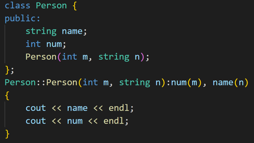

8. 实例化对象时会先调用基类的构造函数，再调用派生类的构造函数；结束对象时先析构派生类再析构基类

### 1.2 拷贝构造函数 {#1.2}

1. 构造函数中，若形参为本类引用，则为拷贝构造函数
1. 编译器会自动给一个类添加无参构造函数、有参构造函数、拷贝构造函数。当手动添加拷贝构造函数时，编译器不再添加默认无参和有参构造函数。当手动添加有参构造函数时，编译器不再添加默认无参构造函数
1. 编译器自动添加的拷贝构造函数会复制形参给自己
1. 拷贝构造函数中，使用赋值号直接将形参(类)的指针成员复制，叫作浅拷贝（注：默认拷贝构造函数就是这样）
1. 拷贝构造函数中，在堆区new空间给形参(类)的指针成员，叫作深拷贝(需要手动new)

.

### 1.3 继承 {#1.3}

#### 单继承

1. 对象只能访问`public`成员
1. `public`继承时，派生类的成员只能访问基类中的`public`和`protected`，派生类的对象只能访问基类中的`public`成员
1. `protected`继承时，派生类的成员只能访问基类中`public`和`protected`，派生类的对象不能访问基类中的任何成员
1. `private`继承时，派生类的成员只能访问基类中的`public`和`protected`，派生类的对象不能访问基类中的任何成员
1. 
    - `protected`继承时，派生类中`public`变为`protected`
    - `private`继承时，派生类中`public`和`protected`变为`private`(如下图)
    - 所以只有`public`继承时派生类的对象才能访问基类的`public`成员

6. 派生类以任何方式继承基类的同时，也会继承基类的全部内存大小（注：静态成员不会增加类的内存。函数内部的局部变量也不会增加类的内存，因为是运行时分配）

7. 实例化对象时会先调用基类的构造函数，再调用派生类的构造函数；结束对象时先析构派生类再析构基类
8. 若派生类成员与基类成员同名，派生类优先级高。会屏蔽基类所有同名成员(包括重载函数和静态成员)。只能使用作用域符号特指才能调用基类成员
9. 当静态成员同名时，既可以通过对象访问基类的静态成员，也可以通过类名访问基类的静态成员。使用类名访问可以不用实例化对象

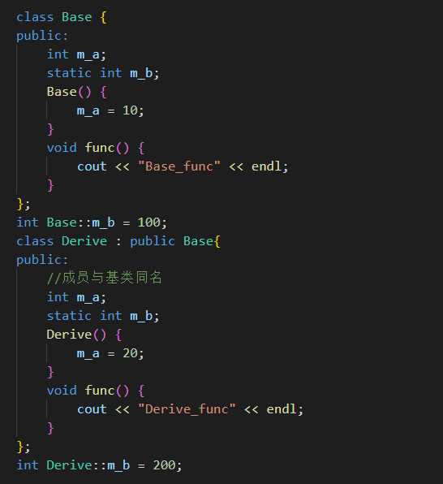

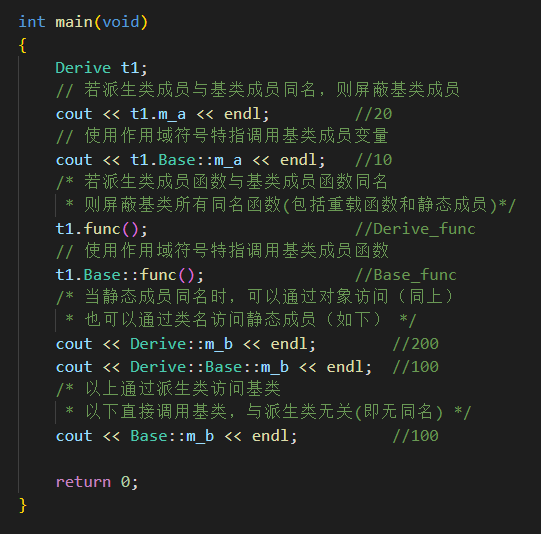

#### 多继承

- 不推荐使用多继承

#### 菱形继承

- 当`D`多继承了`B`和`C`，且`B`和`C`都继承了`A`，这时就形成了菱形继承

#### 虚继承 virtual

在菱形继承中，`A`是相同的一份，`D`可以通过`B`或者`C`来反问`A`，没有一个标准。虚继承则可以使`B` `C` `D`指向相同的一份`A`，则`A`叫做虚基类

1. 虚继承时，`Base1`内自动创建一个指向`Base`的指针
2. 虚继承时，`Base1`的大小为1个指向`Base`的指针 + `Base`的大小
3. 实继承时`Base1`的大小为`Base`的大小
4. 此时`Derive`的大小为2个指向`Base`的指针 + `Base`的大小

#### 向上转型

类是一种数据类型，也可以发生数据类型转换，不过这种转换只有在基类和派生类之间才有意义，并且只能将派生类赋值给基类，包括将派生类对象赋值给基类对象、将派生类指针赋值给基类指针、将派生类引用赋值给基类引用，这在 C++ 中称为向上转型（Upcasting）。相应地，将基类赋值给派生类称为向下转型（Downcasting）。

##### 将派生类对象赋值给基类对象

将派生类对象`B`赋值给基类对象`A`时，只会将派生类对象`B`中的基类的成员变量赋值给基类对象`A`。且只能用派生类对象给基类对象赋值，而不能用基类对象给派生类对象赋值。

赋值的本质是将现有的数据写入已分配好的内存中，对象的内存只包含了成员变量，所以对象之间的赋值是成员变量的赋值，成员函数不存在赋值问题。虽然有 `基类=派生类` 这样的赋值过程，但是基类调用的始终是基类的自身的函数。换句话说，对象之间的赋值不会影响成员函数，也不会影响`this`指针。

.

##### 将派生类指针赋值给基类指针

将派生类指针`B`赋值给基类指针`A`时，此时基类指针`A`指向派生类`B`内的基类地址（实际是A == B）。相当于限制派生类只能调用基类的成员（注：只有使用虚函数时，基类才可以调用派生类的成员函数）

### 1.4 多态

封装、继承和多态是C++面向对象三大特征。多态分为两类:

- 静态多态：函数重载和运算符重载属于静态多态，复用函数名
- 动态多态：派生类和虚函数实现运行时多态

静态多态的函数地址在编译阶段确定，动态多态的函数地址在运行阶段确定

#### 动态多态

##### 满足条件为

1. 派生类要重写基类的虚函数（注：在函数前加`virtual`即为虚函数）
2. 基类的指针或引用执行派生类的对象

##### 原理

当基类创建虚函数的同时会创建一个占4字节的指针`vfptr`，指向虚函数表`vftable`，该虚函数表内记录着基类的虚函数地址`&Animal::speak`。当派生类继承基类时，指针`vfptr`和虚函数表`vftable`都会继承过来。当派生类重写虚函数时，虚函数表内由原来记录基类的虚函数地址`&Animal::speak`变为记录派生类的虚函数地址`&Cat::speak`，所以调用虚函数时总是会使用派生类的虚函数
> 注：当实例化一个对象时，有一个派生类，派生类里面包含着一个基类

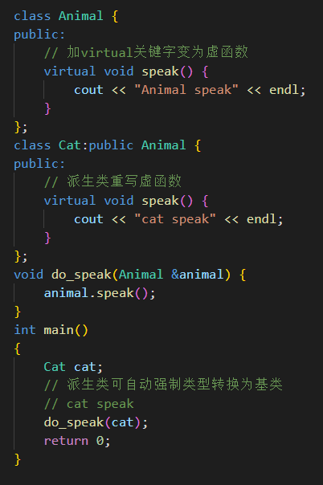

##### 使用多态创建计算器案例

上面的代码中，当`t1`指向不同的派生类对象`new Add;`或`new Mul;`时，`t1->get_result();`执行的结果是不一样的。同一条语句可以执行不同的操作，这就是多态
C++提供多态的目的是通过基类指针对所有派生类（包括直接派生和间接派生）的成员变量和成员函数进行全方位的访问，尤其是成员函数。如果没有多态，我们只能访问成员变量。

#### 纯虚函数和抽象类

1. 在虚函数后面加`= 0`即为纯虚函数；当类中有了纯虚函数，这个类就被称为抽象类
2. 抽象类无法实例化对象
3. 派生类必须重写抽象类（基类）的纯虚函数

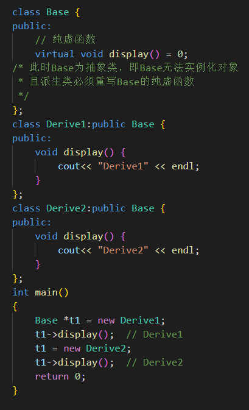

.

### 1.5 命名空间 namespace {#1.4}

1. 命名空间就是全局变量，命名空间A内的成员可以和命名空间B内的成员重名
1. using的功能是永久展开命名空间，无using关键字则是临时展开某个成员

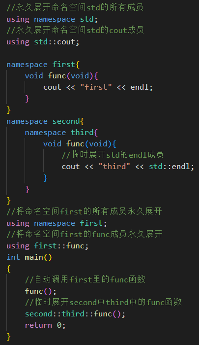

.

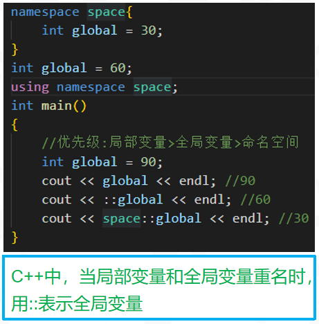

### 1.6 静态成员变量和静态成员函数（static） {#1.5}

1. 静态成员函数：**只能访问静态成员变量**（因为当有多个对象时静态函数能确定静态变量却不能确定动态变量）（注：[常对象只能调用常函数](#a2)））
1. 静态成员变量：类A的静态成员变量B必须在类内声明，类外初始化（静态成员函数随意）
1. 静态变量在编译阶段分配内存
1. 类的成员变量存储在栈区，类的静态成员变量、函数都存储在全局区
1. 静态成员变量和函数在全局区，仅有一份，所有实例化出的对象共享这一份

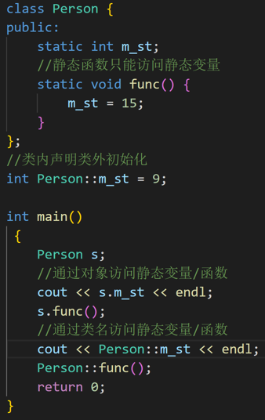

6. 空类在栈区仅占一个字节
7. 静态成员变量和普通函数不属于类的对象，即不增加类的对象的内存大小

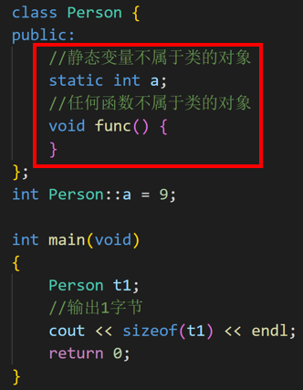

### 1.7 this 指针 {#1.6} 

1. 任何非静态成员函数都默认有`this`指针，且`this`指向调用该非静态成员函数的对象。例如`Person t1; t1.func(10)`。`func`内部的`this`指针指向`&t1`，`*this`表示`t1`
1. 空指针可以调用不含this的成员（因为空指针没有实体，就没有this）

.

3. `this`的原型是`Person *const this`，在函数后面加`const`叫常函数，则`this`变为`const Person *const this`
4. `const Person t1`，在对象定义时加`const`叫常对象。**常对象只能调用常函数**（注：[静态成员函数只能访问静态成员变量](#a1)）

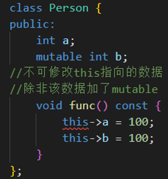

### 1.8 友元 friend {#1.7}

1. 全局函数声明为友元，则该全局函数就可以访问该类的所有成员（包括private成员）
1. 类声明为友元，则友元类中的所有成员函数都是另外一个类的友元函数
1. 类的成员函数声明为友元，则该函数可以访问该类的所有成员（包括private成员）

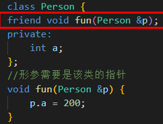

.

.

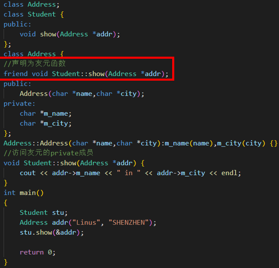

### 1.9 运算符重载 {#1.8}

**没看**

## 二、模版 {#2}

## 杂项

1. `string str;`相当于`char str[9];`
1. `srand(time(NULL));rand()%100;`生成一个随机数，范围0~99
1. int a = 156；将数字拆分(a%10会将a的个位数取出)
cout << (a / 1 % 10) << endl；	//6 
cout << (a / 10 % 10) << endl；	//5
cout << (a / 100 % 10) << endl；	//1
1. C++创建结构体变量时，"struct"可以省略
1. case内的代码过长，则要使用｛｝
1. C++中字符串指针存放在全局区，字符串数组在栈区 
1. switch的形参是int类型，不能判断数字范围

