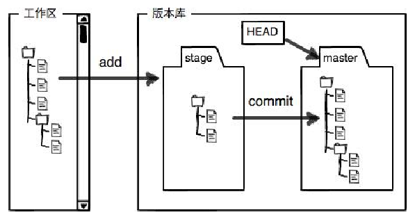
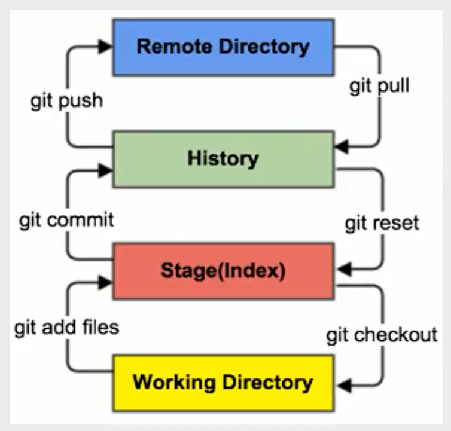
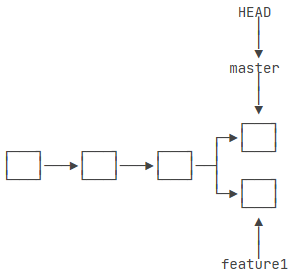
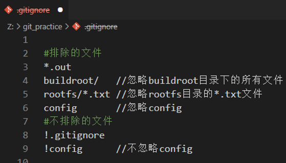

 
**Git**

______

[TOC]

___

## 01.简介 {#简介}

- 工作区(Workspace)：平时存放项目代码的地方
- 暂存区(Index/Stage)：用于临时存放改动信息
- 本地仓库(Repository)：存放所有提交的版本数据
- 远程仓库(Remote)：托管代码的服务器，Github就是个代码托管平台

- master指向提交，HEAD指向当前分支的最新提交。每次提交后，master分支都会向前移动一步

## 02.Git命令  {#Git命令}

|   |
命令
|
解释
|
|---|:---|:---|
|**01**|git init|在当前目录初始化创建Git仓库（注：从远端克隆一个仓库也可以初始化）|
|**02**|git config --global  user.name "qkh"|配置全局⽤户名（更换引号内容）|
|**03**|git config --global  user.email "qkh@bhlk.com"|配置全局⽤户名（更换引号内容）|
|**04**|git status|显示哪些⽂件已被staged、未被staged以及未被跟踪(untracked)|
|**05**|git add [file]|将`file`内所有修改加入到暂存区（注：`git add .`表示添加所有已修改文件(递归)）|
|**06**|git commit -m "message"|将暂存区的文件提交到版本库|
|**07**|git commit -m "简述" --amend|将暂存区的文件合并到最近⼀次的commit中（注：`-m "简述"`可略）|
|**08**|git show 7dd2|查看`commit id`所做的修改 （注：无`commit id`则查看HEAD的信息；加`--name-only`仅显示文件）|
|**09**|git show df58 >> temp.diff|将`commit id`所做的修改输出到`temp.diff`中 （注：无`commit id`则查看HEAD的信息；加`--name-only`仅显示文件）|
|**10**|git log (--color --graph --pretty=oneline)|显示提交记录（注：`f`往前翻，`b`往后翻）|
|**11**|git log -p [file]|显示`file`的所有提交记录。用来查看文件随时间的演变|
|**12**|git log -n [num]|仅显示`num`行提交记录|
|**13**|git log --oneline|提交记录显示在一行上|
|**14**|git log --pretty=oneline|详细显示提交记录显示在一行上|
|**15**|git reflog|显示本地repo的所有commit⽇志 （注：当返回到某版本时又想回去，可用来查看commit id）|
|**16**|git reset [file]|将`file`从暂存区移除，且⼯作区不变 （注：无`file`则移除暂存区的所有文件）|
|**17**|git reset --hard HEAD|HEAD即指针指向最近提交版本，HEAD^即指针指向第二个版本|
|**18**|git reset --hard 1094a|指针指向`commit id`（注：`--hard`表示清除暂存区和工作区的修改，新增文件即未跟踪的文件不会被清除，故恢复后推荐使用`status`查看状态）|
|**19**|git branch|列出所有本地分支|
|**20**|git branch -r|列出所有远程分支|
|**21**|git branch [name]|复制当前分支的文件到新建的分支|
|**22**|git branch [name] df58|复制当前分支的`df58`哈希到新建的分支|
|**23**|git branch -d [name]|删除分支（注：`D`为强制删除）|
|**24**|git branch -m [a] [b]|分支a重命名为b|
|**25**|git checkout -b [name]|新建一个分支，并切换到该分支（注：无`-b`为切换到某分支）|
|**26**|git switch -c [name]|新建一个分支，并切换到该分支（注：无`-c`为切换到某分支）|
|**27**|git switch -c [name] df58|新建一个哈希为`df58`的分支，并切换到该分支（注：无`-c`为切换到某分支）|
|**28**|git merge [name]|合并指定分支到当前分支|
|**29**|git merge --abort|终止合并|
|**30**|git diff|拿工作区和暂存区比较不同，若暂存区无文件则去版本库比较|
|**31**|git diff HEAD --[file]|拿工作区和版本库比较不同（注：无`file`则比较所有文件不同）|
|**32**|git format-patch HEAD -1|格式化补丁|
|**33**|git format-patch c7c37 -1|格式化补丁（注: 若`-2`表示格式化当前哈希值后面两个）|
|**34**|git apply --check [file.patch]|检查补丁是否可用|
|**35**|git apply [file.patch]|应用补丁|
|**36**|git checkout -- [file]|从暂存区恢复文件到工作区。若暂存区无文件则从版本库恢复 （注：`--`后面有空格；无`file`则恢复所有修改的文件）|
|**37**|git rm -r [file]|同时删除版本库和工作区的文件|
|**38**|git rm -r --cached [file]|仅删除版本库文件。即停止追踪`file`文件（ 注：用`.`可以停止追踪所有文件）|
|**39**|git stash save "简述"|储存当前工作现场 注：①未被追踪过的文件不会被储存，故stash之前要status查看有无新文件 ②分支未stash时不能切换到其它分支，否则当前文件会在其它分支出现|
|**40**|git stash list|查看stash的存储列表|
|**41**|git stash show -p [num]|对比list number文件和当前文件的不同（注：`-p`表示详细信息）|
|**42**|git stash pop [num]|将对应list number恢复到工作区且删除num（注：无number则恢复首个）|
|**43**|git stash apply [num]|将对应list number恢复到工作区且不删除num|
|**44**|git stash drop [num]|删除对应list number的数据且不恢复到工作区中|
|**45**|git stash clear|清除stash list存储列表|
|**46**|git cherry-pick [commit id]|复制单个提交所做的修改到当前分支（`merge`是合并某分支的所有提交） （`cherry-pick`会自动做一次提交）|
|**47**|git cherry-pick --continue|解决冲突后继续`cherry-pick`进程|

`stash`使用场景：

1. stash命令一般用于修复bug。把dev分支工作现场临时储存起来，然后从master创建临时分支temp，temp修复完bug并提交，切换到master分支并合并temp，切换到dev分支用`cherry-pick`命令修复bug，若有冲突则解决后add到暂存区，再`git cherry-pick --continue`继续cherry-pick进程。再用`stash pop`恢复现场，最后删除temp分支
2. 由于疏忽，本应该在dev分支开发的内容，却在master上进行了开发，可以用`git stash`将内容保存至堆栈中，切回到dev分支后，再次恢复内容即可
3. 在dev中暂时把文件stash起来然后push到远程，过段时间再pull拉取然后stash pop继续使用（注：stash的内容每个分支都可以使用）（也可以直接提交最后完成项目再合并多个提交）

## 03.Gitbub远程仓库 {#Gitbub远程仓库}

由于本地Git仓库和GitHub仓库之间的传输是通过SSH加密的，故要先将本地秘钥给远程仓库才能正确连接：

1. [创建本地SSH Key]()。在宿主目录下执行`ssh-keygen -t rsa -C "qkh@bhlk.com"`，然后一直回车。会在宿主目录中创建 id_rsa 私钥和 id_rsa.pub 公钥（注：windowns公钥在`/C/Users/丘康辉/.ssh/id_rsa.pub`中）
2. [Github加入公钥]()。打开Github在`settings——SSH`中加入id_rsa.pub公钥

创建远程仓库并使用SSH连接到本地：

1. 打开Github并点击`New repository`创建新的仓库。并复制该仓库的SSH远程路径
2. 在本地命令行中输入`git remote add origin git@github.com:K-Linux/my_practice.git`，意思是以后用 origin 代表远程路径（注：本地可以添加多个远程连接，即多个别名，这样可以指定远程仓库push和pull）
3. `git push -u origin  master`，将本地分支master推送到远程仓库（注：第一次推送要使用 -u 将本地库和远程库关联，关联后就不用每次都git push origin master ,  git pull origin dev。可以简化为git pull , git push）

连接完成后即可开始使用远程库命令：
|   |
命令
|
解释
|
|---|:---|:---|
|**01**|git remote -v|查看远程库信息|
|**02**|git remote rm origin|解除本地和指定远程库`origin`的绑定关系|
|**02**|git remote show origin|显示远程库`origin`，查看远程是否更新|
|**03**|git push origin master|将本地master推送到指定远程`origin`的指定分支（注：会自动创建远程库）|
|**03**|git push --all|将本地所有分支推送到远程库|
|**04**|git pull origin master|拉取远程`origin`的`master`到本地`origin/master`且合并到`master` （注：origin和master可以省略，即拉取关联分支合并到当前分支）|
|**04**|git fetch origin master|拉取指定远程库`origin`的`master`分支到本地`origin/master`但不合并到master （注：origin和master可以省略，即拉取关联分支到当前远程跟踪分支）|
|**05**|git reset --hard origin/master|将本地的状态回退到和远程的一样（实质是和远程跟踪分支一样）|
|**06**|git clone `https://github.com/K-Linux/my_practice.git`|初始化本地库并拉取远程库（注：默认仅拉取master分支）|
|**06**|git clone --branch dev [远程地址]|克隆远程dev分支（注：默认仅拉取master分支）|
|**07**|git switch -c dev origin/dev|拉取远程origin的dev分支到本地|

1. 从远程库clone时，只能看到本地的master分支，这时`git switch -c dev origin/dev`拉取远程origin的dev分支到本地，这时dev分支的push会推送到远程
2. origin/master是一个本地分支，也叫"远程跟踪分支"，指向远程仓库且无"实体"，相当于指针。当使用`git fetch origin master`时，本地的origin/master分支会更新至最新，但是master分支无变化，此时再用`git merge origin/master`即可将最新代码合并至master，master也就是最新代码了，也可使用git pull origin master直接代替git fetch+git merge

## 04.标签 {#04}

| 序号|
命令
|
解释
|
|:---:|:---|:---|
|**01**|git tag v1.0 f52c633|给 commit id 打上标签`v1.0`的标签（注：无id则是当前）|
|**02**|git tag -a v1.0 -m "version 1.0 released" 1094adb|给commit id创建标签`v1.0`，并注释说明（注：无id则是当前）|
|**03**|git tag|查看所有标签|
|**04**|git show v1.0|查看标签`v1.0`的详情|
|**05**|git tag -d v1.0|删除标签`v1.0`|
|**06**|git push origin v1.0|推送标签`v1.0`到远程|
|**07**|git push origin --tags|推送所有标签到远程|
|**08**|git push origin :refs/tags/v1.0|删除远程标签`v1.0`（实质是删除.git/refs/tags/v1.0）|
> 注：Git的标签虽然是版本库的快照，但其实它就是指向某个commit的指针

## 05.忽略文件 {#05}

在Git工作区的根目录下创建`.gitignore`文件，然后将不想被git追踪的文件名填入即可

|   |
命令
|
解释
|
|---|:---|:---|
|**01**|git add -f filename|强制加入git管理（若`filename`在.gitignore中被忽略了，但又想强制加入追踪）|
|**02**|git check-ignore -v filename|查看.gitignore是否有忽略filename|
|**03**|git rm -r --cached filename|取消git管理追踪。已经被管理的文件要先 git rm -r --cached filename 后，才能被 .gitignore|
>注：①在.gitignore中用`!`表示不忽略某个文件 ②空文件(夹)会默认被git忽略

示例

## 06.配置别名 {#配置别名}

暂无笔记

## 参考网址

- [廖雪峰Git](https://www.liaoxuefeng.com/wiki/896043488029600)
- [极客笔记](https://deepinout.com/git/git-tutorial/10_git_amend_command_a_comprehensive_guide.html)

___

## 临时文档

**使用基变返回到某提交并订正该提交**
1. git rebase -i df58 //将HEAD移动到需要修改的commit id的前一个commit id
2. 将需要修改的commit id的pick改成edit并保存退出
3. 在此commit id上修改文件
4. git add [该文件]
5. git commit --amend  //将修改的文件追加到此commit id中
6. git rebase --continue //将HEAD移动到最新的commit id中
7. 此时若与最新的commit id有冲突，则手动处理冲突
8. git add .
9. git commit --amend  //将冲突追加到此commit id中
10. git rebase --continue //将HEAD移动到最新的commit id中，此时一定要用show检查改动的文件

**使用基变合并多个提交**
1. git rebase -i df58 //将HEAD移动到需要修改的commit id的前一个commit id
2. 将需要合并的提交的pick改成 s 并保存退出(但是最上面的不要改，因为都要合并到该提交)
3. 修改提交信息（简述）并保存退出
