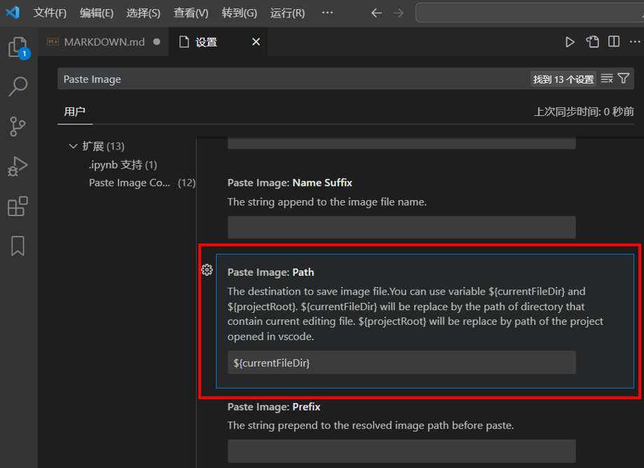
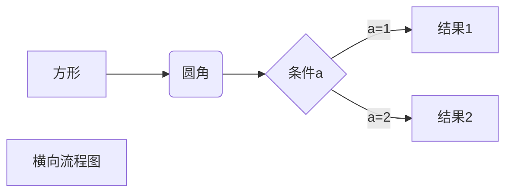
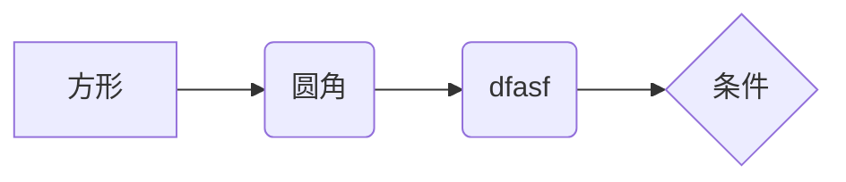
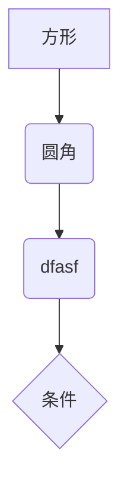

 <font size="7"><center>**MARKDOWN基本语法**</center></font>

___________________________________________________

[TOC]

___

## 0.目录

在顶部添加`[TOC]`，凡是以`#`定义的标题都会被编排到目录中

## 01.标题

- # 一个井号表示一级标题
- ## 二个井号表示二级标题
- ### 三个井号表示三级标题
- #### 四个井号表示四级标题

## 02.锚点

<a id="01">jump to here</a>

## 03.回车

1. 在行的末尾添加两个以上空格，再按回车键  
   即可回车  
2. 或者行末尾加 < br> <br>即可回车

## 04.段落

- 一行空白行

- 表示进入到下一段落文章（段落比回车高一点）

## 05.加粗和斜体

- 加粗用两个星号或者下划线，一个星号即斜体，例如：**双星** __下划__ *单星*
- 快捷键为 ctrl + b

## 06.块

在最前面添加一个 > 符号可以创建块引用。两个 > 则是嵌套块
> 引用名人说过的话语：
>> 读一本好书，就是在和高尚的人谈话。  
>> ——歌德

    上一行空白，这一行缩进n个空格即块效果（n >= 4）
-     如果存在有(无)序列表，则上一行可以不用空白，直接n个空格即可块效果（n >= 4）
还可以用" ```C "创建代码块（C表示C语言关键字高亮，可省略）
```C
int main(int argc, char *argv[]) {
    return 0;
}                               
```

```diff
+ 新增项
- 删除项
```

## 07.列表

1. 数字加点加空格
   - 一杠加空格即无序列表  
     - 无序列表嵌套  

- 无序列表 1.0
  - 无序列表 1.1
  - 无序列表 1.2

## 08.代码字体

- 代码字体用一点包含，例如：`printf("Linux\n");`

## 09.分隔线

1. 在单独一行上使用三个以上星号 (***)、破折号 (---) 或下划线 (___) ，即可创建分隔线
2. 为了兼容性，请在分隔线的前后均添加空白行
3. <font color="yellow">分割线推荐使用下划线</font>。因为连续的三个等号代表一级标题，连续的三个减号代表二级标题

## 10.可点击链接 {#10}

1. 链接格式：[链接名] (链接地址 "链接提示")
2. 这是 [Markdown官网](https://markdown.com.cn) 链接
3. 这是 [慕课Markdown教程](https://www.imooc.com/wiki/markdownlesson/markdowncolor.html "悬停显示") 链接
4. 尖括号生成可点击链接 <https://markdown.com.cn>
5. 双星加粗链接 **[Markdown Guide](https://www.markdownguide.org)**
6. [使用链接将文字变成蓝色]()
7. 链接嵌套。你去过[天坛][基链接]公园吗?[天坛][基链接]公园是个美丽的地方。
<!-- 要空一行 -->
[基链接]: http://www.tiantanpark.com

## 11.添加图片

- ctrl+点击图片链接，可以单独打开图片
-   
- 
- [](https://markdown.com.cn)

图片缩放
  

<center>使用`HTML`的`div`标签居中图片</center>

  <div align=center>
  
  </div>

<center>图片居中&缩放</center>

<div align=center></div>

## 12.转义字符

- 转义字符为反斜杠 \，例如：\**斜*  

## 13.表格

---:表示左对齐
:---:表示居中
表格的最大宽度为750px

|    |<div style="width:200px">周一</div>|周二|周三|周四|周五|
|---:|:---:|---|---|---|:---:|
|**1**|数学|英语|数学|语文|思想品德|
|**2**|美术|数学|品德|数学|语文|

## 14.跳至锚点

[点击跳转至锚点](#01)  

## 15.隐藏代码

<details>
<summary>点击展示代码</summary>

<!-- 以上要空一行 -->
```C
printf("Linux\n");
```
</details>

## 16.自定义列表

第一行为标题。下一行开头为冒号，后跟一个空格和定义

第一项
: This is the definition of the first term.

第二项
: This is one definition of the second term.
: This is another definition of the second term.

## 17.任务列表

- [x] Write the press release
- [ ] Update the website
- [ ] Contact the media

## 18.删除线

~~世界是平坦的。~~ 我们现在知道世界是圆的。

## 19.纯字符串链接

`http://www.example.com`

## 20.Markdown Preview Enhanced插件打印PDF {#20}

1. 用`Markdown Preview Enhanced`打开预览  
2. 在预览界面右键点击`Open in Browser`  
3. 用浏览器导出PDF文件
(用== ==可以高亮字符。例如：==高亮==)

## 21.Paste Image插件粘贴图片 {#21}

图片会默认保存在当前编辑文档的所在目录，也可以自定义路径

1. 文件——首选项——设置——搜索"Paste Image"
2. 修改 Paste Image: Path。原本是`${currentFileDir}`，改成`${currentFileDir}/img`，即在当前目录创建img文件夹。(如果img文件夹不存在则自动创建)

3. `ctrl+alt+v`粘贴图片

## 22.页内跳转 {#22}

1. [跳转到`10.可点击链接`](#10)
2. 不能有大写，不能有空格
3. 如果有`.`符号，则要省略
[跳转到22](#22)

## 23.使用`<font>`标签修改字号和前景色 {#23}

### 字号

  <font size="1">1号字 最小</font>
  <font size="3">3号字 默认</font>
  <font size="7">7号字 最大</font>

### 前景色

  <font color="red">英文控制颜色</font>
  **<font color="yellow">颜色+粗体</font>**
  <font color="rgb(100, 200, 100)">RGB值颜色</font>
  <font color="#FF00BB">使用十六进制值颜色</font>

### 字体居中

<center>示例</center>

## 24.上下标 {#25}

1. 上标，例如:X^2^
2. 下标，例如:H~2~O

___________________;

## MARKDOWN教程网址

- [慕课](https://www.imooc.com/wiki/markdownlesson/markdowncolor.html)
- [官网](https://markdown.com.cn)

___

## 流程图







