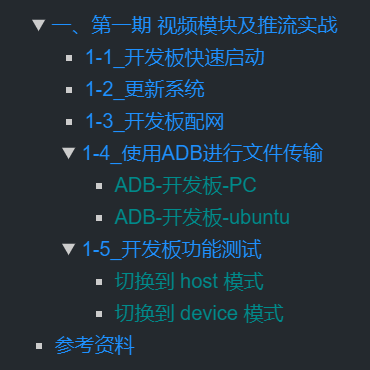

 <font size="7"><center>**临时记录**</center></font>
___

[TOC]

___

## <font color="1E90FF">C 语法</font>

____________________________________

## <font color="1E90FF">硬件</font>

____________________________________

## <font color="1E90FF">ubuntu</font>

____________________________________

## <font color="1E90FF">网络</font>

____________________________________

## <font color="1E90FF">int，short，char</font>

int、short、char都是数字类型，数字范围依次减少。但是char比较特殊，不但可以给char赋值-128~127的数字，也可以赋值单个字符。<font color="yellow">当给char赋值数字时，是给ASCII的十进制赋值数字，当给char赋值字符时，是给ASCII的字符赋值字符</font>。打印的时候不但可以用%c也可以用%d打印

```C
//char a = 55 和 char a = '7' 是等价的
//用%d打印a是55，用%c打印a是字符7
char a = 55;
char b = '7';
printf("%d\n", a)   // 55
printf("%c\n", a)   // 7

printf("%d\n", b)   // 55
printf("%c\n", b)   // 7

// char 类型赋值 0 就是 '\0'
char c[32] = {0};
if (0 == c[6])
    printf("c[6] == 0")   // 会打印
if ('\0' == c[6])
    printf("c[6] == '0'")   // 会打印
```

有符号字符 char 值的范围是： -128 ~ 127
无符号字符 unsigned char 值的范围是：0 ~ 255
ASCII码值的范围是：0 ~ 127

___

## <font color="1E90FF">float a = 0.0</font>

float a = 0.0;会存在一个双精度浮点数（C里默认浮点常量是double的）转换为单精度的过程，防止被编译器优化掉这个过程。后面加`f`更靠谱，float a = 0.0f
___

## <font color="1E90FF">井号`#`表示带格式输出</font>

`#`表示带格式输出
int a = 0x168;
printf("%#x", a); //打印`0x168`
printf("%x", a);  //打印`168`
___

## <font color="1E90FF">OTG</font>
OTG即On-The-Go的英文缩写，是一项用于USB设备连接和数据交换的技术。凡具备OTG功能的设备，通过OTG接口转换器就可以连接并控制常规的USB设备，比如U盘、鼠标、键盘、打印机等。总之OTG功能就是用来连接USB设备的。
___

## <font color="1E90FF">串口、COM口、UART口, TTL、RS232、RS485区别详解</font>

串口、UART口、COM口、USB口是指的物理接口形式(硬件)。而TTL、RS232、RS485指的是电平标准(电信号)

RS-232 电平需要用 DB9 接口

串口是一个泛称，UART，TTL，RS232，RS485都遵循类似的通信时序协议，因此都被通称为串口。

嵌入式里面说的串口，一般是指UART口，通常也叫COM口。UART有4个pin（VCC, GND, RX, TX）

UART 一般的接口电平有 TTL 和 RS-232，其中 TXD 和 RXD 引脚，低电平表示逻辑 0，高电平（3.3V或以上）表示逻辑 1，这个就是 TTL 电平（电平信号）。RS-232 采用差分线（差分信号），-3~-15V 表示逻辑 1，+3~+15V 表示逻辑 0

参考：<https://zhuanlan.zhihu.com/p/89240672>
___

## <font color="1E90FF">有源和无源蜂鸣器的区别</font>

有源蜂鸣器内部带震荡源，价格贵，发声频率固定
无源蜂鸣器内部不带震荡源，通过方波去驱动，发音频率可改变
___

## <font color="1E90FF">晶体振荡器</font>

晶体振荡器 OSC（oscillator）简称晶振，主要的特性就是通电后会产生机械震荡，可以给单片机提供稳定的时钟源，晶振提供时钟频率越高，单片机的运行速度也就越快

<font color="yellow">无源晶振</font>是有2个引脚的无极性元件，需要借助于时钟电路通电才能产生振荡信号，自身无法振荡起来

<font color="yellow">有源晶振</font>有4个引脚，是一个完整的振荡器，只需要电源，就可输出比较好的波形
___

## <font color="1E90FF">RGB屏和MCU屏</font>

MCU-LCD屏它与RGB-LCD屏主要区别在于显存的位置：
RGB-LCD的显存是由主机系统内存充当的,因此其大小只受限于系统内存的大小,这样RGB-LCD可以做出较大尺寸,象现在4.3"只能算入门级,而MID中7",10"的屏都开始大量使用

MCU-LCD的设计之初只要考虑单片机的内存较小,因此都是把显存内置在LCD模块内部.然后软件通过专门显示命令来更新显存,因此MCU屏往往不能做得很大.同时显示更新速度也比RGB-LCD慢.

<div align=center></div>

<div align=center></div>

MCU-LCD屏它与RGB-LCD屏量示数据传输模式也有差别：
        RGB屏只需显存组织好数据。启动显示后。LCD-DMA会自动把显存通过RGB接口送到LCM。
        MCU屏则需要发送画点的命令来修改MCU内部RAM。（即不能直接MCU屏RAM）所以RGB显示速度明显比MCU快,而且播放视频方面,MCU-LCD也比较慢.


参考：<https://blog.csdn.net/vrk731/article/details/85221189>
___

## <font color="1E90FF">上/下拉电阻</font>

上拉电阻就是接一个电阻后再接到VCC上，从而将a点拉成高电平。若按键开启，则a点为低电平。这样就可以确定a点的电平高低了

电路中加上拉电阻或下拉电阻的目的是确定某个状态电路中的高电平或低电平。简单来说，电源到器件引脚上的电阻叫上拉电阻，<font color="yellow">作用是平时使用该引脚为高电平</font>；地到器件引脚的电阻叫下拉电阻，<font color="yellow">作用是平时使该引脚为低电平</font>

不接上/下拉电阻，则称为悬空

<div align=center></div>

___

## <font color="1E90FF">三极管</font>

<div align=center></div>

NPN是基极电压大于(击穿)发射极时流通
PNP是发射极电压大于(击穿)基极时流通
基极 + 集电极 = 发射极
P：positive 正极
N：negative 负极

<div align=center></div>

___

## <font color="1E90FF">万用表</font>

V 为测电压
Ω 为测电阻。压下黄色按键，若电阻为 0 则万用表报警，说明电路是接通的
___

## <font color="1E90FF">推挽输出和开漏输出</font>

推挽输出（Push-Pull Output）：的特点是可以真正的输出高电平和低电平，且这两种电平都具有驱动能力。输出多少伏就是多少伏，不会减少

开漏输出（Open Drain Output）：开漏输出无法真正输出高电平，即高电平时没有驱动能力，需要借助外部上拉电阻完成对外驱动
___

## <font color="1E90FF">进制缩写</font>

O ：Octet， 八进制
B ：Binary， 二进制
H ：Hex， 十六进制
D ：Decimal， 十进制
___

## <font color="1E90FF">C调用C++函数</font>

用C++写的函数可以被C调用，原理就是用特定的符号声明该函数，让该函数用C编译器编译

```C++
//这里是头文件，当其他.cpp文件包含该头文件时就会将 func1 和 func2 函数用C编译器编译
#ifdef __cplusplus
extern "C" {
#endif
int func1(void);
int func2(void);
#ifdef __cplusplus
}
#endif
```

___

## <font color="1E90FF">使用函数获取堆内存方式</font>

```C
#include <stdio.h>
#include <stdlib.h>
#include <string.h>

//传入指针时只能改变解引用
void getmemory_error(char *p) {
    p = (char *)malloc(100);
}
//传入二重指针能改变原指针的值
void getmemory_ok(char **p) {
    *p = (char *)malloc(100);
}
//一般用此方式返回malloc内存
//函数结束时会释放栈区的p，堆区的首地址则返回
char *getmemory_yes(void) {
    char *p = (char *)malloc(100);
    return p;
}

int main(int argc, char *argv[])
{
    char *str;

//一、错误方式获取堆内存
    //相当于char *p = str;即让p指向str
    //然后p又指向了malloc,此时str什么都没得到
    getmemory_error(str);

//二、二重指针获取堆内存
    //将指针str的地址传入，函数里面就可以解引用二重指针来修改指针str的值了
    getmemory_ok(&str);
    strcpy(str, "china");
    printf("%s\n", str);    //china
    //清除堆内存数据"china"，但是堆内存地址一直都是存在的，且str还是指向该地址
    free(str);
    //虽然执行了free(str)，但是str还指向该堆内存的首地址，且该地址数据清零了，所以可以重复使用
    //但已经free了，就千万别再使用该地址了
    strcpy(str, "linux");
    printf("%s\n", str);    //linux

//三、使用return返回堆内存
    //一般用此方式返回malloc内存
    str = getmemory_yes();
    strcpy(str, "bhlk");
    printf("%s\n", str);    //bhlk

    return 0;
}
```

___

## <font color="1E90FF">extern</font>

其它文件使用全局变量时，需要用`extern`关键字声明全局变量

全局变量一定要定义在`.c`文件中

B要使用A的全局变量时，就在B的头文件中用`extern`关键字声明该全局变量
或者在`a.c`定义全局变量`int a;`，在`a.h`中用`extern int a;`声明，然后其它文件用`include`包含`a.h`头文件

`extern`声明全局结构体时，要包含结构体的成员定义（声明全局结构体时extern可以省略）

```C
// 声明不能赋值
extern int a;
```

```C
// main.c 文件定义全局结构体
struct test;
// main.h 文件声明全局结构体
#ifndef _MAIN_H_
#define _MAIN_H_
struct test {
    int b;
};
#endif
// b.c 文件 extern 全局结构体
extern struct test;
// b.h文件
#ifndef _B_H_
#define _B_H_
TODO
#endif

```

___

## <font color="1E90FF">时间函数</font>

```C
int main(int argc, char *argv[])
{
    time_t  time_now = 0;
    time_t  mktime_t = 0;
    char strftime_buf[64] = {0};
    struct tm *localtime_buf = NULL;
    struct tm *gmtime_buf = NULL;
    struct timeval gettimeofday_buf = {0};

    time(&time_now);
    localtime_buf = localtime(&time_now);
    gmtime_buf = gmtime(&time_now);
    mktime_t = mktime(localtime_buf);
    strftime(strftime_buf, sizeof(strftime_buf), "%Y-%m-%d", gmtime_buf);
    gettimeofday(&gettimeofday_buf, NULL);

    printf("time_now:%ld\n",  time_now);
    printf("mktime:%ld\n",  mktime_t);
    printf("year:%d, mon:%d\n", localtime_buf->tm_year+1900, localtime_buf->tm_mon+1);
    printf("year:%d, mon:%d\n", gmtime_buf->tm_year+1900, gmtime_buf->tm_mon+1);
    // strftime 函数可自定义时间格式
    printf("strftime_buf:%s\n", strftime_buf);
    // tv_sec == time_now == mktime_t 这三个变量的值是一样的
    printf("tv_sec:%ld, tv_usec:%ld\n", gettimeofday_buf.tv_sec, gettimeofday_buf.tv_usec);

    return 0;
}
```

___

## <font color="1E90FF">int 强制转化为 int *</font>

当`int`类型强制转化为`int *`时，`int *`的值和`int`是一样的，值一样，仅数据类型变了

```C
int a = 0x8000;
//相当于 (int *)0x8000
printf("%p\n", (int *)a);   //打印0x8000
```

___

## <font color="1E90FF">int的二进制位移</font>

```C
int a = 9;
register = a >> 15;  /* 设置寄存器的高16位 */
register = a << 15;  /* 设置寄存器的底16位 */
```

___

## <font color="1E90FF">中断的CPSR和SPSR寄存器</font>

在马上要跳转模式时，cpsr会将当前模式的数据保存给spsr，然后改变cpsr的M位，转到另一个模式。
例如：IRQ模式下将cpsr数据保存给IRQ模式下的spsr，然后改变cpsr的M位，转到SVC模式，处理完事件后又将cpsr数据保存给SVC模式下的spsr，然后改变cpsr的M位，转到IRQ模式，然后将IRQ模式下的spsr恢复给cpsr

>注意：cpsr寄存器只有唯一的一个，cpsr的M[4:0]位可以任意改变模式

___

## <font color="1E90FF">子网掩码</font>

IP地址中32位实际包含2部分，即IP地址 = 网络(段)地址 + 主机地址。子网掩码只有一个作用，就是将IP地址划分为网络地址和主机地址。子网掩码为1的部分表示网络地址，为0部分表示主机地址

如何判断2个IP地址是否在同一子网内 ？

1. 2个IP地址的网络地址必须相同（主机地址可以不同）那么就处于同一网络。
1. 网络标识 = IP地址 & 子网掩码。2个IP地址的网络标识一样，那么就处于同一网络。

如果子网掩码为255.255.0.0时，
192.168.1.102 & 255.255.255.0 = 192.168.1.0
192.168.1.253 & 255.255.255.0 = 192.168.1.0
以上两个地址处于同一网络/网段

192.168.1.4和192.168.12.5
如果子网掩码是255.255.255.0那么不在同一网段。如果子网掩码是255.255.0.0那么就在同一个网段

<font color="yellow">子网掩码为1的部分相同，为0的部分随意，则在同一网段</font>

___

## <font color="1E90FF">VMware/ubuntu</font>

**<font size="4" color="1E90FF">修改ubuntu主机名称</font>**

主机名存放在/etc/hostname文件中，修改主机名后重启系统后即可

**<font size="4" color="1E90FF">Alt + F7，拖动窗口</font>**

**<font size="4" color="1E90FF">ubuntu设置双网卡</font>**

虚拟机——设置——添加——网络适配器——桥接模式——编辑——虚拟机——更改设置——桥接连接至网卡1或网卡2——(后面步骤不要执行)(sudo dhclient(自动获取IP) 或 右上角关闭网络再打开网络)

如果网络连接不上了则恢复网络设置
windows搜索——"虚拟网络编辑器"——还原默认设置

___

## <font color="1E90FF">markdonw笔记规范</font>

1. 关键词用<font color="yellow">黄色高亮</font>
1. 两个段落之间用回车
1. 命令、变量、关键词、用字符串符号 `val_string`
1. 大章节前面要加中文数字且用2个#，小章节前面要加阿拉伯数字且用3个#，小章节标题用4个#，最多用4个#且只用蓝和绿两个标题颜色，模板如下
`## <font color="1E90FF">一、第一期 视频模块及推流实战</font>`
`### <font color="1E90FF">1-5_开发板功能测试</font>`
`#### <font color="008B8B">切换到 host 模式</font>`



___

## <font color="1E90FF">彩色打印</font>

[^彩色输出]

```C
printf("\033[41;30mdebuglog\033[0m: %s:%d [contains]\n", __FILE__, __LINE__);
```

```sh
# shell脚本
#!/bin/bash
echo -e "\033[5;33mdebuglog\033[0m:[contains]"
#!/bin/sh
echo "\033[5;33mdebuglog\033[0m:[contains]"
```

___

## <font color="1E90FF">NFS</font>

NFS[^NFS]（Network File System）即网络文件系统，它允许网络中的计算机之间通过 TCP/IP 网络共享资源。在NFS的应用中，本地NFS的客户端应用可以透明地读写位于远端NFS服务器上的文件，就像访问本地文件一样。这样我们开发板在 uboot 启动时就可以访问远程 ubuntu 中的根文件系统了

我们先在 ubuntu 中搭建 NFS 服务器：

1. `sudo apt install nfs-kernel-server  //安装 NFS 服务端`
1. `sudo systemctl status nfs-server    //检查nfs-server是否已经启动`
1. `sudo mkdir -p /home/k/nfs           //在根目录下创建NFS共享目录(目录随意)`
1. `sudo chown nobody:nogroup /home/k/nfs//权限不分组`
1. `sudo chmod -R 777 /home/k/nfs       //给客户端分配最高权限访问该共享目录`
1. `sudo vim /etc/exports               //编辑 /etc/exports 配置文件`

```C
/home/k/nfs 172.16.3.50(rw,sync,no_subtree_check)//设置哪些客户端IP可以访问该共享目录(可设置多个IP)
/home/k/nfs 172.16.3.*(rw,sync,no_subtree_check)//设置一个网段的客户端可访问（推荐用这个）
/home/k/nfs *(rw,sync,no_subtree_check)         //设置所有客户端可访问该共享目录
//rw 表示允许读写
//sync 表示文件同时写入硬盘和内存
//no_subtree_check 表示即使输出目录是子目录，nfs服务器也不检查其父目录的权限，这样可以提高效率
```

7. `sudo vim /etc/default/nfs-kernel-server    //从Ubuntu17.04开始，nfs默认只支持协议3和4，kernel默认支持nfs协议2`

```C
RPCNFSDOPTS="--nfs-version 2,3,4 --debug --syslog"  //添加这句话让ubuntu支持NFS协议2、3、4版本
```

8. `sudo exportfs -rv  导出共享目录`
9. `sudo /etc/init.d/nfs-kernel-server restart //重启NFS服务器`
10. `showmount -e   //查看共享目录`

___

## <font color="1E90FF">SSH</font>

开启 Ubuntu 的 SSH 服务以后我们就可以在 Windwos 下使用终端软件登陆到 Ubuntu，比如使用 SecureCRT

Ubuntu 下使用如下命令开启 SSH 服务：
`sudo apt-get install openssh-server`

如果有报错，则把报错的文件都删除，例如`sudo rm /var/lib/dpkg/lock-frontend` 等等

上述命令安装 ssh 服务，ssh 的配置文件为/etc/ssh/sshd_config，使用默认配置即可

PC上使用Xshell执行`ssh 192.168.10.20`来连接ubuntu

___

## <font color="1E90FF">samba</font>

1. `sudo apt update`[^samba]
1. `sudo apt install samba -y`
1. `mkdir -p samba //创建需要共享的目录`
1. `chmod 0777 samba`
1. `sudo vim /etc/samba/smb.conf`

```C
//在该文件末尾配置以下信息
[ubuntu_22]                 //共享目录名称，在网络上访问该共享目录时使用
    comment = samba         //共享目录的简介描述
    path = /home/k/samba    //共享实际路径
    public = yes            //这表示该共享是否为公共共享，即是否允许匿名用户访问。       
    writable = yes          //表示是否允许用户在共享中创建、编辑和删除文件。
    available = yes         //表示该共享是否可用。
    browseable = yes        //表示该共享是否在网络上可以浏览。
    valid users = k         //当前 Ubuntu 系统的用户名
```

6. `sudo smbpasswd -a k //给k用户设置密码`
1. `systemctl restart smbd.service // 重启 Samba 服务器`
1. `systemctl enable smbd.service //密码验证时都是输入系统用户k的密码`
1. `systemctl status smbd.service //查看samba服务器运行状态`
1. 给ubuntu配置成静态IP
1. `win+r` 并输入 ubuntu 地址 `\\192.168.10.20`
1. 输入 samba 服务器帐号和密码
1. 右键 samba 共享目录，点击映射网络驱动器
1. 直接点击确定即完成 samba 配置

___

## <font color="1E90FF">vscode排除搜索文件</font>

```json
//在工作区的顶层目录创建  .vscode\settings.json
{
    "editor.codeActionsOnSave": {
    },
    "search.exclude": {
        "**/node_modules": true,
        "**/*.code-search": true,
    },
    "files.exclude": {
        "**/.git": true,
        "**/.svn": true,
        "**/Thumbs.db": true,
    }
}
```

___

## <font color="1E90FF">vscode 自定义代码补全</font>

1. ctrl + shift + p
1. 输入 `snippets`
1. 配置代码片段（Configure Snippets）
1. 选择需要配置的语言
1. 输入自定义的代码补全

```json
{
    //prefix 是代码前缀；body 是代码补全内容
    // 注意 " 和 \ 要转义成字符
    "debug_printf": {
        "prefix": "debug_printf",
        "body": [
            "printf(\"\\033[41;30mdebuglog\\033[0m: %s:%d [contains]\\n\", __FILE__, __LINE__);"
        ],
        "description": "debug_printf"
    }
}
```

___

## <font color="1E90FF">环境变量PATH</font>

环境变量的含义就是系统在查找可执行程序（如gcc）时，<font color="yellow">会自动到环境变量所指定的目录搜索目标</font>。linux系统可以有很多个环境变量。其中有一部分是linux系统自带的。`PATH`就是系统自带的环境变量。输入`echo  $PATH`可打印`PATH`的内容，可知`PATH`的范围都在 `/usr` 内

- `PATH`是系统可执行程序环境变量
- `LD_LIBRARY_PATH`是系统动态链接库环境变量

___

## <font color="1E90FF">制作静态库和动态库</font>

动/静态库都是先编译多个.o文件，然后将多个.o文件链接成一个动/静态库

动/静态库起名格式为: `lib库名.a` 或者 `lib库名.so`

动态库和静态库编译链接格式都是`gcc -c main.c -o main -L. -lname`。gcc会优先链接动态库，若未找到.so文件才加载.a文件。若要定义链接静态库则需要用`-static`参数来指定链接静态库，例如`gcc -c main.c -o main -L. -lname -static`

<font color="1E90FF">静态库.a</font>：就是将自己的源代码经过只编译不连接 -c 形成 .o 的目标文件，然后用ar工具将.o文件归档成.a静态链接库文件。商业公司通过发布.a库文件和.h头文件来提供静态库给客户使用；客户在自己的.c文件中直接声明和调用这些库文件，用户使用候编译链接主函数时会来链接.a中相关功能函数，生成一个可执行文件。

<font color="1E90FF">动态库.so</font>：现在我们一般都是使用动态库。静态库在用户链接可执行程序时就已经把调用的库中的函数的代码段链接进最终可执行程序中了，坏处是太占地方了。尤其是有多个应用程序都使用了这个库函数时，在多个应用程序最后生成的可执行程序中都各自有一份这个库函数的代码段。当这些应用程序同时在内存中运行时，实际上在内存中有多个这个库函数的代码段，这完全重复了。而动态链接库本身不将库函数的代码段链接入可执行程序，只是做个标记。然后当应用程序在内存中执行时，运行时环境发现它调用了一个动态库中的库函数时，会去加载这个动态库到内存中，然后以后不管有多少个应用程序去调用这个库中的函数都会跳转到第一次加载的地方去执行（不会重复加载）


### <font color="1E90FF">gcc编译库参数</font>

```shell
gcc hello.c -o hello -I /home/k/include -L /home/k/lib -lapi
#-I  i表示指定头文件路径path
#-l  表示指定库函数名pathname。例如指定libjpeg.so库用-ljpeg，即-l是-lib的缩写
#-L  表示指定库函数路径path

#-I(i) /home/k/include  表示头文件目录寻找顺序是 /home/k/include -> /usr/include -> /usr/local/include
#-L /home/k/lib  表示库文件目录寻找顺序是：/home/k/lib -> /lib -> /usr/lib -> /usr/local/lib
#-lapi  表示动态库文件名libapi.so（加入 -static 表示链接静态库文件）
```

### <font color="1E90FF">静态库</font>

```shell
#a.c依赖b.c，b.c依赖c.c
#将每个.c文件编译成.o文件，编译时若需要静/动态库则要指定静/动态库（不能将多个.c文件编译成一个.o文件）
gcc -c a.c -o a.o $(LIBPATH) $(STATICLIB)
gcc -c b.c -o b.o $(LIBPATH) $(STATICLIB)
gcc -c c.c -o c.o $(LIBPATH) $(STATICLIB)
#将多个.o文件打包成一个静态库.a文件
ar -rcs libapi.a a.o b.o c.o

#实际调用静态库
gcc main.c -L . -lapi -static
./a.out #程序内已经包含静态库文件，可以直接运行
```

> ar命令参数
> -s: 重置静态库文件索引
> -r: 将.o文件插入静态库尾（会替换库中同名.o文件）
> -c: 创建静态库文件

### <font color="1E90FF">动态库</font>

```shell
#a.c依赖b.c，b.c依赖c.c
#将每个.c文件编译成.o文件，编译时若需要静/动态库则要指定静/动态库（不能将多个.c文件编译成一个.o文件）
gcc -c a.c -o a.o $(LIBPATH) $(STATICLIB) -fPIC
gcc -c b.c -o b.o $(LIBPATH) $(STATICLIB) -fPIC
gcc -c c.c -o c.o $(LIBPATH) $(STATICLIB) -fPIC
#将多个.o链接成一个动态库.so文件
gcc -o libapi.so a.o b.o c.o -shared

#实际调用动态库
gcc main.c -L . -lapi
export LD_LIBRARY_PATH=$LD_LIBRARY_PATH:(动态库的路径)
./a.out #电路板上的程序运行时需要到板子上的环境变量中加载动态库,
        #故板子上自定义的动态库路径需要导出到环境变量，以便让程序找到
```

> `-fPIC` 表示生成位置无关码 `position independent code`
> `-shared` 表示生成动态库.so文件，按照共享库的方式来链接

程序内部包含了静态库，所以可以直接加载静态库。但是程序加载动态库时需要到环境变量中加载，将动态库导出到环境变量的方式为：
1. 将动态库文件放到系统库目录`/usr/lib`或`/lib`
2. 将动态库文件所在的路径导出到环境变量`LD_LIBRARY_PATH`。例如 `export  LD_LIBRARY_PATH=$LD_LIBRARY_PATH:/mnt/mtd`

> 系统链接动态库时会先去`LD_LIBRARY_PATH`环境变量所指定的路径寻找动态库，然后再去`/lib`寻找，最后去`/usr/lib`寻找
> `PATH`是可执行程序环境变量，`LD_LIBRARY_PATH`是动态链接库环境变量 

___

## <font color="1E90FF">vim 配置</font>

[vimrc.txt](attachment/vimrc "点击打开")

将 vimrc.txt 拷贝并改名到 ~/.vimrc

___

## <font color="1E90FF">Xshell 配置</font>

[highlight.hls](attachment/highlight.hls "点击打开")

**关键字高亮**

1. 将 highlight.hls 拷贝到 C:\Users\82717\Documents\NetSarang Computer\7\Xshell\HighlightSet Files 目录中
1. Xshell 点击`工具`—`突出显示集`—`highlight`—`设置为当前组`—`关闭`

```
highlight.hls 配置文件语法解释

Keyword=(\bactive(d)?\b)|(\bsuccess(ful(ly)?|ed)?\b)|(\btrue\b)|(\bok\b)|(\bup\b)|(\brun(ning)?\b)|(\bdeployed\b)|(\bunlocked\b)|(\bstart(ed|ing)?\b)|(\bbegin(ning)?\b)|(\benable(d)?\b)|(\bcreate(d)?\b)|(\bopen\b)
\b: 是单词边界的意思，确保匹配的是完整的单词，而不是单词的一部分
active(d)?: 中的 (d)? 表示 "d" 这个后缀是可选的
|: 用来连接多个括号里的规则
successs 里是嵌套可选

TermBackColor=1：终端背景色设置，具体颜色由编辑器定义。
Underline=0：匹配文本不带下划线。
Bold=0：不加粗。
Strikeout=0：不删除线。
BackColorIndex=286 和 TextColorIndex=286：颜色索引，具体颜色依编辑器而定。
UseRegex=1：表示 Keyword 字段是正则表达式。
Italic=0：不斜体。
Enable=0：当前规则未启用。
CaseSens=0：不区分大小写。
```

**复制粘贴**

Xshell 点击`工具`—`选项`—`键盘和鼠标`—取消`输入/输出终端时滚到底部`—开启`按键滚动到底部`—`确定`

**滚轮后界面不动**

Xshell 点击`属性`—`终端`—`高级`—`编辑`—`新建`—输入需求快捷键—`类型`选项选择`菜单`—下一项选择`复制`—`确定`


[^彩色输出]:[printf 彩色输出](https://www.cnblogs.com/lewki/p/14343894.html)
[^NFS]:[良许搭建NFS服务器](https://www.lxlinux.net/6086.html)
[^samba]:[Samba服务器搭建教程](https://blog.csdn.net/qq_42417071/article/details/136328807)