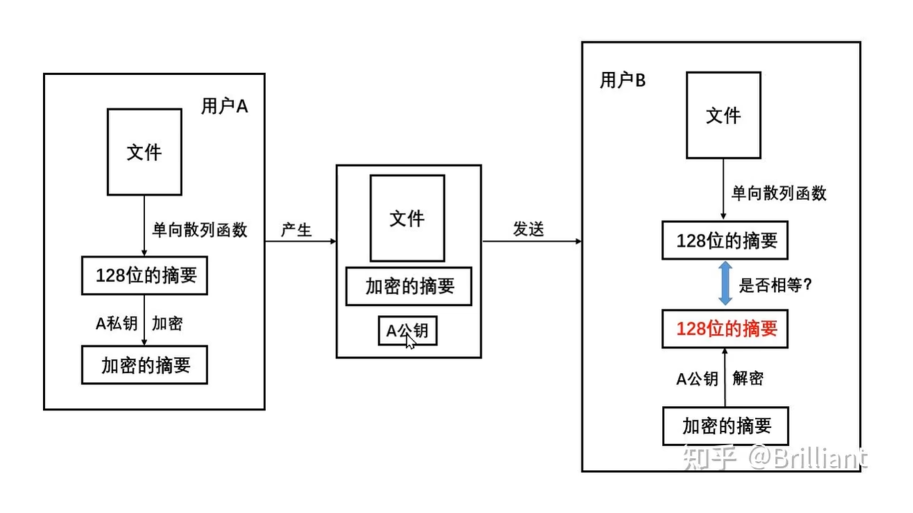

<font size="7"><center>**OPENSSL**</center></font>

___

[TOC]

___

## <font color="1E90FF">基础简介</font>

Base64 编码是用于将二进制数据转化为 ASCII 字符串的技术

## <font color="1E90FF">一、openssl 基础</font>

摘要也称哈希值，表示输入任意长度的数据，都会输出固定长度的数据。通过摘要算法（比如MDS和SHA-1）就可以得到该哈希值。

摘要算法不是加密算法，不能用于加密，因为无法通过摘要反推明文，只能用于防篡改
对摘要进行加密就是数字签名

有几种常见的哈希算法，如MD5、SHA-1、SHA-256等

<table>
  <tr><td width="0%"><font color=white>算法</td><td width="0%"><font color=white>长度</td></tr>
  <tr><td width="0%"><font color=white>MD5</td><td width="0%"><font color=white>128 bit</td></tr>
  <tr><td width="0%"><font color=white>SHA-1</td><td width="0%"><font color=white>160 bit</td></tr>
  <tr><td width="0%"><font color=white>SHA-256</td><td width="0%"><font color=white>256 bit</td></tr>
</table>


服务器证书是由 CA（权威数字证书机构）的私钥加密过的服务器公钥
客户端通过CA的公钥（客户端自己内置CA公钥或者网上自行获取）来解密服务器证书得到服务器公钥。客户端随机生成一个aes密钥，然后用服务器公钥加密aes密钥并传给服务器
服务器用私钥解密得到aes密钥
客户端和服务器用aes密钥加密通信

服务器指的是 IPC
客户端指的是 web



1. 用户A提取文件的摘要(哈希值)，然后使用A私钥加密摘要，得到摘要密文
1. 将原文件、摘要密文、A公钥发送给用户B
1. 用户B使用A公钥解密摘要密文，得到摘要明文1。用户B提取原文件的摘要(哈希值)得到摘要明文2。对比摘要明文1和摘要明文2，以此来验证原文件是否被修改


### <font color="1E90FF">CA、服务端、客户端证书和密钥生成</font>

```shell
一. 生成自签名 CA 证书（根证书）
CA 证书用于签发和验证服务器 / 客户端证书，是信任链的起点
# 1. 生成 CA 私钥（2048位，加密存储，需设置密码）
openssl genrsa -des3 -out ca.key 2048
# 提示输入密码（如：ca_password，记住该密码，后续签发证书时需要）

# 2. 生成 CA 自签名证书（有效期10年）
openssl req -new -x509 -days 3650 -key ca.key -out ca.crt
# 输入上一步设置的 CA 私钥密码
# 然后按提示输入信息（国家、组织、Common Name 等，Common Name 可填 "My CA"）

生成文件：
ca.key：CA 私钥（用于签发其他证书）
ca.crt：CA 自签名证书（客户端 / 服务器信任的根证书）。

二. 生成服务器证书和密钥
客户端通过验证该证书确认服务器身份
# 1. 生成服务器私钥（2048位，不加密存储，方便服务器自动启动）
openssl genrsa -out server.key 2048

# 2. 生成服务器证书请求（CSR）
openssl req -new -key server.key -out server.csr
# 提示输入信息（注意：Common Name 需填服务器的域名或IP，如 "localhost" 或 "192.168.1.100"，其他项目可留空）

# 3. 用 CA 证书签发服务器证书（有效期10年）
openssl x509 -req -in server.csr -CA ca.crt -CAkey ca.key -CAcreateserial -out server.crt -days 3650
# 输入 CA 私钥密码（步骤1中设置的 ca_password）

生成文件：
server.key：服务器私钥（Mosquitto 用于解密客户端请求）。
server.csr：服务器证书请求（临时文件，可删除）。
server.crt：服务器证书（客户端用于验证服务器身份）。

三. 生成客户端证书和密钥
用于双向认证（若服务器要求验证客户端），服务器通过该证书确认客户端身份。
# 1. 生成客户端私钥（2048位）
openssl genrsa -out client.key 2048

# 2. 生成客户端证书请求（CSR）
openssl req -new -key client.key -out client.csr
# 提示输入信息（Common Name 可填客户端标识，如 "client_001"，其他可留空）

# 3. 用 CA 证书签发客户端证书（有效期10年）
openssl x509 -req -in client.csr -CA ca.crt -CAkey ca.key -CAcreateserial -out client.crt -days 3650
# 输入 CA 私钥密码

生成文件：
client.key：客户端私钥（客户端用于解密服务器响应）。
client.csr：客户端证书请求（临时文件，可删除）。
client.crt：客户端证书（服务器用于验证客户端身份）。


从证书 server.crt 中提取公钥
openssl x509 -in server.crt -pubkey -noout > server_public.key
从私钥 server.key 中计算出公钥
openssl rsa -in server.key -pubout -out server_public.key


使用加密连接时需要注意客户端和服务器的时间需要同步
```


<!-- ### <font color="1E90FF">socket 套接字的类型</font> -->


## <font color="1E90FF">二、现代密码学</font>

### <font color="1E90FF">散列函数加密（哈希函数加密）</font>

散列函数又称为哈希函数或摘要函数

可将任意长度的字符串经过运算变成固定长度的数值，多应用在文件校验和数字签名中

加密方式：MD5, SHA-1, SHA-256, SHA-512

MD5 可以将任意长度的原文生成一个128位（16字节）的哈希值
SHA-1 可以将任意长度的原文生成一个160位（20字节）的哈希值

### <font color="1E90FF">对称加密</font>

对称加密有两种： DES 加解密，AES 加解密。AES是DES的加强版

核心原理：流加密(对每个字符加密)，块加密(将整体分成数个块，然后只对块加密，最后一块不够则填充)

toString 和 new String

加密模式：ECB CBC

填充模式：NoPadding 和 PKCS5padding

加密和解密用的都是同一个密钥

特点：1.加密速度快 2.

### <font color="1E90FF">非对称加密</font>

RSA 算法和 ECC 算法

数字摘要

base64核心加密原则和原理

数字签名和数字证书


## <font color="1E90FF">参考资料</font>

- [C语言中文网](http://c.biancheng.net/socket/)