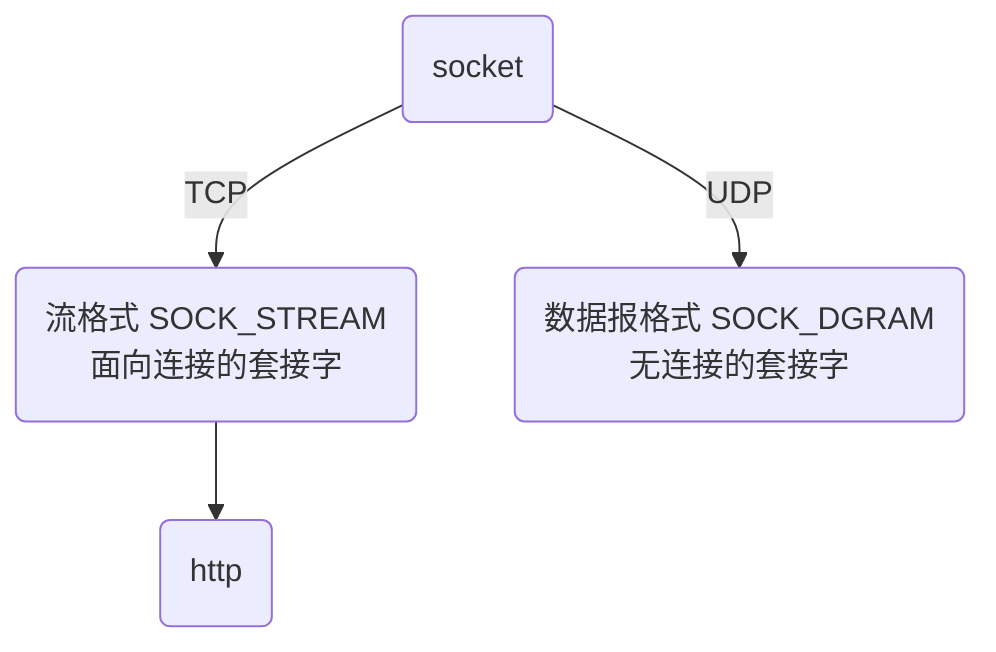
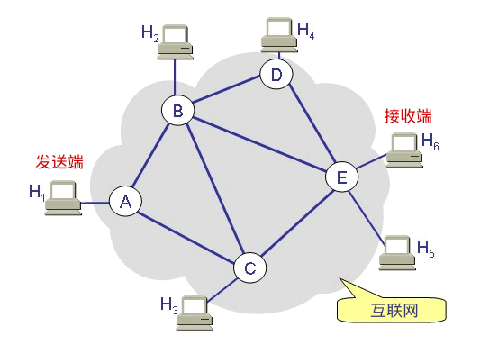
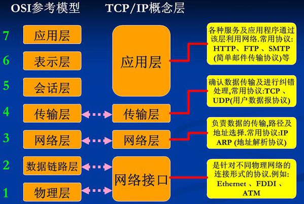
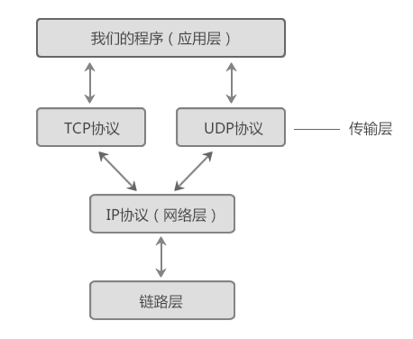

<font size="7"><center>**socket**</center></font>

___

[TOC]

___

## <font color="1E90FF">一、socket基础</font>

<div align=center></div>

- 在计算机通信领域，socket 被翻译为"套接字"，它是计算机之间进行通信的一种约定或一种方式。通过 socket 这种约定，一台计算机可以接收其他计算机的数据，也可以向其他计算机发送数据。

- 我们把插头插到插座上就能从电网获得电力供应，同样，为了与远程计算机进行数据传输，需要连接到因特网，而 socket 就是用来连接到因特网的工具。

- socket 的典型应用就是 Web 服务器和浏览器：浏览器获取用户输入的 URL，向服务器发起请求，服务器分析接收到的 URL，将对应的网页内容返回给浏览器，浏览器再经过解析和渲染，就将文字、图片、视频等元素呈现给用户。

### <font color="1E90FF">socket 套接字的类型</font>

世界上有很多种套接字，这里只讲 Internet 套接字，它是最经典最常用的。以后提及套接字，指的都是 Internet 套接字

根据数据的传输方式，可以将 Internet 套接字分为 <font color="yellow">流格式套接字</font> 和 <font color="yellow"> 数据报格式套接字</font> 两种类型

<center>



</center>

#### <font color="1E90FF">流格式套接字（SOCK_STREAM）</font> {#SOCK_STREAM}

流格式套接字（Stream Sockets）也叫 "面向连接的套接字" 在代码中使用`SOCK_STREAM`表示
`SOCK_STREAM`是一种可靠的、双向的通信数据流，若数据丢失，可以重新发送，其特征为：

- 数据在传输过程中不会消失
- 数据是按照顺序传输的
- 数据的发送和接收不是同步的

为什么流格式套接字可以达到高质量的数据传输呢？这是因为 <font color="yellow">流格式套接字使用了 TCP 协议</font>（The Transmission Control Protocol，传输控制协议）。TCP/IP 中 TCP 用来确保数据的正确性，控制你的数据按照顺序准确到达，IP（Internet Protocol，网络协议）用来控制数据如何从源头到达目的地，即"路由"

流格式套接字的内部有一个缓冲区（字符数组），通过 socket 传输的数据将保存到这个缓冲区。接收端在收到数据后有可能在缓冲区被填满以后一次性地读取，也可能分成好几次读取。也就是说，不管数据分几次传送过来，接收端只需要根据自己的要求读取，不用非得在数据到达时立即读取。传送端有自己的节奏，接收端也有自己的节奏，它们是不一致的。<font color="yellow">浏览器所使用的`http`协议就基于面向连接(流格式)的套接字</font>，因为必须要确保数据准确无误，否则加载的 HTML 将无法解析

#### <font color="1E90FF">数据报格式套接字（SOCK_DGRAM）</font> {#SOCK_DGRAM}

数据报格式套接字（Datagram Sockets）也叫"无连接的套接字"，在代码中使用`SOCK_DGRAM`表示
使用数据报格式套接字时计算机只管传输数据，不作数据校验，如果数据在传输中丢失，是无法重传的。因为数据报套接字所做的校验工作少，所以在传输效率方面比流格式套接字要高

可以将 SOCK_DGRAM 比喻成高速移动的快递车，它有以下特征：

- 强调快速传输而非传输顺序
- 传输的数据可能丢失也可能损毁
- 限制每次传输的数据大小（数据小便于传输）
- 数据的发送和接收是同步的

"数据的发送和接收是同步的"；换句话说，接收次数应该和发送次数相同

总之，数据报套接字是一种不可靠的、不按顺序传递的、以追求速度为目的的套接字

数据报套接字也使用 IP 协议作路由，但是它<font color="yellow">使用 UDP 协议</font>（User Datagram Protocol，用户数据报协议）

QQ 视频聊天就使用 SOCK_DGRAM 来传输数据，因为首先要保证通信的效率，尽量减小延迟，而数据的正确性是次要的

#### <font color="1E90FF">面向连接和无连接套接字的区别</font>

<div align=center></div>

 <font color="yellow">面向连接的套接字</font>，在正式通信之前要先确定一条固定路径来传递数据包。路径被破坏的话(断电)，会重新建立路径。为了保证数据包准确、顺序地到达，发送端在发送数据包以后，若一段时间内没有得到接收端的回应，那么发送端会重新再发送一次，直到得到接收端的回应
 发送端发送一个数据包，如何得到接收端的确认呢？很简单，发送端为每一个数据包分配一个 ID，接收端接收到数据包后，返回一个数据包，告诉发送端我接收到了 ID 为 xxx 的数据包

<font color="yellow">无连接的套接字</font>，每个数据包可以选择不同的路径，但是会发生意外情况，比如：第一个数据包选择了路径ABDE，但是路由器B突然断电了。第二个数据包选择了路径ABE，虽然路不远，但是太拥堵，以至于它等待的时间太长，路由器把它丢弃了

### <font color="1E90FF">OSI网络七层模型简明</font>

OSI 是 Open System Interconnection 的缩写，译为"开放式系统互联"。OSI 模型把网络通信的工作分为7层，它的缺点是分层太多且复杂，后来人们简化后，只保留了4层，从下到上分别是接口层、网络层、传输层和应用层，每一层都包含了若干协议，<font color="yellow">这就是大名鼎鼎的 TCP/IP 模型</font>

<div align=center></div>

网络模型就是进行数据封装的。我们平常使用的程序（或者说软件）一般都是通过应用层来访问网络的，程序产生的数据会一层一层地往下传输，直到最后的网络接口层，就通过网线发送到互联网上去了。数据每往下走一层，就会被这一层的协议增加一层包装，等到发送到互联网上时，已经比原始数据多了四层包装。整个数据封装的过程就像俄罗斯套娃。当另一台计算机接收到数据包时，会从网络接口层再一层一层往上传输，每传输一层就拆开一层包装，直到最后的应用层，就得到了最原始的数据，这才是程序要使用的数据

给数据加包装的过程，实际上就是在数据的头部增加一个标志（一个数据块），表示数据经过了这一层，我已经处理过了。给数据拆包装的过程正好相反，就是去掉数据头部的标志，让它逐渐现出原形

<font color="yellow">我们所说的 socket 编程，是站在传输层的基础上，所以可以使用 TCP/UDP 协议，但是不能干「访问网页」这样的事情，因为访问网页所需要的 http 协议位于应用层</font>

两台计算机进行通信时，必须遵守以下原则：

1. <font color="yellow">必须是同一层次进行通信</font>。比如，A 计算机的应用层和 B 计算机的传输层就不能通信，因为它们不在一个层次，数据的拆包会遇到问题。
1. 每一层的功能都必须相同，也就是拥有完全相同的网络模型。如果网络模型都不同，那不就乱套了，谁都不认识谁。
1. 数据只能逐层传输，不能跃层。
1. 每一层可以使用下层提供的服务，并向上层提供服务。

### <font color="1E90FF">TCP/IP协议族</font>

协议（Protocol）就是网络通信过程中的约定或者合同。协议有很多种，通信双方必须使用同一协议才能通信。协议仅仅是一种规范，例如，如何建立连接，如何相互识别等。这些规范必须由代码来实现。例如 IP 协议规定了如何找到目标计算机，那么程序员在开发软件时就必须遵守该协议，不能另起炉灶

<font color="yellow">TCP/IP 模型包含了 TCP、IP、UDP、Telnet、FTP、SMTP 等上百个互为关联的协议，其中 TCP 和 IP 是最常用的两种底层协议，所以把这些协议统称为 TCP/IP 协议族</font>

socket 编程是基于 TCP 和 UDP 协议的，它们的层级关系如下图所示：

<div align=center></div>

### <font color="1E90FF">IP、MAC和端口号</font>

在互联网中要找到一台计算机需要具备三个要素：IP 地址、MAC 地址和端口号。IP 地址定位一个局域网，MAC 地址定位一台计算机，端口号定位一个网络程序。一个数据包中会附带对方的 IP 地址和 MAC 地址

#### <font color="1E90FF">IP地址</font>

- IP地址是 Internet Protocol Address 的缩写，译为"网际协议地址"。目前大部分软件使用 IPv4 地址
- 一个局域网可以拥有一个独立的 IP 地址（对外就好像只有一台计算机），一台计算机也可以拥有一个独立的 IP 地址。但是目前广泛使用 IPv4 地址，它的资源是非常有限的，<font color="yellow">一台计算机一个 IP 地址是不现实的，往往是一个局域网才拥有一个 IP 地址</font>
- 在因特网上进行通信时，必须要知道对方的 IP 地址。实际上数据包中已经附带了 IP 地址，把数据包发送给路由器以后，路由器会根据 IP 地址找到对方的地理位置，完成一次数据的传递

#### <font color="1E90FF">MAC地址</font>

- MAC 地址是 Media Access Control Address 的缩写，直译为“媒体访问控制地址”，也称为局域网地址（LAN Address），以太网地址（Ethernet Address）或物理地址（Physical Address）
- 现实的情况是，一个局域网往往才能拥有一个独立的 IP；换句话说，IP 地址只能定位到一个局域网，无法定位到具体的一台计算机。然而，<font color="yellow">真正能唯一标识一台计算机的是 MAC 地址</font>，每张网卡出厂的时候 MAC 地址已经被写死了，且每个 MAC 地址在全世界都是独一无二的。（局域网中的路由器/交换机会记录每台计算机的 MAC 地址）
- 数据包中除了会附带对方的 IP 地址，还会附带对方的 MAC 地址，当数据包达到局域网以后，<font color="yellow">路由器/交换机会根据数据包中的 MAC 地址找到对应的计算机</font>，然后把数据包转交给它，这样就完成了数据的传递。

#### <font color="1E90FF">端口号</font>

- 一台计算机可以同时提供多种网络服务，例如 Web 服务（网站）、FTP 服务（文件传输服务）、SMTP 服务（邮箱服务）等，仅有 IP 地址和 MAC 地址，计算机虽然可以正确接收到数据包，但是却不知道要将数据包交给哪个网络程序来处理，所以通信失败。
- 为了区分不同的网络程序，计算机会为每个网络程序分配一个独一无二的端口号（Port Number），例如，Web 服务的端口号是 80，FTP 服务的端口号是 21，SMTP 服务的端口号是 25。
- 端口（Port）是一个虚拟的、逻辑上的概念。可以将端口理解为一道门，数据通过这道门流入流出，每道门有不同的编号，就是端口号。如下图所示：

<div align=center></div>

### <font color="1E90FF">socket 示例</font>

server.cpp

```C++
#include <stdio.h>
#include <string.h>
#include <stdlib.h>
#include <unistd.h>
#include <arpa/inet.h>
#include <sys/socket.h>
#include <netinet/in.h>

int main(){
    //创建套接字。AF_INET表示使用IPv4地址，SOCK_STREAM表示使用面向连接的套接字，IPPROTO_TCP表示使用TCP协议
    int serv_sock = socket(AF_INET, SOCK_STREAM, IPPROTO_TCP);

    //创建sockaddr_in结构体（服务器的IP地址和端口都保存在该结构体中）
    struct sockaddr_in serv_addr;
    memset(&serv_addr, 0, sizeof(serv_addr));           //每个字节都用0填充
    serv_addr.sin_family = AF_INET;                     //使用IPv4地址
    serv_addr.sin_addr.s_addr = inet_addr("127.0.0.1"); //服务器的IP地址
    serv_addr.sin_port = htons(1234);                   //服务器的端口号
    //将套接字serv_sock和sockaddr_in结构体绑定，即套接字和IP、端口绑定
    bind(serv_sock, (struct sockaddr*)&serv_addr, sizeof(serv_addr));

    //让套接字进入被动监听状态。即套接字处于睡眠中，等待客户端发起请求才会被唤醒
    listen(serv_sock, 20);

    //创建sockaddr_in结构体（客户端发起请求后，客户端的IP地址和端口都保存在该结构体中）
    struct sockaddr_in clnt_addr;
    socklen_t clnt_addr_size = sizeof(clnt_addr);
    /* accept() 函数用来接收客户端的请求。此程序运行到 accept() 函数就会被阻塞，直到客户端发起请求后，
    从套接字serv_sock中读取客户端的IP和端口号，保存到clnt_addr中，并返回新创建的套接字文件描述符(用来代指客户端) */
    int clnt_sock = accept(serv_sock, (struct sockaddr*)&clnt_addr, &clnt_addr_size);

    //向客户端发送数据
    char str[] = "http://c.biancheng.net/socket/";
    write(clnt_sock, str, sizeof(str));
   
    //关闭套接字
    close(clnt_sock);
    close(serv_sock);
    
    return 0;
}
/* 服务器中分别要创建服务器和客户端的套接字文件描述局，sockaddr_in结构体*/
```

client.cpp

```C++
#include <stdio.h>
#include <string.h>
#include <stdlib.h>
#include <unistd.h>
#include <arpa/inet.h>
#include <sys/socket.h>

int main(){
    //创建套接字。AF_INET表示使用IPv4地址，SOCK_STREAM表示使用面向连接的套接字，IPPROTO_TCP表示使用TCP协议
    int sock = socket(AF_INET, SOCK_STREAM, 0);

    //创建sockaddr_in结构体（服务器的IP地址和端口都保存在该结构体中）
    struct sockaddr_in serv_addr;
    memset(&serv_addr, 0, sizeof(serv_addr));           //每个字节都用0填充
    serv_addr.sin_family = AF_INET;                     //使用IPv4地址
    serv_addr.sin_addr.s_addr = inet_addr("127.0.0.1"); //服务器的IP地址
    serv_addr.sin_port = htons(1234);                   //服务器的端口号
    /* 客户端通过 connect() 函数向服务器发起请求，处于监听状态的服务器被激活，执行accept()函数，接受客户端的请求，
    然后执行write()函数向客户端传回数据。客户端接收到数据后，connect()就运行结束了，然后使用read()将数据读取出来 */
    connect(sock, (struct sockaddr*)&serv_addr, sizeof(serv_addr));
   
    //读取服务器传回的数据
    char buffer[40];
    read(sock, buffer, sizeof(buffer)-1);
   
    printf("Message form server: %s\n", buffer);
   
    //关闭套接字
    close(sock);
    
    return 0;
}
```

### <font color="1E90FF">socket( )函数详解</font>

socket( )函数包含在`<sys/socket.h>` 头文件中，原型为：`int socket(int af, int type, int protocol);`

- `af` 为地址族（Address Family），也就是 IP 地址类型。`AF_INET` 表示 IPv4 地址，例如 127.0.0.1；`AF_INET6` 表示 IPv6 地址，例如 1030::C9B4:FF12:48AA:1A2B
- `type` 为数据传输方式或套接字类型，常用的有 [SOCK_STREAM](#SOCK_STREAM) 和 [SOCK_DGRAM](#SOCK_DGRAM)
- `protocol` 表示传输协议，常用的有`IPPROTO_TCP`和`IPPTOTO_UDP`，分别表示 TCP 传输协议和 UDP 传输协议
>1. `127.0.0.1`是一个特殊IP地址，表示本机地址
>1. PF_INET 等价于 AF_INET

一般情况下有了 af 和 type ，操作系统会自动推演出协议类型，除非遇到有两种不同的协议支持同一种地址类型和数据传输类型。如果我们不指明使用哪种协议，操作系统没办法自动推演

如果地址类型为 AF_INET，数据传输方式为 SOCK_STREAM ，那么满足这两个条件的协议只有 TCP，这种套接字称为 TCP 套接字。
如果地址类型为 AF_INET，数据传输方式为 SOCK_DGRAM ，那么满足这两个条件的协议只有 UDP，这种套接字称为 UDP 套接字。

上面两种情况都只有一种协议满足条件，可以将`protocol`的值设为 0，系统会自动推演出应该使用什么协议

### <font color="3E90FF">bind( )函数详解</font>

bind( ) 函数的原型为：`int bind(int sock, struct sockaddr *addr, socklen_t addrlen);`

#### <font color="3E90FF">sockaddr_in 结构体</font>

```C
struct sockaddr_in{
    sa_family_t     sin_family;   //地址族（Address Family）（即地址类型）
    uint16_t        sin_port;     //16位的端口号
    struct in_addr  sin_addr;     //32位IP地址
    char            sin_zero[8];  //不使用，一般用0填充
};
```


- `sin_family` 表示地址族（实质是 unsigned short 类型）
- `sin_port` 为端口号。uint16_t 的长度为两个字节，理论上端口号的取值范围为 0~65536，但 0~1023 的端口一般由系统分配给特定的服务程序，例如 Web 服务的端口号为 80，所以我们的程序要尽量在 1024~65536 之间分配端口号
- `sin_addr` 是 `struct in_addr` 结构体类型的变量（详解见下一标题）
- `sin_zero[8]` 没有用的8个字节。一般先用 memset() 将结构体的全部字节填充为 0，再给前3个成员赋值，剩下的 sin_zero 自然就是 0 了。

>端口号需要用 htons() 函数转换

#### <font color="3E90FF">in_addr 结构体</font>

```C
struct in_addr{
    in_addr_t  s_addr;  //32位的IP地址，等价于unsigned long
};
```

`in_addr_t`在头文件`<netinet/in.h>`中定义，长度为4个字节，是一个整数，而IP地址是一个字符串，所以需要 inet_addr() 函数进行整数和大小端转换，例如：

```C
unsigned long ip = inet_addr("127.0.0.1");  // 7F.0.0.1
printf("%ld\n", ip);                        // 打印16777343
printf("%#x\n", ip);                        // 打印0x100007f，即01.00.00.7F
```


___

## <font color="1E90FF">杂项</font>

填充
填充
填充
填充
填充
填充