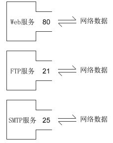

<font size="7"><center>**socket**</center></font>

___

[TOC]

___

## <font color="1E90FF">一、socket基础</font>

<div align=center></div>


在计算机通信领域，socket 被翻译为"套接字"，它是计算机之间进行通信的一种约定或一种方式。通过 socket 这种约定，一台计算机可以接收其他计算机的数据，也可以向其他计算机发送数据。

socket 的典型应用就是 Web 服务器和浏览器：浏览器获取用户输入的 URL，向服务器发起请求，服务器分析接收到的 URL，将对应的网页内容返回给浏览器，浏览器再经过解析和渲染，就将文字、图片、视频等元素呈现给用户。

### <font color="1E90FF">socket 套接字的类型</font>

世界上有很多种套接字，这里只讲 Internet 套接字，它是最经典最常用的。以后提及套接字，指的都是 Internet 套接字

根据数据的传输方式，可以将 Internet 套接字分为 <font color="yellow">流格式套接字</font> 和 <font color="yellow"> 数据报格式套接字</font> 两种类型

<center>


</center>

#### <font color="1E90FF" size="3">流格式套接字（SOCK_STREAM）</font> {#SOCK_STREAM}

流格式套接字（Stream Sockets）也叫 "面向连接的套接字" 在代码中使用`SOCK_STREAM`表示
`SOCK_STREAM`是一种可靠的、双向的通信数据流，若数据丢失，可以重新发送，其特征为：

- 数据在传输过程中不会消失
- 数据是按照顺序传输的
- 数据的发送和接收不是同步的

为什么流格式套接字可以达到高质量的数据传输呢？这是因为 <font color="yellow">流格式套接字使用了 TCP 协议</font>（The Transmission Control Protocol，传输控制协议）。TCP/IP 中 TCP 用来确保数据的正确性，控制你的数据按照顺序准确到达，IP（Internet Protocol，网络协议）用来控制数据如何从源头到达目的地，即"路由"

流格式套接字的内部有一个缓冲区（字符数组），通过 socket 传输的数据将保存到这个缓冲区。接收端在收到数据后有可能在缓冲区被填满以后一次性地读取，也可能分成好几次读取。也就是说，不管数据分几次传送过来，接收端只需要根据自己的要求读取，不用非得在数据到达时立即读取。传送端有自己的节奏，接收端也有自己的节奏，它们是不一致的。<font color="yellow">浏览器所使用的`http`协议就基于面向连接(流格式)的套接字</font>，因为必须要确保数据准确无误，否则加载的 HTML 将无法解析

#### <font color="1E90FF" size="3">数据报格式套接字（SOCK_DGRAM）</font> {#SOCK_DGRAM}

数据报格式套接字（Datagram Sockets）也叫"无连接的套接字"，在代码中使用`SOCK_DGRAM`表示

使用数据报格式套接字时计算机只管传输数据，不作数据校验，如果数据在传输中丢失，是无法重传的。因为数据报套接字所做的校验工作少，所以在传输效率方面比流格式套接字要高

可以将 SOCK_DGRAM 比喻成高速移动的快递车，它有以下特征：

- 强调快速传输而非传输顺序
- 传输的数据可能丢失也可能损毁
- 限制每次传输的数据大小（数据小便于传输）
- 数据的发送和接收是同步的。换句话说，接收次数应该和发送次数相同

总之，数据报套接字是一种不可靠的、不按顺序传递的、以追求速度为目的的套接字

数据报套接字也使用 IP 协议作路由，但是它<font color="yellow">使用 UDP 协议</font>（User Datagram Protocol，用户数据报协议）

QQ 视频聊天就使用 SOCK_DGRAM 来传输数据，因为首先要保证通信的效率，尽量减小延迟，而数据的正确性是次要的

#### <font color="1E90FF" size="3">面向连接和无连接套接字的区别</font>

<div align=center></div>

 <font color="yellow">面向连接的套接字</font>，在正式通信之前要先确定一条固定路径来传递数据包。路径被破坏的话(断电)，会重新建立路径。为了保证数据包准确、顺序地到达，发送端在发送数据包以后，若一段时间内没有得到接收端的回应，那么发送端会重新再发送一次，直到得到接收端的回应

 发送端发送一个数据包，如何得到接收端的确认呢？很简单，发送端为每一个数据包分配一个 ID，接收端接收到数据包后，返回一个数据包，告诉发送端我接收到了 ID 为 xxx 的数据包

<font color="yellow">无连接的套接字</font>，每个数据包可以选择不同的路径，但是会发生意外情况，比如：第一个数据包选择了路径ABDE，但是路由器B突然断电了。第二个数据包选择了路径ABE，虽然路不远，但是太拥堵，以至于它等待的时间太长，路由器把它丢弃了

### <font color="1E90FF">OSI网络七层模型简明</font>

OSI 是 Open System Interconnection 的缩写，译为"开放式系统互联"。OSI 模型把网络通信的工作分为7层，它的缺点是分层太多且复杂，后来人们简化后，只保留了4层，从下到上分别是接口层、网络层、传输层和应用层，每一层都包含了若干协议，<font color="yellow">这就是大名鼎鼎的 TCP/IP 模型</font>

<div align=center></div>

网络模型就是进行数据封装的。我们平常使用的程序（或者说软件）一般都是通过应用层来访问网络的，程序产生的数据会一层一层地往下传输，直到最后的网络接口层，就通过网线发送到互联网上去了。数据每往下走一层，就会被这一层的协议增加一层包装，等到发送到互联网上时，已经比原始数据多了四层包装。整个数据封装的过程就像俄罗斯套娃。当另一台计算机接收到数据包时，会从网络接口层再一层一层往上传输，每传输一层就拆开一层包装，直到最后的应用层，就得到了最原始的数据，这才是程序要使用的数据

给数据加包装的过程，实际上就是在数据的头部增加一个标志（一个数据块），表示数据经过了这一层，我已经处理过了。给数据拆包装的过程正好相反，就是去掉数据头部的标志，让它逐渐现出原形

<font color="yellow">我们所说的 socket 编程，是站在传输层的基础上，所以可以使用 TCP/UDP 协议，但是不能干「访问网页」这样的事情，因为访问网页所需要的 http 协议位于应用层</font>

两台计算机进行通信时，必须遵守以下原则：

1. <font color="yellow">必须是同一层次进行通信</font>。比如，A 计算机的应用层和 B 计算机的传输层就不能通信，因为它们不在一个层次，数据的拆包会遇到问题。
1. 每一层的功能都必须相同，也就是拥有完全相同的网络模型。如果网络模型都不同，那不就乱套了，谁都不认识谁。
1. 数据只能逐层传输，不能跃层。
1. 每一层可以使用下层提供的服务，并向上层提供服务。

### <font color="1E90FF">TCP/IP协议族</font>

协议（Protocol）就是网络通信过程中的约定或者合同。协议有很多种，通信双方必须使用同一协议才能通信。协议仅仅是一种规范，例如，如何建立连接，如何相互识别等。这些规范必须由代码来实现。例如 IP 协议规定了如何找到目标计算机，那么程序员在开发软件时就必须遵守该协议，不能另起炉灶

<font color="yellow">TCP/IP 模型包含了 TCP、IP、UDP、Telnet、FTP、SMTP 等上百个互为关联的协议，其中 TCP 和 IP 是最常用的两种底层协议，所以把这些协议统称为 TCP/IP 协议族</font>

socket 编程是基于 TCP 和 UDP 协议的，它们的层级关系如下图所示：

<div align=center></div>

### <font color="1E90FF">IP、MAC和端口号</font>

在互联网中要找到一台计算机需要具备三个要素：IP 地址、MAC 地址和端口号。IP 地址定位一个局域网，MAC 地址定位一台计算机，端口号定位一个网络程序。一个数据包中会附带对方的 IP 地址和 MAC 地址

**<font size="4" color="1E90FF">IP地址</font>**

- IP地址是 Internet Protocol Address 的缩写，译为"网络协议地址"。目前大部分软件使用 IPv4 地址
- 一个局域网可以拥有一个独立的 IP 地址（对外就好像只有一台计算机），一台计算机也可以拥有一个独立的 IP 地址。但是目前广泛使用 IPv4 地址，它的资源是非常有限的，<font color="yellow">一台计算机一个 IP 地址是不现实的，往往是一个局域网才拥有一个 IP 地址</font>
- 在因特网上进行通信时，必须要知道对方的 IP 地址。实际上数据包中已经附带了 IP 地址，把数据包发送给路由器以后，路由器会根据 IP 地址找到对方的地理位置，完成一次数据的传递

**<font size="4" color="1E90FF">MAC地址</font>**

- MAC 地址是 Media Access Control Address 的缩写，直译为“媒体访问控制地址”，也称为局域网地址（LAN Address），以太网地址（Ethernet Address）或物理地址（Physical Address）
- 现实的情况是，一个局域网往往才能拥有一个独立的 IP；换句话说，IP 地址只能定位到一个局域网，无法定位到具体的一台计算机。然而，<font color="yellow">真正能唯一标识一台计算机的是 MAC 地址</font>，每张网卡出厂的时候 MAC 地址已经被写死了，且每个 MAC 地址在全世界都是独一无二的。（局域网中的路由器/交换机会记录每台计算机的 MAC 地址）
- 数据包中除了会附带对方的 IP 地址，还会附带对方的 MAC 地址，当数据包达到局域网以后，<font color="yellow">路由器/交换机会根据数据包中的 MAC 地址找到对应的计算机</font>，然后把数据包转交给它，这样就完成了数据的传递。

**<font size="4" color="1E90FF">端口号</font>**

- 一台计算机可以同时提供多种网络服务，例如 Web 服务（网站）、FTP 服务（文件传输服务）、SMTP 服务（邮箱服务）等，仅有 IP 地址和 MAC 地址，计算机虽然可以正确接收到数据包，但是却不知道要将数据包交给哪个网络程序来处理，所以通信失败。
- 为了区分不同的网络程序，计算机会为每个网络程序分配一个独一无二的端口号（Port Number），例如，Web 服务的端口号是 80，FTP 服务的端口号是 21，SMTP 服务的端口号是 25。
- 端口（Port）是一个虚拟的、逻辑上的概念。可以将端口理解为一道门，数据通过这道门流入流出，每道门有不同的编号，就是端口号。如下图所示：

<div align=center></div>

### <font color="1E90FF">socket 示例</font>

server.cpp

```C++
#include <stdio.h>
#include <string.h>
#include <stdlib.h>
#include <unistd.h>
#include <arpa/inet.h>
#include <sys/socket.h>
#include <netinet/in.h>

int main(){
    //创建套接字。AF_INET表示使用IPv4地址，SOCK_STREAM表示使用面向连接的套接字，IPPROTO_TCP表示使用TCP协议
    int serv_sock = socket(AF_INET, SOCK_STREAM, IPPROTO_TCP);

    //创建sockaddr_in结构体（服务器的IP地址和端口都保存在该结构体中）
    struct sockaddr_in serv_addr;
    memset(&serv_addr, 0, sizeof(serv_addr));           //每个字节都用0填充
    serv_addr.sin_family = AF_INET;                     //使用IPv4地址
    serv_addr.sin_addr.s_addr = inet_addr("127.0.0.1"); //服务器的IP地址
    serv_addr.sin_port = htons(1234);                   //服务器的端口号
    //将套接字serv_sock和sockaddr_in结构体绑定，即套接字和IP、端口绑定
    bind(serv_sock, (struct sockaddr*)&serv_addr, sizeof(serv_addr));

    //让套接字进入被动监听状态。即套接字处于睡眠中，等待客户端发起请求才会被唤醒。请求队列最大为20
    listen(serv_sock, 20);

    //创建sockaddr_in结构体（客户端发起请求后，客户端的IP地址和端口都保存在该结构体中）
    struct sockaddr_in clnt_addr;
    socklen_t clnt_addr_size = sizeof(clnt_addr);
    /* accept() 函数用来接收客户端的请求。此程序运行到 accept() 函数就会被阻塞，直到客户端发起请求后，
    从套接字serv_sock中读取客户端的IP和端口号，保存到clnt_addr中，并返回新创建的套接字文件描述符(用来代指客户端) */
    int clnt_sock = accept(serv_sock, (struct sockaddr*)&clnt_addr, &clnt_addr_size);

    //向客户端发送数据
    char str[] = "http://c.biancheng.net/socket/";
    write(clnt_sock, str, sizeof(str));
   
    //关闭套接字
    close(clnt_sock);
    close(serv_sock);
    
    return 0;
}
/* 服务器中分别要创建服务器和客户端的套接字文件描述局，sockaddr_in结构体*/
```

client.cpp

```C++
#include <stdio.h>
#include <string.h>
#include <stdlib.h>
#include <unistd.h>
#include <arpa/inet.h>
#include <sys/socket.h>

int main(){
    //创建套接字。AF_INET表示使用IPv4地址，SOCK_STREAM表示使用面向连接的套接字，IPPROTO_TCP表示使用TCP协议
    int sock = socket(AF_INET, SOCK_STREAM, 0);

    //创建sockaddr_in结构体（服务器的IP地址和端口都保存在该结构体中）
    struct sockaddr_in serv_addr;
    memset(&serv_addr, 0, sizeof(serv_addr));           //每个字节都用0填充
    serv_addr.sin_family = AF_INET;                     //使用IPv4地址
    serv_addr.sin_addr.s_addr = inet_addr("127.0.0.1"); //服务器的IP地址
    serv_addr.sin_port = htons(1234);                   //服务器的端口号
    /* 客户端通过 connect() 函数向服务器发起请求，处于监听状态的服务器被激活，执行accept()函数，接受客户端的请求，
    然后执行write()函数向客户端传回数据。客户端接收到数据后，connect()就运行结束了，然后使用read()将数据读取出来 */
    connect(sock, (struct sockaddr*)&serv_addr, sizeof(serv_addr));
   
    //读取服务器传回的数据
    char buffer[40];
    read(sock, buffer, sizeof(buffer)-1);
   
    printf("Message from server: %s\n", buffer);
   
    //关闭套接字
    close(sock);
    
    return 0;
}
```

启动一个shell终端，先编译 server.cpp 并运行：

```shell
[admin@localhost ~]$ g++ server.cpp -o server
[admin@localhost ~]$ ./server
正常情况下，程序运行到 accept() 函数就会被阻塞，等待客户端发起请求。
```

再启动一个shell终端，编译 client.cpp 并运行：

```shell
[admin@localhost ~]$ g++ client.cpp -o client
[admin@localhost ~]$ ./client
Message form server: http://c.biancheng.net/socket/
```


### <font color="1E90FF">socket( )函数详解</font>

socket( )函数包含在`<sys/socket.h>` 头文件中，原型为：
```C
int socket(int af, int type, int protocol); 
```

- `af` 为地址族（Address Family），也就是 IP 地址类型。`AF_INET` 表示 IPv4 地址，例如 127.0.0.1；`AF_INET6` 表示 IPv6 地址，例如 1030::C9B4:FF12:48AA:1A2B
- `type` 为数据传输方式或套接字类型，常用的有 [SOCK_STREAM](#SOCK_STREAM) 和 [SOCK_DGRAM](#SOCK_DGRAM)
- `protocol` 表示传输协议，常用的有`IPPROTO_TCP`和`IPPTOTO_UDP`，分别表示 TCP 传输协议和 UDP 传输协议
>1. `127.0.0.1`是一个特殊IP地址，表示本机地址
>1. PF_INET 等价于 AF_INET

一般情况下有了 af 和 type ，操作系统会自动推演出传输协议类型，除非遇到有两种不同的协议支持同一种地址类型和数据传输类型

如果地址族为 AF_INET，数据传输方式为 SOCK_STREAM ，那么满足这两个条件的协议只有 TCP，这种套接字称为 TCP 套接字

如果地址族为 AF_INET，数据传输方式为 SOCK_DGRAM ，那么满足这两个条件的协议只有 UDP，这种套接字称为 UDP 套接字

> 上面两种情况都只有一种协议满足条件，可以将`protocol`的值设为 0，系统会自动推演出应该使用什么协议

### <font color="1E90FF">bind( )函数详解</font>

bind( ) 函数的原型为：

```C
int bind(int sock, struct sockaddr *addr, socklen_t addrlen);
```

socklen_t 实质是 unsigned int 类型

#### <font color="1E90FF" size="3">sockaddr_in 结构体</font>

```C
 //sockaddr_in 结构体用来存放地址族、IP地址和端口号
struct sockaddr_in{
    sa_family_t     sin_family;   //地址族（Address Family）（unsigned shot 类型）
    uint16_t        sin_port;     //16位的端口号            （unsigned shot 类型）
    struct in_addr  sin_addr;     //32位IP地址              （unsigned long 类型）
    char            sin_zero[8];  //不使用，一般用0填充
};
```

- `sin_family` 表示地址族（实质是 unsigned short 类型）
- `sin_port` 为端口号。uint16_t 的长度为两个字节，理论上端口号的取值范围为 0~65536，但 0~1023 的端口一般由系统分配给特定的服务程序，例如 Web 服务的端口号为 80，所以我们的程序要尽量在 1024~65536 之间分配端口号
- `sin_addr` 是 `struct in_addr` 结构体类型的变量（详解见下一标题）
- `sin_zero[8]` 没有用的8个字节。一般先用 memset() 将结构体的全部字节填充为 0，再给前3个成员赋值，剩下的 sin_zero 自然就是 0 了。

>端口号需要用 htons() 函数进行大小端转换（host to net short）

**in_addr 结构体**

```C
struct in_addr{
    in_addr_t  s_addr;  //32位的IP地址，等价于unsigned long
};
```

`in_addr_t`在头文件`<netinet/in.h>`中定义，长度为4个字节，是一个整数，而IP地址是一个字符串，所以需要 inet_addr() 函数进行整数和大小端转换，例如：

```C
unsigned long ip = inet_addr("127.0.0.1");  // 7F.0.0.1
printf("%ld\n", ip);                        // 打印16777343
printf("%#x\n", ip);                        // 打印0x100007f，即01.00.00.7F
```

#### <font color="1E90FF" size="3">sockaddr 结构体</font>

bind() 第二个参数的类型为 sockaddr，而代码中却使用 sockaddr_in，然后再强制转换为 sockaddr，这是为什么呢？

```C
struct sockaddr{
    sa_family_t  sin_family;   //地址族（Address Family），也就是地址类型
    char         sa_data[14];  //IP地址和端口号
};
```

<center>sockaddr_in 与 sockaddr（括号内表示所占用的字节数）</center>

<div align=center></div>

sockaddr_in 和 sockaddr 的长度都是16字节，所以使用 sockaddr_in 强制转换类型成 sockaddr 时不会丢失字节。可以认为，sockaddr 是一种通用的结构体，可以用来保存多种类型的IP地址和端口号。例如， sockaddr_in 是用来保存 IPv4 地址的结构体。sockaddr_in6 是用来保存 IPv6 地址的结构体

```C
//IPv6
struct sockaddr_in6 { 
    sa_family_t sin6_family;    //(2)地址类型(地址族)，取值为AF_INET6
    in_port_t sin6_port;        //(2)16位端口号
    uint32_t sin6_flowinfo;     //(4)IPv6流信息
    struct in6_addr sin6_addr;  //(4)具体的IPv6地址
    uint32_t sin6_scope_id;     //(4)接口范围ID
};
```

### <font color="1E90FF">connect( ) 函数</font>

客户端使用 connect() 函数用来建立连接，它的原型为：

```C
int connect(int sock, struct sockaddr *serv_addr, socklen_t addrlen);
```

> socklen_t 实质是 unsigned int 类型
> connect() 的各个参数都和 bind() 相同，此处不再赘述

### <font color="1E90FF">listen( ) 函数</font>

对于服务器端程序，使用 bind() 绑定套接字后，还需要使用 listen() 函数让套接字进入被动监听状态，再调用 accept() 函数，就可以随时响应客户端的请求了。它的原型为：

```C
int listen(int sock, int backlog);
```

- `sock` 为需要进入监听状态的套接字
- `backlog` 为请求队列的最大长度。

<font color="yellow">监听状态</font>：是指让套接字处于睡眠状态，只有当接收到客户端请求时，套接字才会被唤醒，来响应请求

<font color="yellow">请求队列</font>：当套接字正在处理客户端请求时，如果有新的请求进来，它们就按照先后顺序在缓冲区中排队，直到缓冲区满。这个缓冲区，就称为请求队列（Request Queue）。请求队列的长度（能存放客户端请求的个数）可以通过 backlog 参数指定

> 注意：listen() 只是让套接字处于监听状态，并没有接收请求。接收请求需要使用 accept() 函数

### <font color="1E90FF">accept( ) 函数</font>

当套接字处于监听状态时，可以通过 accept() 函数来接收客户端请求。其参数与 bind() 和 connect() 是相同的，除了 addrlen 是指针类型。其原型为：

```C
int accept(int sock, struct sockaddr *addr, socklen_t *addrlen);
```

当接收到客户端请求时，客户端的IP地址和端口号会保存在 addr 中，并返回一个新的套接字来和客户端通信，而 sock 是服务器端的套接字，后面和客户端通信时，要使用这个新生成的套接字，而不是原来服务器端的套接字，注意区分

> listen() 只是让套接字进入监听状态，并没有真正接收客户端请求，listen() 后面的代码会继续执行，直到遇到 accept() 后，会阻塞程序执行（后面代码不能被执行），直到收到客户端的请求

### <font color="1E90FF">read()和write()函数</font>

两台计算机之间的通信相当于两个套接字之间的通信。Linux 不区分套接字文件和普通文件，使用 read() 和 write() 可以向套接字中读取和写入数据

**write() 的原型为：**

```C
ssize_t write(int fd, const void *buf, size_t nbytes);
```

- `fd` 为要写入的文件描述符，`buf` 为要写入的数据缓冲区地址，`nbytes` 为要写入的数据的字节数
- `size_t` 是 typedef 声明的 `unsigned int` 类型；`ssize_t` 是 typedef 声明的 `signed int` 类型
- write() 函数会将缓冲区 buf 中的 nbytes 个字节写入文件 fd，成功则返回写入的字节数，失败则返回 -1

**read() 的原型为：**

```C
ssize_t read(int fd, void *buf, size_t nbytes);
```

`fd` 为要读取的文件描述符，`buf` 为要接收数据的缓冲区地址，`nbytes` 为要读取的数据的字节数

### <font color="1E90FF">socket实现回声客户端</font>

server.cpp

```C
int client_socket = accept(server_socket, (struct sockaddr *)& client_addr, &client_addr_size);
//read()新创建的套接字，可以获取客户端发来的数据
//write()新创建的套接字，可以发送客户端发来的数据
char buf[64];
read(client_socket, buf, sizeof(buf));      //接收客户端发来的数据
write(client_socket, buf, sizeof(buf));     //将数据原样返回
```

client.cpp

```C
connect(server_socket, (struct sockaddr *)&server_addr, sizeof(server_addr));
//将数据write()到自己的套接字，服务器就会收到数据
write(server_socket, "Linux China", 12);    //将数据发送给服务器
char buffer[50];
//read()自己的套接字，可以读取到服务器发来的数据
read(server_socket, buffer, sizeof(buffer));//接收服务器发来的数据
//打印
printf("%s\n", buffer);
```

### <font color="1E90FF">服务器端持续监听客户端</font>

server.cpp

```C
#include <stdio.h>
#include <string.h>
#include <stdlib.h>
#include <unistd.h>
#include <arpa/inet.h>
#include <sys/socket.h>
#include <netinet/in.h>

#define BUF_SIZE 100

int main() {
    //创建套接字。AF_INET表示使用IPv4地址，SOCK_STREAM表示使用面向连接的套接字，IPPROTO_TCP表示使用TCP协议
    int serv_sock = socket(AF_INET, SOCK_STREAM, IPPROTO_TCP);

    //创建sockaddr_in结构体（服务器的IP地址和端口都保存在该结构体中）
    struct sockaddr_in serv_addr;
    memset(&serv_addr, 0, sizeof(serv_addr));           //每个字节都用0填充
    serv_addr.sin_family = AF_INET;                     //使用IPv4地址
    serv_addr.sin_addr.s_addr = inet_addr("127.0.0.1"); //服务器的IP地址
    serv_addr.sin_port = htons(1234);                   //服务器的端口号
    //将套接字serv_sock和sockaddr_in结构体绑定，即套接字和IP、端口绑定
    bind(serv_sock, (struct sockaddr*)&serv_addr, sizeof(serv_addr));

    //让套接字进入被动监听状态。即套接字处于睡眠中，等待客户端发起请求才会被唤醒
    listen(serv_sock, 20);

    //创建sockaddr_in结构体（客户端发起请求后，客户端的IP地址和端口都保存在该结构体中）
    struct sockaddr_in clnt_addr;
    socklen_t clnt_addr_size = sizeof(clnt_addr);
    char buffer[BUF_SIZE] = {0};

    while (1) {
        /*accept() 函数用来接收客户端的请求。此程序运行到 accept() 函数就会被阻塞，直到客户端发起请求后，
        从套接字serv_sock中读取客户端的IP和端口号，保存到clnt_addr中，并返回新建的套接字(用来和客户端通信)*/
        int clnt_sock = accept(serv_sock, (struct sockaddr*)&clnt_addr, &clnt_addr_size);

        read(clnt_sock, buffer, sizeof(buffer));    //读取客户端发来的数据
        write(clnt_sock, buffer, sizeof(buffer));   //将数据原样返回
        
        memset(buffer, 0, sizeof(buffer));
        close(clnt_sock);                           //完成一次通信后关闭与客户端连接的套接字
    }
   
    //关闭套接字
    close(serv_sock);
    
    return 0;
}
```

client.cpp

```C
#include <stdio.h>
#include <string.h>
#include <stdlib.h>
#include <unistd.h>
#include <arpa/inet.h>
#include <sys/socket.h>

#define BUF_SIZE 100

int main() {
    //创建sockaddr_in结构体（服务器的IP地址和端口都保存在该结构体中）
    struct sockaddr_in serv_addr;
    memset(&serv_addr, 0, sizeof(serv_addr));           //每个字节都用0填充
    serv_addr.sin_family = AF_INET;                     //使用IPv4地址
    serv_addr.sin_addr.s_addr = inet_addr("127.0.0.1"); //服务器的IP地址
    serv_addr.sin_port = htons(1234);                   //服务器的端口号

    char buffer[BUF_SIZE] = {0};

    while (1) {
        //创建套接字。AF_INET表示使用IPv4地址，SOCK_STREAM表示使用面向连接的套接字，IPPROTO_TCP表示使用TCP协议
        int sock = socket(AF_INET, SOCK_STREAM, 0);
        /*客户端通过connect()函数向服务器发起请求，处于监听状态的服务器被激活，执行accept()函数，接受客户端的请求，
        然后执行write()函数向客户端传回数据。客户端接收到数据后，connect()就运行结束了，然后用read()将数据读取出来*/
        connect(sock, (struct sockaddr*)&serv_addr, sizeof(serv_addr));
    
        //将数据发送给服务器
        scanf("%s", buffer);
        write(sock, buffer, sizeof(buffer));

        //读取服务器传回的数据
        memset(buffer, 0, sizeof(buffer));
        read(sock, buffer, sizeof(buffer));
    
        printf("Message from server: [%s]\n", buffer);
    
        //完成一次通信后关闭与服务器连接的套接字
        memset(buffer, 0, sizeof(buffer));
        close(sock);
    }
    
    return 0;
}
```

>server.cpp 中调用 close() 不仅会关闭服务器端的 socket，还会通知客户端连接已断开，客户端也会清理 socket 相关资源，所以 client.cpp 中需要将 socket() 放在 while 循环内部，因为每次请求完毕都会清理 socket，下次发起请求时需要重新创建


### <font color="1E90FF">socket缓冲区以及阻塞模式</font>

**<font size="4" color="1E90FF">缓冲区</font>**

每个 socket 被创建后，都会分配两个大小为 8K 的缓冲区，输入缓冲区和输出缓冲区

write()/send() 并不立即向网络中传输数据，而是先将数据写入缓冲区中，再由TCP协议将数据从缓冲区发送到目标机器。一旦将数据写入到缓冲区，函数就可以成功返回，不管它们何时被发送到网络以及是否到达目标机器，这些都是 TCP 协议负责的事情

TCP 协议独立于 write()/send() 函数，数据有可能刚被写入缓冲区就发送到网络，也可能在缓冲区中不断积压，然后一次性发送到网络，这取决于当时的网络情况、当前线程是否空闲等诸多因素，不由程序员控制

read()/recv() 函数也是如此，也从输入缓冲区中读取数据，而不是直接从网络中读取

<center>TCP套接字的 I/O 缓冲区示意图</center>

<div align=center></div>

这些I/O缓冲区特性可整理如下：

- 创建TCP套接字时会自动生成单独存在的 I/O 缓冲区
- 即使关闭套接字，输出缓冲区也会继续传送遗留的数据
- 如果关闭套接字，输入缓冲区的数据将被丢失
- 输入输出缓冲区的默认大小一般都是 8K

**<font size="4" color="1E90FF">阻塞模式</font>**

对于TCP套接字（默认情况下），当使用 write()/send() 发送数据时：

- 首先会检查缓冲区，如果缓冲区的剩余空间小于要发送的数据，那么 write()/send() 会被阻塞，直到缓冲区中的数据被发送到目标机器，腾出足够的空间，才唤醒 write()/send() 函数继续写入数据

- 如果TCP协议正在向网络发送数据，那么输出缓冲区会被锁定，不允许写入，write()/send() 也会被阻塞，直到数据发送完毕缓冲区解锁，write()/send() 才会被唤醒

- 如果要写入的数据大于缓冲区的最大长度，那么将分批写入

- 直到所有数据被写入缓冲区 write()/send() 才能返回

当使用 read()/recv() 读取数据时：

- 首先会检查缓冲区，如果缓冲区中有数据，那么就读取，否则函数会被阻塞，直到网络上有数据到来

- 如果要读取的数据长度小于缓冲区中的数据长度，那么就不能一次性将缓冲区中的所有数据读出，剩余数据将不断积压，直到有 read()/recv() 函数再次读取

- 直到读取到数据后 read()/recv() 函数才会返回，否则就一直被阻塞

这就是TCP套接字的阻塞模式。所谓阻塞，就是上一步动作没有完成，下一步动作将暂停，直到上一步动作完成后才能继续，以保持同步性

### <font color="1E90FF">TCP协议的粘包问题（数据的无边界性）</font>

socket 数据的接收和发送是无关的，read() 和 write() 的执行次数可能不相同。例如，write() 重复执行三次发送字符串"abc"，那么目标机器上的 read() 可能分三次接收，每次都接收"abc"；也可能分两次接收，第一次接收"abcab"，第二次接收"cabc"；也可能一次就接收到字符串"abcabcabc"。客户端发送的多个数据包被当做一个数据包接收，这就是数据的 "粘包" 问题，也称数据的无边界性

### <font color="1E90FF">TCP三次握手建立连接</font>

客户端在收发数据前要使用 connect() 函数和服务器建立连接，来保证IP地址、端口、物理链路等正确无误。TCP 建立连接时要传输三个数据包(报)，每个数据包(报)的结构如下图

**<font size="4" color="1E90FF">TCP数据包结构</font>**

<center>TCP数据包(报)结构</center>

<div align=center></div>

<font color="yellow">序号</font>：Seq（Sequence Number）序号占32位，用来标识数据包的序号
<font color="yellow">确认号</font>：Ack（Acknowledge Number）确认号占32位，Ack = Seq + 1
<font color="yellow">标志位</font>：每个标志位占用1Bit，共有6个标志位

- URG：紧急指针（urgent pointer）有效
- ACK：确认序号有效
- PSH：接收方应该尽快将这个报文交给应用层
- RST：重置连接
- SYN：建立一个新连接（Synchronous）
- FIN： 断开一个连接（Finish）

**<font size="4" color="1E90FF">TCP建立连接（三次握手）</font>**

使用 connect() 建立连接时，客户端和服务器端会相互发送三个数据包，请看下图：

<center>TCP套接字三次握手示意图</center>

<div align=center></div>

客户端调用 socket() 函数创建套接字后，套接字处于CLOSED状态（因为没有建立连接）；服务器端调用 listen() 函数后，套接字进入LISTEN状态，开始监听客户端请求

当客户端开始发起请求，即调用 connect() 函数后，通信过程如下：

1. 当客户端调用 connect() 函数后，TCP协议会组建一个数据包。`Seq` 字段会用一个随机数1000填充。并置位 `SYN` 标志位，表示该数据包是用来建立同步连接的。将数据包发送给服务器后进入SYN-SEND状态
1. 服务器端收到数据包后，检测到 `SYN` 标志位被置位了，就知道这是请求建立连接的数据包
然后服务器端也会组建一个数据包，`Seq` 字段会生用一个随机数2000填充。`Ack` 字段用1001填充。并置位 `SYN` 和 `ACK` 标志位，将数据包发出后进入SYN-RECV状态。
1. 客户端收到数据包后，检测到 `SYN` 和 `ACK` 标志位被置位，就会检测 `Ack` 字段的值是否为 1000+1，如果是就说明连接建立成功
然后客户端再组建一个数据包，`Ack` 字段用2001填充，并置位 `ACK` 标志位，表示客户端正确接收了服务器发来的"确认包"。将数据包发出后进入ESTABLISED状态，告诉服务器连接已经成功建立

1. 服务器端收到数据包，检测到 ACK 标志位被置位，就会检测 `Ack` 字段的值是否为 2000+1，如果是就说明连接建立成功，服务器进入ESTABLISED状态

客户端和服务器都进入了ESTABLISED状态，表示连接建立成功，接下来就可以收发数据了

<font color="yellow">三次握手的关键是要确认对方收到了自己的数据包，这个目标就是通过 "确认号（Ack）" 字段实现的。收到对方的数据包后，检测 "确认号（Ack）" 字段是否为 Ack = Seq + 1 </font>

> Ack = 收到的数据包的序号Seq + 1
> 标志位 SYN 表示该数据包用来建立连接，标志位 ACK 表示确认收到了数据包

### <font color="1E90FF">TCP数据的传输过程</font>

建立连接后，两台主机就可以相互传输数据了。如下图所示：

<center>TCP 套接字的数据交换过程</center>

<div align=center></div>

上图给出了主机A分2次向主机B传递200字节的过程。首先，主机A通过1个数据包发送100个字节的数据，数据包的 `Seq` 号设置为 1200。主机B收到数据后，向主机A发送 `ACK` 包，并将 `Ack` 号设置为 1301。客户端收到后，检测到 `ACK` 标志位被置位，就会检测 `Ack` 字段的值是否为 1200+100+1，如果是就再通过1个数据包发送100字节的数据，数据包的 `Seq` 直接设置为收到的 `Ack` 值1301

> 传输数据时， Ack = 收到的数据包的序号Seq + 传递的字节数 + 1
> 为了保证数据准确到达，目标机器在收到数据包后必须立即回传ACK包，这样发送方才能确认数据传输成功

下面分析传输过程中数据包丢失的情况，如下图所示：

<center>TCP套接字数据传输过程中发生错误</center>

<div align=center></div>

上图表示通过 Seq 1301 数据包向主机B传递100字节的数据，但中间发生了错误，主机B未收到。经过一段时间后，主机A仍未收到对于 Seq 1301 的ACK确认，因此尝试重传数据。


**<font size="4" color="1E90FF">重传超时时间（RTO，Retransmission Time Out）</font>**

TCP套接字每次发送数据包时都会启动定时器，如果在一定时间内没有收到目标机器传回的 ACK 包，那么定时器超时，数据包会重传。定时器的值太大了会导致不必要的等待，太小会导致不必要的重传，理论上最好是网络 RTT 时间，但又受制于网络距离与瞬态时延变化，所以实际上使用自适应的动态算法（例如 Jacobson 算法和 Karn 算法等）来确定超时时间。

> 往返时间RTT（Round-Trip Time）表示从发送端发送数据开始，到发送端收到来自接收端的 ACK 确认包，总共经历的时延

TCP数据包重传次数根据系统设置的不同而有所区别。有些系统，如果重传3次后还未收到该数据包的 ACK 确认，就不再尝试重传。但有些要求很高的业务系统，会不断地重传丢失的数据包，以尽最大可能保证业务数据的正常交互。

最后需要说明的是，发送端只有在收到对方的 ACK 确认包后，才会清空输出缓冲区中的数据。

### <font color="1E90FF">TCP四次握手断开连接</font>

TCP断开连接让计算机释放不再使用的资源。如果连接不能正常断开，不仅会造成数据传输错误，还会导致套接字不能关闭，持续占用资源

下图演示了客户端主动断开连接的场景：

<div align=center></div>

建立连接后，客户端和服务器都处于ESTABLISED状态。这时，客户端发起断开连接的请求：

1. 客户端调用 close() 函数后，向服务器发送 FIN 数据包表示任务完成需要断开连接。进入FIN_WAIT_1状态
2. 服务器收到数据包后，检测到设置了 FIN 标志位，就知道要断开连接，于是向客户端发送"确认包"，进入CLOSE_WAIT状态
3. 客户端收到"确认包"后进入FIN_WAIT_2状态，等待服务器准备完毕后再发送一个数据包来
4. 等待片刻后，服务器准备完毕，便主动向客户端发送 FIN 包，告诉它我准备好了，断开连接吧。然后进入LAST_ACK状态
5. 客户端收到服务器的 FIN 包后，再向服务器发送 ACK 包，告诉它你断开连接吧。然后进入TIME_WAIT状态
6. 服务器收到客户端的 ACK 包后，就断开连接，关闭套接字，进入CLOSED状态

**关于 TIME_WAIT 状态的说明**

客户端最后一次发送 ACK包后进入 TIME_WAIT 状态，而不是直接进入 CLOSED 状态关闭连接，这是为什么呢？

TCP 是面向连接的传输方式，必须保证数据能够正确到达目标机器，不能丢失或出错，而网络是不稳定的，随时可能会毁坏数据，所以机器A每次向机器B发送数据包后，都要求机器B”确认“，回传ACK包，告诉机器A我收到了，这样机器A才能知道数据传送成功了。如果机器B没有回传ACK包，机器A会重新发送，直到机器B回传ACK包。

客户端最后一次向服务器回传ACK包时，有可能会因为网络问题导致服务器收不到，服务器会再次发送 FIN 包，如果这时客户端完全关闭了连接，那么服务器无论如何也收不到ACK包了，所以客户端需要等待片刻、确认对方收到ACK包后才能进入CLOSED状态。那么，要等待多久呢？

数据包在网络中是有生存时间的，超过这个时间还未到达目标主机就会被丢弃，并通知源主机。这称为报文最大生存时间（MSL，Maximum Segment Lifetime）。TIME_WAIT 要等待 2MSL 才会进入 CLOSED 状态。ACK 包到达服务器需要 MSL 时间，服务器重传 FIN 包也需要 MSL 时间，2MSL 是数据包往返的最大时间，如果 2MSL 后还未收到服务器重传的 FIN 包，就说明服务器已经收到了 ACK 包。


### <font color="1E90FF">网络数据传输时的大小端</font>

**<font size="4" color="1E90FF">大端序和小端序</font>**

CPU 向内存保存数据的方式有两种：

- 大端序（Big Endian）：高位字节存放到低位地址（高位字节在前）
- 小端序（Little Endian）：高位字节存放到高位地址（低位字节在前）

假设从地址 0x20 开始保存一个 int 型数据 0x12345678，大端序和小端序 CPU 保存方式如下图所示：

<center>大端序</center>

<div align=center></div>

<center>小端序</center>

<div align=center></div>


对于大端序，最高位字节 0x12 存放到低位地址 0x20，最低位字节 0x78 存放到高位地址 0x23
对于小端序，最高位字节 0x12 存放到高位地址 0x23，最低位字节 0x78 存放到低位地址 0x20

不同 CPU 保存和解析数据的方式不同（主流的 Intel 系列 CPU 为小端序），小端序系统和大端序系统通信时要在发送数据前将数据转换为统一的大端序格式——<font color="yellow">网络字节序</font>（Network Byte Order）

主机 A 先把数据转换成大端序再进行网络传输，主机 B 收到数据后先转换为自己的格式再解析

**<font size="4" color="1E90FF">网络字节序转换函数</font>**

常见的网络字节转换函数有：

- `htons()`：host to network short，将 short 类型数据从主机字节序转换为网络字节序，返回uint16_t（转为大端）
- `ntohs()`：network to host short，将 short 类型数据从网络字节序转换为主机字节序
- `htonl()`：host to network long，将 long 类型数据从主机字节序转换为网络字节序，返回uint32_t（转为大端）
- `ntohl()`：network to host long，将 long 类型数据从网络字节序转换为主机字节序

通常，以`s`为后缀的函数用于端口号转换；以`l`为后缀的函数用于 IP 地址转换。

```C
#include <stdio.h>
#include <stdlib.h>
#include <arpa/inet.h>

int main(){
    unsigned short net_port, host_port = 0x1234;
    unsigned long net_addr, host_addr = 0x12345678;

    net_port = htons(host_port);    //端口号大小端转换
    net_addr = htonl(host_addr);    //IP地址大小端转换

    printf("Host ordered port: %#x\n", host_port);          //0x1234;
    printf("Network ordered port: %#x\n", net_port);        //0x3412;
    printf("Host ordered address: %#lx\n", host_addr);      //0x12345678;
    printf("Network ordered address: %#lx\n", net_addr);    //0x78563412;

    return 0;
}
```

**<font size="4" color="1E90FF">inet_addr转换函数</font>**

IP地址一般使用<font color="yellow">点分十进制</font>来表示。例如`"127.0.0.1"` ，它是一个字符串，因此需要将其转换为4字节的整型，再进行网络字节序转换。`inet_addr()` 函数就可以同时完成这种转换

`inet_addr()` 可以把 IP 地址转换为 32 位整型和网络字节序转换，同时还可以检测 IP 地址是否有效

```C
#include <stdio.h>
#include <stdlib.h>
#include <sys/socket.h>
#include <netinet/in.h>
#include <arpa/inet.h>

int main() {

//IP地址转换为整型和网络字节序转换
    char *addr1 = "1.2.3.4";    //有效IP地址
    unsigned long convert_addr1 = inet_addr(addr1);

    if(convert_addr1 == INADDR_NONE)
        puts("Error occured!");
    else
        printf("Network ordered integer addr: %#lx\n", convert_addr1);  //0x4030201

//检测IP地址有效性
    char *addr2 = "1.2.3.256";  //无效IP地址
    unsigned long convert_addr2 = inet_addr(addr2);

    convert_addr2 = inet_addr(addr2);
    if(convert_addr2 == INADDR_NONE)
        puts("Error occured!");     //打印此处
    else
        printf("Network ordered integer addr: %#lx\n", convert_addr2);

    return 0;
}
```

> 注意：通过 write() 发送的数据， TCP 协议会自动转换为网络字节序

### <font color="1E90FF">点分十进制</font>

IP地址是由32位二进制构成的即一个整型数据，而在人机交互中通常使用字符串点分十进制方式显示

|    |||
|:---:|:---:|:---:|
|**十六进制**|0xFFFFFFFF|0xC0A80166|
|**十六进制**|FF . FF . FF . FF|C0 . A8 . 01 . 66|
|**点分十进制**|255.255.255.255|192.168.1.102|

### <font color="1E90FF">socket实现文件传输功能</font>

未做详细笔记

server.cpp中使用

```C++
//多次读取fp文件中的数据到buffer中，并将数据发送到sock套接字
while((read(fp, buffer, BUF_SIZE)) > 0) {
    write(sock, buffer, BUF_SIZE);
}
//文件读取完毕，断开输出流，向客户端发送FIN包
shutdown(client_sock, SHUT_WR); //shutdown会断开连接，但缓冲区数据还会继续发送（参数2是固定宏）
read(client_sock, buffer, BUF_SIZE);  //阻塞，等待客户端接收完毕
fclose(fp);
closesocket(client_sock);
closesocket(server_sock);
```

client.cpp中使用

```C++
//多次读取sock套接字的数据到buffer中，并将数据保存到fp文件描述符中
while((read(sock, buffer, BUF_SIZE)) > 0) {
    write(fp, buffer, BUF_SIZE);
}
//文件接收完毕后直接关闭套接字，无需调用shutdown()
fclose(fp);
closesocket(sock);
```

### <font color="1E90FF">socket编程中使用域名</font>

未做笔记

### <font color="1E90FF">基于UDP的服务器端和客户端</font>

未做笔记

___

## <font color="1E90FF">二、HTTP 协议</font>

1. URL 就是网址
1. HTTP 头部信息是 `key:value` 的形式，用 CRLF 换行表示字段结束
1. key 可以使用 - ，但不能使用下划线_


<table>
  <tr><td bgcolor=#008B8B width="0%"><font color=white>请求/响应行</td></tr>
  <tr><td bgcolor=#1E90FF width="0%"><font color=white>请求/响应头</td></tr>
  <tr><td width="0%"><font color=white>空格</td></tr>
  <tr><td bgcolor=red width="0%"><font color=white>请求/响应主体</td></tr>
</table>

```http
请求 URL      https://www.processon.com/view/link/5c97952de4b0ab74ece439cd
请求方法      GET
状态代码      200 OK
远程地址      120.233.185.137:443
引用站点策略  strict-origin-when-cross-origin

HTTP/1.1 200 OK
Server: CLOUD ELB 1.0.0
Content-Type: text/html; charset=utf-8
Content-Encoding: gzip
Connection: keep-alive
Date: Sat, 12 Jul 2025 10:09:18 GMT
EO-LOG-UUID: 4485520768803220682
EO-Cache-Status: MISS

GET /view/link/5c97952de4b0ab74ece439cd HTTP/1.1
Accept: text/html,application/xhtml+xml,application/xml;q=0.9,image/avif,image/webp,image/apng,*/*;q=0.8,application/signed-exchange;v=b3;q=0.7
Accept-Encoding: gzip, deflate, br, zstd
Accept-Language: zh-CN,zh;q=0.z
Connection: keep-alive
Host: www.processon.com
```

```http
请求 URL      https://www.processon.com/api/personal/view/link/v2
请求方法      POST
状态代码      200 OK
远程地址      120.233.185.137:443
引用站点策略  no-referrer

HTTP/1.1 200 OK
Server: CLOUD ELB 1.0.0
Content-Type: application/json
Content-Encoding: gzip
Connection: keep-alive
Date: Sat, 12 Jul 2025 10:09:19 GMT
EO-LOG-UUID: 7239874992213125081
EO-Cache-Status: MISS

POST /api/personal/view/link/v2 HTTP/1.1
Accept: */*
Accept-Encoding: gzip, deflate, br, zstd
Accept-Language: zh-CN,zh;q=0.9
Connection: keep-alive
Content-Length: 49
Content-Type: application/x-www-form-urlencoded
Host: www.processon.com
Origin: https://www.processon.com
```

### <font color="1E90FF">请求信息</font>

HTTP 请求由请求行、请求头、请求主体组成

**请求行**

<table>
  <td bgcolor=#008B8B width="0%"><font color=white>method</td>
  <td width="0%"><font color=white>空格</td>
  <td bgcolor=#1E90FF width="0%"><font color=white>URL</td>
  <td width="0%"><font color=white>空格</td>
  <td bgcolor=red width="0%"><font color=white>version</td>
</table>

```http
GET /view/link/5c97952de4b0ab74ece439cd HTTP/1.1
```

请求行按顺序依次由请求方法、请求路径（相对路基）、协议版本组成
请求方法有 GET、POST、HEAD、PUT、DELETE、TRACE、OPTIONS

**请求头**

```http
Host: www.processon.com
```

请求行之后的部分都是请求头
请求头结尾需要一个空行，标志着头信息结束，主体信息开始
请求头必须要有 Host。若是 post 方法，则请求头还须要有 Content-Type 和 Content-Length

**请求主体**

请求头之后的部分都是请求主体

### <font color="1E90FF">响应信息</font>

http 响应由响应行、响应头、响应主体组成

**响应行**

```http
HTTP/1.1 200 OK
```

响应行按顺序依次由协议版本、状态码、状态描述

**响应头**

响应行之后的部分都是响应头
响应头结尾需要一个空行，标志着头信息结束，主体信息开始
响应头必须要有 Host。若是 post 方法，则请求头还须要有 Content-Type 和 Content-Length

**响应主体**

响应头之后的部分都是响应主体

### <font color="1E90FF">HTTP 通信流程</font>


1. 浏览器收到一个 URL
1. 从 URL 中解析出域名
1. 检查浏览器缓存中是否有这个域名对应的 IP
1. 若浏览器缓存中无域名对应的 IP，则将域名发送到 DNS 服务器
1. DNS 服务器返回域名对应的 IP
1. 访问 IP 进行 TCP 三次握手，建立连接（若加密则还需要 TLS 握手）
1. 发起 HTTP 请求，获得 HTTP 服务器响应
1. 访问 IP 发送关闭连接请求

HTTP思维导图 <https://www.processon.com/view/link/5c97952de4b0ab74ece439cd>

___

## <font color="1E90FF">三、Websocket 协议</font>

WebSocket 是一种网络通信协议。我们已经有了 HTTP 协议，为什么还需要 websocket 协议？答案很简单，因为 <font color="yellow">HTTP 协议的缺陷是 "通信只能由客户端发起"</font>。HTTP 协议做不到服务器主动向客户端推送信息。这种单向请求的特点，客户端要获知服务器的状态变化就非常麻烦。我们只能使用轮询：每隔一段时候，就发出一个询问，了解服务器有没有新的信息。轮询的效率低，非常浪费资源（因为必须不停连接，或者 HTTP 连接始终打开）

Web服务器使用的是http协议，所以通常Web服务器又称http服务器

webSocket协议本质上与HTTP协议类似，webSocket是一种全双工通信的协议，是基于HTTP协议的不足提出的一种新的通信协议。任意一方都可以建立连接将数据推向另一方，webSocket只需要建立一次连接就可以一直保持。

WebSocket 是基于 TCP 的协议。WebSocket 的连接从一个标准的 HTTP 请求开始，经过一次协议升级后，建立起一个全双工的 WebSocket 连接。

WebSocket 默认使用以下两个端口：
80 端口：非加密的 WebSocket 协议，使用 ws:// 开头的 URL。
443 端口：加密的 WebSocket 协议（通过 TLS/SSL 加密），使用 wss:// 开头的 URL。

```http
ws://host:port/path
```

WebSocket 的 URL 一共由四部分构成

1. ws:// 表示 Websocket 协议
1. host 表示服务器的域名或 IP 地址，例如 example.com 或 192.168.1.100
1. port 表示d端口。默认端口是 80 或 443，可以省略。如果使用其他端口，则需要显式指定
1. path 表示服务器上用于 WebSocket 连接的具体路径

### <font color="1E90FF">工作原理</font>

WebSocket 连接从 HTTP 请求开始，客户端通过 HTTP 升级机制请求升级协议：

**<font color="#F3BA4B">客户端发起特定的 HTTP 请求，以表示希望建立 WebSocket 连接</font>**

```http
GET /chat HTTP/1.1
Host: example.com
Upgrade: websocket
Connection: Upgrade
Sec-WebSocket-Key: dGhlIHNhbXBsZSBub25jZQ==
Sec-WebSocket-Version: 13
```
- Upgrade: websocket：表示将协议升级为 WebSocket
- Connection: Upgrade：表示希望连接协议升级
- Sec-WebSocket-Key：客户端生成的随机密钥，用于服务器生成握手应答的 Sec-WebSocket-Accept
- Sec-WebSocket-Version：指定 WebSocket 的版本，当前标准版本是 13

**<font color="#F3BA4B">服务器收到请求后，返回状态码，并附带确认的握手信息</font>**

```http
HTTP/1.1 101 Switching Protocols
Upgrade: websocket
Connection: Upgrade
Sec-WebSocket-Accept: s3pPLMBiTxaQ9kYGzzhZRbK+xOo=
```
- 101 状态码
- Switching Protocols 是对状态码的描述
- Sec-WebSocket-Accept：由 Sec-WebSocket-Key 和特定算法生成的哈希值，用于确认握手的安全性

**<font color="#F3BA4B">数据帧传输</font>**

WebSocket 的数据通过帧 (frame) 进行传输，支持以下几种帧类型：

1. 文本帧（Text Frame）：用于传输文本数据，通常是 UTF-8 编码的字符串。
1. 二进制帧（Binary Frame）：用于传输二进制数据，如图片、音视频数据等。
1. 关闭帧（Close Frame）：用于关闭连接。
1. Ping 和 Pong 帧：用于检测连接的活跃性，Ping 由客户端或服务器发送，Pong 由对方响应。

每个 WebSocket 数据帧的格式如下：

```C++
 0                   1                   2                   3
 0 1 2 3 4 5 6 7 8 9 0 1 2 3 4 5 6 7 8 9 0 1 2 3 4 5 6 7 8 9 0 1
+-+-+-+-+-------+-+-------------+-------------------------------+
|F|R|R|R| opcode|M| Payload len |    Extended payload length    |
|I|S|S|S|  (4)  |A|     (7)     |             (16/64)           |
|N|V|V|V|       |S|             |   (if payload len==126/127)   |
| |1|2|3|       |K|             |                               |
+-+-+-+-+-------+-+-------------+ - - - - - - - - - - - - - - - +
|     Extended payload length continued, if payload len == 127  |
+ - - - - - - - - - - - - - - - +-------------------------------+
|                               |Masking-key, if MASK set to 1  |
+-------------------------------+-------------------------------+
| Masking-key (continued)       |          Payload Data         |
+-------------------------------- - - - - - - - - - - - - - - - +
|                     Payload Data continued ...                |
+ - - - - - - - - - - - - - - - - - - - - - - - - - - - - - - - +
|                     Payload Data continued ...                |
+---------------------------------------------------------------+
```

- <font color="#F3BA4B">FIN</font> <font color="#FF7D7D">(1bit) </font>：表示一帧的结束。如果为 1，表示这是结束帧
- <font color="#F3BA4B">RSV1, RSV2, RSV3</font> <font color="#FF7D7D">(3bit) </font>：保留位，用于扩展协议。通常在初始实现中，这些位应设置为 0
- <font color="#F3BA4B">Opcode</font> <font color="#FF7D7D">(4bit) </font>：用于表示帧的类型
  - 0x0：继续帧
  - 0x1：文本帧
  - 0x2：二进制帧
  - 0x3~0x7：预留给以后的非控制帧
  - 0x8：连接关闭帧
  - 0x9：Ping 帧
  - 0xA：Pong 帧
  - 0xB~0xF：预留给以后的控制帧
- <font color="#F3BA4B">Mask</font> <font color="#FF7D7D">(1bit) </font>：表示是否对数据进行掩码处理
  - 客户端到服务器的消息必须使用掩码
  - 服务器到客户端的消息不需要使用掩码
- <font color="#F3BA4B">Payload length</font> <font color="#FF7D7D">(7bit+16bit+64bit) </font>：表示数据的长度
  - 当它的值在 0 到 125 之间时，表示有效负载的字节数
  - 当它的值是 126（0x7E）时，表示后面将有 2 字节（16 位）来表示有效负载的真实长度（有效负载长度在 0 到 65535 之间）。
  - 当它的值是 127（0x7F）时，则表示后面会有 8 字节（64 位）来表示有效负载的真实长度
- <font color="#F3BA4B">Masking Key</font> <font color="#FF7D7D">(0或4字节) </font>：
  - 所有从客户端发往服务端的数据帧都已经与一个包含在这一帧中的 32 bit 的掩码进行了异或运算
  - 如果 Mask 标志位（1 bit）为 1，那么这个字段存在，如果标志位为 0，那么这个字段不预留，直接不存在
- <font color="#F3BA4B">Payload data</font>：实际传输的数据，根据 <font color="#F3BA4B">Payload length</font> 字段的值来确定长度

**<font color="#F3BA4B">保持连接与心跳</font>**

WebSocket 在建立连接后会保持连接状态，直到一方显式关闭连接。为了防止连接由于网络问题或闲置超时而断开，WebSocket 支持通过 Ping-Pong 机制来检测连接的活跃性。客户端或服务器可以发送一个 Ping 帧，接收方必须在合理时间内响应一个 Pong 帧，确保连接仍然正常

Ping-Pong 机制的示例流程:

- <font color="#F3BA4B">客户端发送 Ping 帧</font>：
  - 客户端发送一个 Ping 帧，Payload Data 可能包含当前时间戳
  - 帧格式：`| FIN | RSV | Opcode: 0x9 | MASK=1 | Payload Length | Masking key=6 | Payload Data=时间戳 |`
- <font color="#F3BA4B">服务器接收并响应 Pong 帧</font>：
  - 服务器接收到 Ping 帧后，立即发送一个 Pong 帧，Payload Data 与接收到的 Ping 帧的 Payload Data 相同
  - 帧格式：`| FIN | RSV | Opcode: 0xA | MASK=0 | Payload Length | Payload Data=时间戳 |`
- <font color="#F3BA4B">客户端接收 Pong 帧</font>：
  - 客户端接收到 Pong 帧后，可以确认连接仍然活跃
  - 客户端可以根据时间戳计算往返时间（RTT），以评估网络延迟

> 客户端和服务器都可以发送 Ping 帧
> 如果发送 Ping 帧的一方在一定时间内没有收到 Pong 帧，则会关闭连接或重新连接
> Ping 和 Pong 帧的 Payload Data 是可选的，但通常会包含一些简单的数据（如时间戳）

**<font color="#F3BA4B">关闭连接</font>**

WebSocket 连接关闭时，双方需要发送一个关闭帧（Close Frame）。关闭帧包含一个关闭码和关闭原因，可以用于表明连接关闭的原因。具体来说，关闭帧的格式遵循 WebSocket 协议规范，其中状态码的位置和结构如下：

- <font color="#F3BA4B">FIN 位</font>: 1 bit
- <font color="#F3BA4B">RSV 位</font>: 3 bits (保留位，一般用于扩展)
- <font color="#F3BA4B">Opcode</font>: 4 bits (对于关闭帧，值为 0x8)
- <font color="#F3BA4B">MASK</font>: 1 bit (指示消息是否被掩码，客户端消息必须掩码)
- <font color="#F3BA4B">Payload length</font>: 7 bits, 7+16 bits, 或 7+64 bits (指示随后的有效负载的长度)
- <font color="#F3BA4B">Masking key</font>: 0或4 bytes (如果 MASK 位为 1，则使用，包含用于掩码的密钥)
- <font color="#F3BA4B">Payload data</font>: (长度通过 Payload length 指定)
  - 关闭状态码: 在关闭帧的有效负载部分的最开始，紧接在 Payload length 字段后面。这两个字节 （未经掩码处理）表示状态码（Close Code）。
  - 关闭原因: 状态码之后可以跟随一个可选的 UTF-8 字符串，描述关闭的原因。

常见的标准关闭码有：
1000：正常关闭
1009：发送的消息超过了可以接收的大小

示例关闭帧字节流：

`| FIN | RSV | Opcode:0x8 | MASK | Payload length | Close Code (2 bytes) | Close Reason (n bytes) |`

## <font color="1E90FF">四、MQTT 协议</font>

**Eclipse Paho C Client** 是一个 MQTT 客户端开源库
**mosquitto** 是一个开源的 MQTT 服务器

### <font color="1E90FF">资料下载网址</font>

MQTT 协议原理详解：https://blog.csdn.net/qq_41867007/article/details/149707365
windows 版 mosquitto 下载（PC搭建环境测试用）：https://mosquitto.org/download/
windows 版 mqtt 客户端软件下载（PC搭建环境测试用）：https://mqttx.app/downloads
Eclipse Paho C Client 源码（用于编译链接进IPC主程序）：https://github.com/eclipse-paho/paho.mqtt.c?tab-readme-ov-file
openssl 源码（用于被 Eclipse Paho C Client 依赖）https://openssl-library.org/source/

[mqtt_client_demo.cpp mqtt API 用法示例总结](attachment/mqtt_client_demo.cpp "点击打开")

### <font color="1E90FF">Eclipse Paho C Client 编译</font>

Eclipse Paho C Client 库默认是禁用 SSL 功能的，需要我们手动开启。编译步骤如下

1. 执行 `dpkg -s libssl-dev`（查看服务器是否安装过 OpenSSL 开发库）
1. 执行 `sudo apt update`
1. 执行 `sudo apt install gcc g++ cmake make libssl-dev`（若无 OpenSSL 开发库则安装）
1. 使用对应平台的交叉编译工具链编译 openssl 开源库

```shell
./Configure linux-armv4 --prefix=/home/k/openssl-1.1.1l/install \
--cross-compile-prefix=arm-ca9-linux-gnueabihf- && make && make install
```

3. 进入到 Eclipse Paho C Client 源码顶层目录，并执行 `mkdir -p build/install && cd build`
4. 执行以下命令配置编译参数

```shell
cmake .. -DPAHO_BUILD_STATIC=ON -DPAHO_WITH_SSL=ON \
-DCMAKE_INSTALL_PREFIX=/home/k/paho.mqtt.c-master/build/install \
-DCMAKE_SYSTEM_NAME=Linux \
-DCMAKE_C_COMPILER=arm-AX620E-linux-uclibcgnueabihf-gcc \
-DCMAKE_CXX_COMPILER=arm-AX620E-linux-uclibcgnueabihf-g++ \
-DOPENSSL_ROOT_DIR=/home/k/openssl-1.1.1l

# 注释
# -DPAHO_BUILD_STATIC=ON        # 可选：编译静态库
# -DPAHO_BUILD_SHARED=ON        # 可选：编译动态库
# -DPAHO_WITH_SSL=ON            # 开启 SSL 功能
# -DCMAKE_INSTALL_PREFIX=       # MQTT安装路径 
# -DCMAKE_SYSTEM_NAME=          # 编译的系统
# -DCMAKE_C_COMPILER=           # 指定gcc编译器
# -DCMAKE_CXX_COMPILER=         # 指定g++编译器
# -DOPENSSL_ROOT_DIR=           # openssl 源码库顶层目录路径（需要先将 openssl 库编译成功）
```

5. `make && make install`

```shell
编译出的库名称中的 "3" 表示 MQTT 的版本，无实际意义；
"a" 表示异步 API 库；"c" 表示同步 API 库；"s" 表示SSL
例如：libpaho-mqtt3as.so 表示异步SSL库；libpaho-mqtt3c.so 表示同步非SSL库 
```

### <font color="1E90FF">mosquitto 参数配置及启动</font>

**<font color="#F3BA4B">mosquitto 下载安装</font>**

**windows 版 mosquitto 下载** https://mosquitto.org/download/

**ubuntu 版 mosquitto** 下载步骤如下：

1. `sudo apt-add-repository ppa:mosquitto-dev/mosquitto-ppa`     #添加源到软件仓库
1. `sudo apt-get update`                                         #更新软件仓库列表
1. `sudo apt-get install mosquitto`                              #安装 mosquitto
1. `sudo service mosquitto status`                               #查看 mosquitto 运行状态
1. `sudo service mosquitto start`                                #启动 mosquitto 服务
1. `sudo service mosquitto stop`                                 #停止 mosquitto 服务
1. `sudo service mosquitto restart`                              #重启 mosquitto 服务

> IPC 使用 MQTT 协议连接到 Windows 版 mosquitto 服务器。方便测试调试 IPC 的 MQTT 协议

> ubuntu 上写测试程序调用 Eclipse Paho C Client 开源库的 API，然后连接到 ubuntu 版 mosquitto。方便了解 Eclipse Paho C Client 开源库的 API

**<font color="#F3BA4B">mosquitto 启动参数配置</font>**

mosquitto 服务器启动时会加载 /etc/mosquitto/mosquitto.conf 中的配置。也会包含 /etc/mosquitto/conf.d 目录下的所有配置。 可以创建 /etc/mosquitto/conf.d/my_mos.conf 配置文件并输入以下内容（windows 版 mosquitto.conf 在安装目录下）

```shell
# 若 allow_anonymous false，password_file 需要注释掉
allow_anonymous true                          # 允许匿名访问（无需账号密码也可以连接 mosquitto 服务器）
password_file /etc/mosquitto/conf.d/MyPwdFile # 配置 mosquitto 服务器密码（配置方式在后面）
# password_file D:\mosquitto服务器所在目录\MyPwdFile (windows版)

# 配置 mqtt 协议端口
listener 1001                                 # 配置端口 1001
protocol mqtt                                 # 指定 1001 端口对应 mqtt(tcp) 协议

# 配置 mqtts 协议端口(注意给证书和密钥读写权限)
listener 1002                                 # 配置端口 1002
protocol mqtt                                 # 指定 1002 端口对应 mqtt(tcp) 协议
cafile /etc/mosquitto/ca_certificates/ca.crt  # CA 证书路径（ubuntu必须放这个路径，windos可以任意）
certfile /etc/mosquitto/certs/server.crt      # 服务端证书路径（ubuntu必须放这个路径，windos可以任意）
                                              # 服务端证书的 Common Name 需填服务器的IP，如"192.168.17.76"
keyfile /etc/mosquitto/certs/server.key       # 服务端私钥路径（ubuntu必须放这个路径，windos可以任意）
require_certificate false                     # false: 单向认证（仅服务端验证）    true: 双向认证
tls_version tlsv1.2 tlsv1.3                   # 可选：限制可用的 TLS 版本（增强安全性）

# 配置 socket 协议端口
listener 1003                                 # 配置端口 1003
protocol websockets                           # 指定 1003 端口对应 websocket 协议

# 配置 sockets 协议端口(注意给证书和密钥读写权限)
listener 1004                                 # 配置端口 1004
protocol websockets                           # 指定 1004 端口对应 websockets 协议
cafile /etc/mosquitto/ca_certificates/ca.crt  # CA 证书路径（ubuntu必须放这个路径，windos可以任意）
certfile /etc/mosquitto/certs/server.crt      # 服务端证书路径（ubuntu必须放这个路径，windos可以任意）
                                              # 服务端证书的 Common Name 需填服务器的IP，如"192.168.17.76"
keyfile /etc/mosquitto/certs/server.key       # 服务端私钥路径（ubuntu必须放这个路径，windos可以任意）
require_certificate false                     # false: 单向认证（仅服务端验证）    true: 双向认证
tls_version tlsv1.2 tlsv1.3                   # 可选：限制可用的 TLS 版本（增强安全性）
```

**<font color="#F3BA4B">mosquitto 创建账号密码</font>**

**windows 下创建 mosquitto 账号密码**

1. 在 mosquitto 安装路径下打开命令行
1. 输入 `mosquitto_passwd.exe -c MyPwdFile MyAccount` (-c MyPwdFile 表示创建的账号存储文件，MyAccount 是创建的账号名)
1. 输入密码 && 再次确认密码
1. `mosquitto_passwd.exe MyPwdFile2 MyAccount2` (创建第二个账号。多个账号以此类推)
1. mosquitto.conf 配置文件添加 password_file D:\mosquitto服务器所在目录\MyPwdFile

**ubuntu 下创建 mosquitto 账号密码**

1. 输入 `cd /etc/mosquitto/conf.d`
1. 输入 `mosquitto_passwd -c MyPwdFile MyAccount` (-c MyPwdFile 表示创建的账号存储文件，MyAccount 是创建的账号名)
1. 输入密码 && 再次确认密码
1. 输入 `mosquitto_passwd MyPwdFile2 MyAccount2` (创建第二个账号。多个账号以此类推)
1. mosquitto.conf (或my_mos.conf) 配置文件添加 `password_file /etc/mosquitto/conf.d/MyPwdFile`

>注意给 MyPwdFile 读写权限

**<font color="#F3BA4B">mosquitto 服务启动命令</font>**

这里以windows做示例，ubuntu同理

1. 在 mosquitto 安装路径下打开命令行
1. 输入 `mosquitto -d -v -c mosquitto.conf` 启动 mosquitto 服务

```
开启多个 mosquitto 命令行，每个命令行根据输入的命令不同，可充当服务器和客户端

附加命令（比较少用）
`mosquitto_sub -d -v -t mqtt/config -u account -P admin`

发布和订阅通用参数
-h / --host：指定 MQTT 服务器地址（默认 localhost）  示例：-h test.mosquitto.org
-p / --port：指定服务器端口（默认 1883，SSL 连接默认 8883）  示例：-p 8883
-u / --username：连接服务器的用户名  示例：-u "user123"
-P / --password：连接服务器的密码  示例：-P "pass456"

发布消息参数（mosquitto_pub）
-t / --topic：指定消息发布的主题  示例：-t "sensor/temp"
-m / --message：指定发布的消息内容  示例：-m "25.5℃"
-q / --qos：指定 QoS 等级（0/1/2，默认 0）  示例：-q 1
-r / --retain：设置为保留消息  示例：-r
--clean-session：是否启用清洁会话（默认 true，断开连接后清除订阅）  示例：--clean-session false

订阅消息参数（mosquitto_sub）
-t / --topic：指定订阅的主题  -t "sensor/#"
-q / --qos：指定订阅的 QoS 等级（默认 0）  示例：-q 2
-v / --verbose：显示消息的主题和内容（默认只显示内容）  示例：-v
-c / --disable-clean-session：禁用清洁会话

安全参数（SSL/TLS 连接）
--cafile：CA 证书文件路径（用于验证服务器）  示例：--cafile ca.crt
--cert：客户端证书文件路径（双向认证时使用）  示例：--cert client.crt
--key：客户端私钥文件路径（双向认证时使用）  示例：--key client.key

发布消息到服务器
mosquitto_pub -h test.mosquitto.org -t "demo/topic" -m "hello mqtt"

订阅主题并显示详细信息
mosquitto_sub -h test.mosquitto.org -t "demo/#" -v -q 1

使用 SSL 连接并发布保留消息
mosquitto_pub -h ssl://test.mosquitto.org -p 8883 --cafile ca.crt -t "secure/topic" -m "secret"
```
### <font color="1E90FF">MQTT 参数解释</font>

**<font color="#F3BA4B">Retain 保留发布的主题消息</font>**

1. 当客户端 A 设置 Retain 标志为 true 且发布一条消息 "mes1" 给服务器，服务器会为该主题保留这条消息。当有新的客户端 B 订阅这个主题时，服务器会立即将这条保留的消息 "mes1" 发送给客户端 B。此时客户端 A 再发布消息 "mes2" 给服务器，服务器会用 "mes2" 覆盖 "mes1"。当客户端 C 订阅这个主题时，就会收到服务器发送的消息 "mes2"。若 Retain 标志为 false，因为客户端 A 发布消息时，客户端 B 和 C 都还没订阅主题，所以 客户端 B 和 C 都不会收到消息
1. 举个例子，在智能家居系统中，有一个主题 home/temperature 用于发布室内温度信息且设置了保留标志，每30秒发布一次温度信息。如果用户新添加了一个温度显示设备并订阅了这个主题，那么新设备一订阅就能马上获取到最后发布的温度信息，无需等待下一次发布
1. 对于没有设置保留标志的消息，则消息一旦被服务器转发，则服务器就不再保留。而设置了保留标志的消息，会被服务器留存，直到有新的带有保留标志的消息发布覆盖它，或者手动清除（发送空消息）

**<font color="#F3BA4B">clean 保留订阅的主题消息</font>**

1. 当 Clean Session 值为 true 时：服务器不会保存该客户端的订阅信息，也不会缓存未被客户端接收的 QoS 1、QoS 2 级别消息。客户端断开连接后，会话相关的所有信息会被服务器清除；下次以相同 Client ID 连接时，会作为全新会话，需重新订阅主题
1. 当 Clean Session 值为 false 时：服务器会保存该客户端的订阅信息，并缓存未被接收的 QoS 1、QoS 2 级别消息。客户端断开后再次连接（使用相同 Client ID）时，服务器会恢复之前的订阅，并推送未送达的消息
简言之，它决定了服务器是否持久化客户端的订阅关系和未完成的消息传递，帮助开发者根据业务场景（如是否需要离线消息、订阅关系持久化）来配置会话行为。

**<font color="#F3BA4B">Qos 消息可靠性</font>**

1. QoS 0 最多一次：消息发送后不确认，可能数据丢失或重复发送（非重要数据，如实时温度周期性上报）
1. QoS 1 至少一次：消息确保到达，客户端未收到接收方确认则会重发（用于重要数据，如设备状态变更）
1. QoS 2 刚好一次：消息确保仅到达一次（通过两次握手确认）（用于关键指令，如支付控制指令）
1. QoS 可靠性指标只针对 "发布者——服务器" 和 "服务器——订阅者"。不适用于 "发布者——订阅者"
1. 客户端A消息发布时是 QoS2，客户端B订阅时是 QoS1，则服务器会以 QoS2 接收数据并以 QoS1 发送消息给客户端B

发送端视角 Publisher

<table>
  <tr>
    <td align="center">Qos等级</span></td>
    <td align="center">名称</span></td>
    <td align="center">发送端行为</span></td>
  </tr>
  <tr>
    <td align="center">Qos 0</span></td>
    <td>最多一次（At Most Once）</span></td>
    <td>1. 发送端将消息一次性发送给服务器，不等待任何确认；</br>2. 发送后立即丢弃消息，不缓存、不重发；</br>3. 风险：消息可能丢失（如网络中断），但开销最小。</span></td>
  </tr>
  <tr>
    <td align="center">Qos 1</span></td>
    <td>至少一次（At Least Once）</span></td>
    <td>1. 发送端发送消息后，缓存消息并等待服务器的 PUBACK 确认包；</br> 2. 若未收到 PUBACK（超时 / 网络中断），则重发消息（直到收到确认）；</br> 3. 结果：消息一定送达服务器，但可能重复发送（如确认包丢失），服务器需处理重复。</span></td>
  </tr>
  <tr>
    <td align="center">Qos 2</span></td>
    <td>恰好一次（Exactly Once）</span></td>
    <td></span>1. 发送端通过「四次握手」确保消息仅送达一次；</br> 2. 任何步骤超时则重发对应包，确保无丢失、无重复；</br> 3. 特点：可靠性最高，但开销最大（多轮交互 + 缓存）</br></td>
  </tr>
</table>

订阅端视角 Subscriber

<table>
  <tr>
    <td align="center">Qos等级</span></td>
    <td align="center">订阅端行为</span></td>
  </tr>
  <tr>
    <td align="center">Qos 0</span></td>
    <td></span>1. 接收服务器转发的消息，不向服务器发送任何确认；</br> 2. 收到后直接处理，不缓存；</br> 3. 风险：消息可能丢失（如订阅端离线、网络中断），但处理简单。</td>
  </tr>
  <tr>
    <td align="center">Qos 1</span></td>
    <td></span>1. 接收服务器转发的消息后，必须向服务器发送 PUBACK 确认包；</br> 2. 若未发送 PUBACK（超时 / 网络中断），服务器会重发消息，因此订阅端可能收到重复消息，需自行去重；</br> 3. 结果：消息一定能收到，但需处理重复。</td>
  </tr>
  <tr>
    <td align="center">Qos 2</span></td>
    <td></span>1. 接收服务器转发的消息后，通过「四次握手」确保仅处理一次：</br> 2. 服务器未收到 PUBCOMP 前会重发，订阅端通过消息 ID 去重，避免重复处理；</br> 3. 结果：消息恰好接收一次，无丢失、无重复。</td>
  </tr>
</table>

注意事项：

1. 开启 SSL 时，设备时间需要和服务器时间同步，否则可能会导致证书过期校验失败
1. Mosquitto 服务端证书和私钥已经配置文件需要有读写权限
1. Mosquitto 服务器证书的 Common Name (CN) 需要正确填写服务器的 IP 或域名
1. 编译应用程序时 -lmqtt3as （编译出的mqtt库）必须放在 -lssl.a -lcryptto.a 前面（遵循依赖库放在被依赖库之前的原则）


## <font color="1E90FF">参考资料</font>

- [C语言中文网](http://c.biancheng.net/socket/)
- [HTTP思维导图](https://www.processon.com/view/link/5c97952de4b0ab74ece439cd)
- [websocket](https://subingwen.cn/project/websocket/)