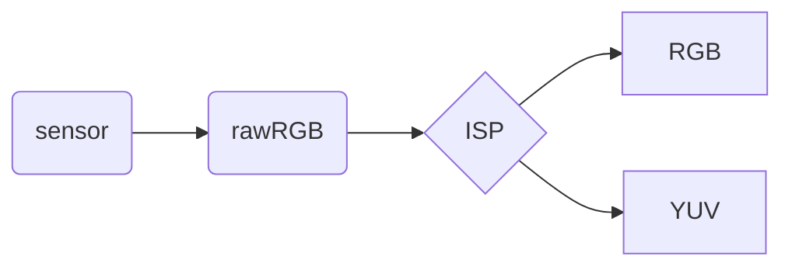
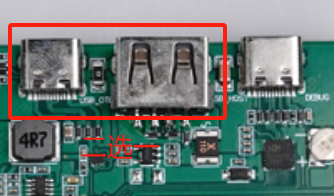
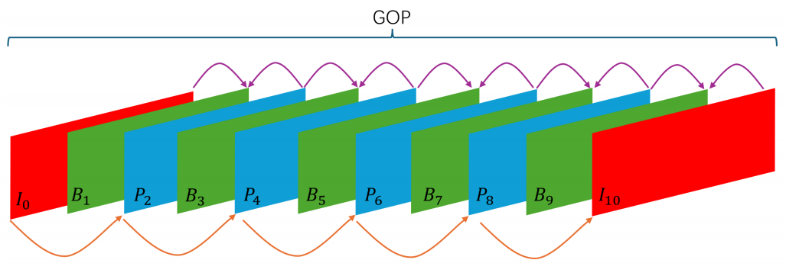
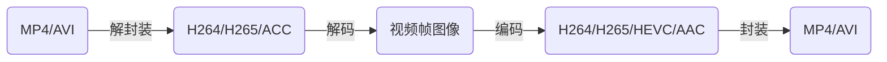
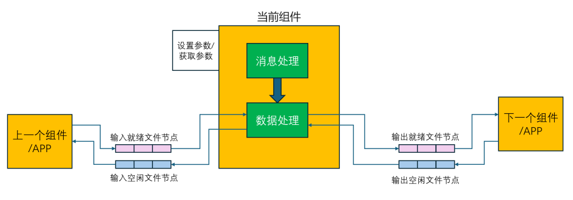
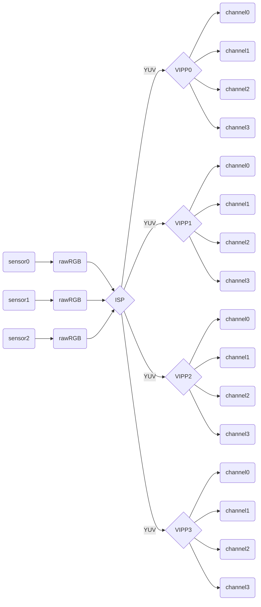

<font size="7"><center>**全志**</center></font>

[TOC]

___


- 24 帧视频即每秒钟24张图片，fps (frame per second) 帧率
- `MJPEG`也是一种压缩算法，但比较简单，压缩比低，商业使用少
- `H.264`即视频编码格式（压缩算法）
- 视频存储: 一般将 H.264 流打包成 MP4 格式存储
- 图片压缩很耗 CPU，HI3518E 内置了一个 `DSP` 来专门运算处理图片
- <font color="yellow">DSP</font>: digital signal processing 数字信号处理，用来处理`ISP`
- <font color="yellow">ISP</font>: image signal processing 图像信号处理
- <font color="yellow">WDR</font>: wide dynamic range 宽动态。将一帧照片中非常暗的区域曝光度高，非常亮的区域曝光度低，以达到画面清晰的效果
- `hardware`: 硬件
- `software`: 软件
- <font color="yellow">VB</font>: video buffer 视频缓存池。有A、B、C等多个内存池。A内存池中有 n 个内存块，每个块的长度等于每帧的长度
- 视频流传输使用`http`或`rtsp`
- `HI3518E` 配置为 `CPU(arm9) + DSP + 内置64MB内存 + 外置16MB SPIFlash`（存 uboot, kernel, rootfs, app）
- sensor 接口用的是并行接口（mipi csi是串口）
- 我们的开发板是在官方的开发板的基础上简化而来的（企业也是这样做的）
- <font color="yellow">模拟信号</font>: 用电信号去模拟自然事物。优点为连续性，精度无限, 但是抗干扰能力差, 传输不便
- <font color="yellow">数字信号</font>: 将连续的模拟信号用有限的数字表示。优点为抗干扰能力强, 便于传输, 但是精度不高
- 自然事物——电信号——模拟信号——数字信号（二进制）
- <font color="yellow">pitch</font>: 像素间距。指相邻两个象素点中心之间的距离（我们说间距时，像素点之间是没有缝隙的）
- <font color="yellow">sensor接口</font>: MIPI、LVDS、DC
- <font color="yellow">3A</font>: `auto exposure` `auto white balance` `auto focus`
- <font color="yellow">channel</font>: 其它通道为普通通道。但是仅 VPSS GROUP 通道分为 2 种，物理通道和扩展通道。物理通道具有缩放、裁剪等功能。扩展通道具备缩放功能，它通过绑定物理通道，将物理通道输出作为自己的输入，把图像缩放成用户设置的目标分辨率输出。VPSS GROUP 的每个通道号都有其特性，需查看手册。<font color="yellow">输入通道和输出通道是两个不同的通道</font>
- <font color="yellow">GROUP</font>: VPSS 只有一个，VPSS里有多个 group，每个 GROUP 组的输入源只有一个，但可以有多个 channel 通道输出（group的输入通道和输出通道是两个不同的通道）
- <font color="yellow">VI</font>: VI 由 dev 和 channel 组成。一个 dev 可以连接多个 channel，多个 channel 就可以输出多路不同分辨率的图像数据。离线模式是指 VI 写出数据到 DDR，然后与之绑定的模块从 DDR 读取数据。在线模式是指 VI 与VPSS 之间的在线数据流传输，VI 不会写出数据到 DDR，而是直接把数据流送给 VPSS。
- <font color="yellow">VPSS</font>: Video Process Sub-System 视频处理子系统。支持对一幅输入图像进行统一预处理，如去噪、去隔行、翻转等，然后再对各通道分别进行缩放、锐化等处理，最后输出多种（多路）不同分辨率的图像。
- <font color="yellow">BMP</font>: Bit Map 位图
- <font color="yellow">码率</font>: 又称比特率Bitrate，单位为bps（bit per second），是指单位时间内传送的数据量。对于每帧都变化的场景，若图像质量稳定则编码码率波动大；若编码码率稳定则图像质量波动大
- <font color="yellow">CBR和VBR</font>: 恒定码率和可变码率。当场景静止时CBR和VBR数值一样。当场景变化大时CBR数值稳定，而VBR数值较大
- 按包获取码流时，获取的可能不是一个完整帧（前一次API被取走一部分）
- 按帧获取码流时，获取的是一个完整帧（多个包）
<font color="yellow">RTSP</font>：（Real-Time Transport Streaming Protocol）实时传输流协议 
<font color="yellow">RTCP</font>：（Real-time Transport Control Protocol）实时传输控制协议 
<font color="yellow">RTP</font>：（Real-time Transport Protocol）实时传输协议

## <font color="1E90FF">一、第一期 视频模块及推流实战</font>

光线进入镜头，经过镜头折射进入 sensor。sensor 进行光电转换， 将光信号转为模拟信号，ADC 再将模拟信号转为数字信号（二进制），此时数字信号也称为 rawRGB，最后将 rawRGB 传入主芯片，此时原始图片可能会变暗或者各种瑕疵，主芯片会将原始数据进行 ISP 处理调整，并输出 YUV 或 RGB 数据，然后编码压缩成 H.264 或其它格式。 IPC 会将编码后的视频通过网络传输到服务器，客户端从服务器下载视频流，然后将视频流解码并播放



### <font color="1E90FF">1-1_开发板快速启动</font>

[开发板快速启动.pdf](attachment/1-1_开发板快速启动.pdf "点击打开")

### <font color="1E90FF">1-2_更新烧录系统</font>{#可点击链接}

[更新系统.pdf](attachment/1-2_更新系统.pdf "点击打开")

USB_host 连接大核，连接串口调式
USB_OTG 连接小核，连接 adb 烧录程序

1. 打开`PhoenixSuit`固件烧写工具，并选择`一键刷机`
1. 选择好要烧录的文件系统
1. 开发板上先按住`FEL`，然后再按一下`reset `，此时就进入了烧录模式
1. `PhoenixSuit`就会自动开启烧录

>注意虚拟机会拦截USB连接

### <font color="1E90FF">1-3_开发板配网</font>

[开发板配网.pdf](attachment/1-3_开发板配网.pdf "点击打开")

1. 扫描开发板附近所有可用的WiFi，输入 `wifi -s`
1. 连接wifi，输入 `wifi -c [WiFi名称] [密码]`

>开发板需要安装天线，否则将无法扫描到WiFi
>开发板只能连接2.4GHz的WiFi，不能是5GHz的WiFi

### <font color="1E90FF">1-4_使用ADB进行文件传输</font>

[使用ADB进行文件传输.pdf](attachment/1-4_使用ADB进行文件传输.pdf "点击打开")

ADB 可用于开发板和 PC 之间的文件传输，也可用于开发板和 ubuntu 之间的文件传输

#### <font color="008B8B">ADB-开发板-PC</font>

1. 确保 USB_OTG 物理上连接开发板和 PC
1. 确保 USB_OTG 连接到 PC 端，而非 ubuntu 端
1. 电脑命令行上输入 `adb shell` 即可进入开发板后台
1. 电脑命令行上输入 `adb devices` 即可查看已连接的开发板设备
1. 电脑命令行上输入 `adb push [PC pathname] [开发板 pathname]` 即可将 PC 文件传输到开发板
1. 电脑命令行上输入 `adb pull [开发板 pathname] [PC pathname]` 即可将开发板文件传输到 PC

#### <font color="008B8B">ADB-开发板-ubuntu</font>

1. 虚拟机——可移动设备——将ADB切换连接到 ubuntu
1. 安装ADB `sudo apt-get install android-tools-adb`
1. 输入 `adb devices` 时会报错，原因是权限不足或缺少 udev 规则
1. `sudo apt-get install android-sdk-platform-tools-common`
1. `sudo vi /etc/udev/rules.d/51-android.rules`
1. 输入 `SUBSYSTEM=="usb", MODE="0660", GROUP="plugdev", SYMLINK+="android%n"`
1. 重启 ubuntu

其它操作同 PC 

### <font color="1E90FF">1-5_开发板功能测试</font>

[开发板功能验证.pdf](attachment/1-5.开发板功能验证.pdf "点击打开")

开发板 USB 的功能有两种，分别是 device 和 host。两者互斥, 默认为 device 模式，可以使用 ADB 功能



#### <font color="008B8B">切换到 host 模式</font>

```shell
echo 256 > /sys/class/gpio/export
echo out > /sys/class/gpio/gpio256/direction
echo 1 > /sys/class/gpio/gpio256/value
cat /sys/devices/platform/soc/usbc0/usb_host
```

切换到 host 模式后可将 U 盘接入开发板，然后挂载 U 盘，操作如下

1. 将 U 盘接入 ubuntu
1. ubuntu 中输入`sudo fdisk -l`，找到 U 盘设备，一般是 /dev/sdb
1. ubuntu 中输入`sudo umount /dev/sdb1`，卸载 U 盘分区，如果有 sdb2 分区则依次卸载
1. ubuntu 中输入`sudo mkfs.vfat -F 32 /dev/sdb1`，格式化为 FAT32 文件系统
1. 将 U 盘接入开发板
1. 开发板中输入`mount /dev/sda1 /mnt/extsd`，将 U 盘挂载到 /mnt/extsd 目录
1. 开发板中输入`umount /dev/sda1`或`umount /mnt/extsd`，卸载 U 盘分区

#### <font color="008B8B">切换到 device 模式</font>

```shell
echo 256 > /sys/class/gpio/export
echo out > /sys/class/gpio/gpio256/direction
echo 0 > /sys/class/gpio/gpio256/value
cat /sys/devices/platform/soc/usbc0/usb_device
```

### <font color="1E90FF">2-2_全志SDK编译</font>

[全志SDK编译.pdf](attachment/2-2_全志SDK编译.pdf "点击打开")

#### <font color="008B8B">解压获取SDK</font>

进入到SDK目录，然后进行以下操作

1. 同时选中以下三个文件，右键用 7-zip 解压，解压密码是 `100askTeam_MPP_Vxxx-AICT.NET`
Ubuntu_18.04.6_VM-100ASK.zip.001
Ubuntu_18.04.6_VM-100ASK.zip.002
Ubuntu_18.04.6_VM-100ASK.zip.003
1. 解压后得到 Ubuntu_18.04.6_VM-100ASK
1. 打开VMware——左上角点击"文件"——"打开"
1. 找到解压的SDK目录并选中 "Ubuntu_18.04.6_VM_LinuxVMImages.COM.vmx"
1. "开启此虚拟机"——"我已复制该虚拟机"
1. 登录密码是 ubuntu
1. 在宿主目录下输入`tar -zxvf tina-v853-100ask.tar.gz`解压获取到 tina-v853-100ask

#### <font color="008B8B">SDK编译</font>

ubuntu进入到解压后的SDK目录 tina-v853-100ask，然后执行以下操作

1. 输入`source build/envsetup.sh`，初始化编译环境
1. 输入`lunch`，选择开发板方案，输入`1`
1. 输入`make -j8`
1. 输入`pack`，打包系统镜像
1. 打开ubuntu文件夹，将镜像 /home/ubuntu/tina-v853-100ask/out/v853-100ask/tina_v853-100ask_uart0.img 拷贝到Windows中
1. 将镜像烧录到开发板中 [1-2_更新烧录系统](#可点击链接)

> 镜像分区大小修改文件：device/config/chips/v853/configs/100ask/linux/sys_partition.fex

### <font color="1E90FF">2-3_编译MPP应用程序</font>

[编译MPP程序.pdf](attachment/2-3_编译MPP程序.pdf "点击打开")

1. 输入`source build/envsetup.sh`，初始化编译环境
1. 输入`lunch`，选择开发板方案，输入`1`
1. 输入`make -j8`
1. 输入`make menuconfig`，进行配置 sample 程序，见pdf文件
1. 输入`cleanmpp`，清理 MPP 程序
1. 输入`mkmpp`，编译 MPP 程序

编译完后每个 MPP sample 的源码目录为 tina\external\eyesee-mpp\middleware\sun8iw21\sample\sample_xxx\
测试程序存放在目录下 tina\external\eyesee-mpp\middleware\sun8iw21\sample\bin\

### <font color="1E90FF">2-4_新增MPP应用程序</font>

[新增MPP程序.pdf](attachment/2-4_新增MPP程序.pdf "点击打开")

1. `cd external/eyesee-mpp/middleware/sun8iw21/sample/`
1. `cp -rf sample_hello_100ask sample_hello_100ask_qkh`
1. `cd sample_hello_100ask_qkh`
1. 删除 sample_hello_100ask_qkh 里的文件，仅保留 .c 和 .h 文件
1. `mv sample_hello_100ask.c sample_hello_100ask_qkh.c`
1. 返回到顶层目录
1. `vi package/allwinner/eyesee-mpp/middleware/Makefile`
1. 定位到 MPPCFG_SAMPLE_HELLO_100ASK
1. 拷贝这小段代码，并将变量加上qkh后缀，保存
1. `vi package/allwinner/eyesee-mpp/middleware/Config.in`
1. 定位到 mpp_sample_hello_100ask
1. 拷贝这小段代码，并将变量加上qkh后缀，保存（注意依赖不要加后缀）
1. `vi external/eyesee-mpp/middleware/sun8iw21/sample/tina.mk`
1. 定位到 sample_hello_100ask
1. 拷贝这小段代码，并将变量加上qkh后缀，保存（注意目录也要加后缀）
1. `vi external/eyesee-mpp/middleware/sun8iw21/tina.mk`
1. 定位到 MPPCFG_SAMPLE_HELLO_100ASK
1. 拷贝这小段代码，并将变量加上qkh后缀，保存
1. `build/envsetup.sh && lunch 1`
1. `make menuconfig`
1. 进入顺序为：Allwinner —— eyesee-mpp —— 启动 mpp sample hello 100ask_qkh
1. `cleanmpp && mkmpp`
1. `cd external/eyesee-mpp/middleware/sun8iw21/sample/bin` （或 cd .../sun8iw21/sample/sample_hello_100ask_qkh）
1. `adb push sample_hello_100ask_qkh /mnt/UDISK/`
1. 开发板 /mnt/UDISK/sample_hello_100ask_qkh 执行应用程序

> 好像每次都要从 source build/envsetup.sh 重新开始
> /etc/init.d/rc.final 脚本中最后一行就是启动应用程序，注释可不执行
/usr/bin/sample_virvi2vo -path /usr/bin/sample_virvi2vo.conf&


### <font color="1E90FF">3-1_颜色与位深</font>

**灰度**：是指亮度

**位深度**：是指颜色深度，即存储在图像中的颜色信息量。图像的位深度越高，可以存储的颜色就越多。位深最低是黑色，最高是白色。数码相机通常可生成 24 位（8 位 x 3 通道）图像

### <font color="1E90FF">3-6_图像格式RGB</font>

[图像格式-RGB.pdf](attachment/3-5-2_图像格式-RGB.pdf "点击打开")

1. **rawRGB**：rawRGB 文件是未压缩和未处理的图像数据。当 ADC 将模拟信号转为数字信号，此时图像数据为 rawRGB，rawRGB 不能直接显示，需要经过 ISP 计算转化为 RGB 数据，最后将 RGB 数据转化为 YUV 存储（rgb bayer）
1. RGB 的本质是将一个颜色拆分为 R、G、B 三个颜色，然后用数字表示这三个颜色的亮度。例如 0x070809，07、08、09分别表示 R、G、B 的亮度
1. 屏幕中一个像素占 24 位，即 24bit。每 8 位各代表R、G、B的数值。有了 RGB 的数值就可以定位并确定这个像素所代表的颜色值（RGB 就像一个坐标的 xyz 轴数值）
1. ARGB 占 32 位，即 32bit。A 是透明度，即 RGB 的百分比。计算举例 A=30%，R=150，G=130，B=60，则显示的结果为 R=30xA，G=130xA，B=60xA

> 注意: RGB 里面存的是颜色的亮度值，而不是色度值
> raw [rɔː] adj: 原始的

### <font color="1E90FF">3-7_图像格式YUV</font>

[图像格式-YUV.pdf](attachment/3-5-3_图像格式-YUV.pdf "点击打开")

1. YUV 和 RGB 是两种像素格式，YUV 都要转化为 RGB 才能在设备上显示，两者可以通过固定公式来转换
1. YUV 比 RGB 格式最大的好处是可以做到在保持图像质量降低不明显的前提下，减小文件大小。这是因为 YUV 进行了采样操作
1. YUV 本质是将一个颜色拆分为 Y、U、V 三个分量。Y 表示亮度 (灰度值)，U 和 V 表示色度 (颜色值)。
1. YCbCr： Y 是指亮度分量，Cb 指蓝色色度分量，Cr 指红色色度分量。在 YUV 家族中，YCbCr 是在计算机系统中应用最多的成员，H264/H265、JPEG、MPEG 均采用此格式。一般人们所讲的 YUV 大多是指 YCbCr。YCbCr 有许多取样格式，如 4:4:4、4:2:2、4:1:1、4:2:0
1. 我们一般不会将所有 rawRGB 数据进行传输保存，而是进行部分采样，采样方式有 YUV444、YUV422、YUV420 等
1. 将 rawRGB 数据进行采样后就需要将采样后的数据进行存储。YUV 存储格式可以分为两种：packed（打包）格式和 planar（平面）格式。packed 将 YUV 分量全部存放在同一个数组中；planar 使用三个数组分开存放 YUV 三个分量，先存储所有的 Y 分量，再存储所有的 U 分量，再存储所有的 V 分量

<table>
  <tr>
    <td>RGB 转 YUV 公式</td>
    <td>YUV 转 RGB 公式</td>
  </tr>
    <td>Y = 0.299 * R + 0.587 * G + 0.114 * B</br>U = 0.492 * (B - Y)</br>V = 0.877 * (R - Y)</td>
    <td>R = Y + 1.140 * V</br>G = Y - 0.394 * U - 0.581 * V</br>B = Y + 2.032 * U</td>
  </tr>
</table>

#### <font color="008B8B">YUV444采样方式和存储格式</font>

**YUV444 采样**

完全取样，每个像素都有独立的Y/U/V值，都是 8 位

每个像素所占 bit 为 （Y + U + V）* 8 = 24 bit，即 3 字节

<!--  -->

<table>
  <tr>
    <td align="center">Y0</br>U0 V0</td> <td align="center">Y1</br>U1 V1</td>
    <td align="center">Y2</br>U2 V2</td> <td align="center">Y3</br>U3 V3</td>
  </tr>
  <tr>
    <td align="center">Y4</br>U4 V4</td> <td align="center">Y5</br>U5 V5</td>
    <td align="center">Y6</br>U6 V6</td> <td align="center">Y7</br>U7 V7</td>
  </tr>
  <tr>
    <td align="center">Y8</br>U8 V8</td> <td align="center">Y9</br>U9 V9</td>
    <td align="center">Y10</br>U10 V10</td> <td align="center">Y11</br>U11 V11</td>
  </tr>
</table>

**YUV444 packed 格式存储**

<table>
  <tr>
    <td bgcolor="00B0F0" align="center">Y0</td> <td bgcolor="E98532" align="center">U0</td>
    <td bgcolor="green" align="center">V0</td> <td bgcolor="00B0F0" align="center">Y1</td>
    <td bgcolor="E98532" align="center">U1</td> <td bgcolor="green" align="center">V1</td>
    <td bgcolor="00B0F0" align="center">Y2</td> <td bgcolor="E98532" align="center">U2</td>
    <td bgcolor="green" align="center">V2</td> <td bgcolor="00B0F0" align="center">…</td>
    <td bgcolor="E98532" align="center">…</td> <td bgcolor="green" align="center">…</td>
    <td bgcolor="00B0F0" align="center">Y11</td> <td bgcolor="E98532" align="center">U11</td>
    <td bgcolor="green" align="center">V11</td>
  </tr>
</table>

**YUV444 planar 格式存储**

<table>
  <tr>
    <td bgcolor="00B0F0" align="center">Y0</td> <td bgcolor="00B0F0" align="center">Y1</td>
    <td bgcolor="00B0F0" align="center">Y2</td> <td bgcolor="00B0F0" align="center">…</td>
    <td bgcolor="00B0F0" align="center">Y11</td> <td bgcolor="E98532" align="center">U0</td>
    <td bgcolor="E98532" align="center">U1</td> <td bgcolor="E98532" align="center">U2</td>
    <td bgcolor="E98532" align="center">…</td> <td bgcolor="E98532" align="center">U11</td>
    <td bgcolor="green" align="center">V0</td> <td bgcolor="green" align="center">V1</td>
    <td bgcolor="green" align="center">V2</td> <td bgcolor="green" align="center">…</td>
    <td bgcolor="green" align="center">V11</td>
  </tr>
</table>

#### <font color="008B8B">YUV422采样方式和存储格式</font>

**YUV422 采样**

YUV422 采样可节省 1/3 的存储空间和数据传输量。Y 分量和 UV 分量按照 2:1 的比例采样。每个像素点的 Y 分量都采集，而每间隔一个像素则同时采集一对 UV 分量，这样就每 2 个 Y 共用一对 UV 值

每两个像素所占 bit 为 2Y + U + V = （2 + 1 + 1）* 8 = 32 bit，故一个像素所占 bit 为 32 / 2 = 16 bit，即 2 字节

以下表格中每个格子表示一个像素，浅色 UV 字体表示丢弃原有的 UV 值，而采用相邻的 UV 值，每相邻 1 个像素共用一个 UV 值，这就是采样

<!--  -->

<table>
  <tr>
    <td align="center">Y0<br>U0 V0</span></td>
    <td align="center">Y1<br><span style="color:rgb(8, 80, 89);">U0 V0</span></td>
    <td align="center">Y2<br>U2 V2</span></td>
    <td align="center">Y3<br><span style="color:rgb(8, 80, 89);">U2 V2</span></td>
  </tr>
  <tr>
    <td align="center">Y4<br>U4 V4</span></td>
    <td align="center">Y5<br><span style="color:rgb(8, 80, 89);">U4 V4</span></td>
    <td align="center">Y6<br>U6 V6</span></td>
    <td align="center">Y7<br><span style="color:rgb(8, 80, 89);">U6 V6</span></td>
  </tr>
  <tr>
    <td align="center">Y8<br>U8 V8</span></td>
    <td align="center">Y9<br><span style="color:rgb(8, 80, 89);">U8 V8</span></td>
    <td align="center">Y10<br>U10 V10</span></td>
    <td align="center">Y11<br><span style="color:rgb(8, 80, 89);">U10 V10</span></td>
  </tr>
</table>

**YUV422 packed 格式存储**

<table>
  <tr>
    <td bgcolor="00B0F0" align="center">Y0</td> <td bgcolor="E98532" align="center">U0</td>
    <td bgcolor="00B0F0" align="center">Y1</td> <td bgcolor="green" align="center">V0</td>
    <td bgcolor="00B0F0" align="center">Y2</td> <td bgcolor="E98532" align="center">U2</td>
    <td bgcolor="00B0F0" align="center">Y3</td> <td bgcolor="green" align="center">V2</td>
    <td bgcolor="00B0F0" align="center">…</td> <td bgcolor="E98532" align="center">…</td>
    <td bgcolor="00B0F0" align="center">…</td> <td bgcolor="green" align="center">…</td>
    <td bgcolor="00B0F0" align="center">Y10</td> <td bgcolor="E98532" align="center">U10</td>
    <td bgcolor="00B0F0" align="center">Y11</td> <td bgcolor="green" align="center">V10</td>
  </tr>
</table>

**YUV422 planar 格式存储 （YUV422P 又称为 I422）**

<table>
  <tr>
    <td bgcolor="00B0F0" align="center">Y0</td> <td bgcolor="00B0F0" align="center">Y1</td>
    <td bgcolor="00B0F0" align="center">Y2</td> <td bgcolor="00B0F0" align="center">…</td>
    <td bgcolor="00B0F0" align="center">Y11</td> <td bgcolor="E98532" align="center">U0</td>
    <td bgcolor="E98532" align="center">U2</td> <td bgcolor="E98532" align="center">U4</td>
    <td bgcolor="E98532" align="center">…</td> <td bgcolor="E98532" align="center">U10</td>
    <td bgcolor="green" align="center">V0</td> <td bgcolor="green" align="center">V2</td>
    <td bgcolor="green" align="center">V4</td> <td bgcolor="green" align="center">…</td>
    <td bgcolor="green" align="center">V10</td>
  </tr>
</table>

**YUV422 semi-planar 格式存储（YUV422SP）**

<table>
  <tr>
    <td bgcolor="00B0F0" align="center">Y0</td> <td bgcolor="00B0F0" align="center">Y1</td>
    <td bgcolor="00B0F0" align="center">Y2</td> <td bgcolor="00B0F0" align="center">…</td>
    <td bgcolor="00B0F0" align="center">Y11</td> <td bgcolor="E98532" align="center">U0</td>
    <td bgcolor="green" align="center">V0</td> <td bgcolor="E98532" align="center">U2</td>
    <td bgcolor="green" align="center">V2</td> <td bgcolor="E98532" align="center">U4</td>
    <td bgcolor="green" align="center">V4</td> <td bgcolor="E98532" align="center">…</td>
    <td bgcolor="green" align="center">…</td> <td bgcolor="E98532" align="center">U10</td>
    <td bgcolor="green" align="center">V10</td>
  </tr>
</table>


#### <font color="008B8B">YUV420采样方式和存储格式</font>

**YUV420采样方式**

YUV420 采样，可节省 1/2 的存储空间和数据传输量。YUV420 采样是指在每一行扫描时，只扫描一种色度分量（U或者V），和 Y 分量按照 2:1 的方式采样。比如，第一行扫描时，YU 按照 2:1 的方式采样，那么第二行扫描时，YV 分量按照 2:1 的方式采样。对于每个色度分量来说，它的水平方向和竖直方向的采样和 Y 分量相比都是 2:1

YUV420 采样最终是四个 Y 分量共用一套 UV 分量，且是按照 2*2 的小方格的形式分布的

每四个像素所占 bit 为 4Y + U + V = （4 + 1 + 1）* 8 = 48 bit，故一个像素所占 bit 为 48 / 4 = 12 bit，即 1.5 字节

YUV420 采样每 4 个 Y 共用一个 U/V 值。如下表格，每个格子表示一个像素，浅色 UV 字体表示丢弃原有的 UV 值，而采用相邻的 UV 值，每相邻 2*2 个像素共用一个 UV 值，这就是采样

<!--  -->

<table>
  <tr>
    <td align="center">Y0<br>U0 <span style="color:rgb(8, 80, 89);">V4</span></td>
    <td align="center">Y1<br><span style="color:rgb(8, 80, 89);">U0 V4</span></td>
    <td align="center">Y2<br>U2 <span style="color:rgb(8, 80, 89);">V6</span></td>
    <td align="center">Y3<br><span style="color:rgb(8, 80, 89);">U2 V6</span></td>
  </tr>
  <tr>
    <td align="center">Y4<br><span style="color:rgb(8, 80, 89);">U0</span> V4</td>
    <td align="center">Y5<br><span style="color:rgb(8, 80, 89);">U0 V4</span></td>
    <td align="center">Y6<br><span style="color:rgb(8, 80, 89);">U2</span> V6</td>
    <td align="center">Y7<br><span style="color:rgb(8, 80, 89);">U2 V6</span></td>
  </tr>
  <tr>
    <td align="center">Y8<br>U8 <span style="color:rgb(8, 80, 89);">V12</span></td>
    <td align="center">Y9<br><span style="color:rgb(8, 80, 89);">U8 V12</span></td>
    <td align="center">Y10<br>U10 <span style="color:rgb(8, 80, 89);">V14</span></td>
    <td align="center">Y11<br><span style="color:rgb(8, 80, 89);">U10 V14</span></td>
  </tr>
  <tr>
    <td align="center">Y12<br><span style="color:rgb(8, 80, 89);">U8</span> V12</td>
    <td align="center">Y13<br><span style="color:rgb(8, 80, 89);">U8 V12</span></td>
    <td align="center">Y14<br><span style="color:rgb(8, 80, 89);">U10</span> V14</td>
    <td align="center">Y15<br><span style="color:rgb(8, 80, 89);">U10 V14</span></td>
  </tr>
</table>

**YUV420 planar 存储格式（YUV420P 又称为 I420）**

<table>
  <tr>
    <td bgcolor="00B0F0" align="center">Y0</td> <td bgcolor="00B0F0" align="center">Y1</td>
    <td bgcolor="00B0F0" align="center">Y2</td> <td bgcolor="00B0F0" align="center">…</td>
    <td bgcolor="00B0F0" align="center">Y15</td> <td bgcolor="E98532" align="center">U0</td>
    <td bgcolor="E98532" align="center">U2</td> <td bgcolor="E98532" align="center">U8</td>
    <td bgcolor="E98532" align="center">U10</td> <td bgcolor="green" align="center">V4</td>
    <td bgcolor="green" align="center">V6</td> <td bgcolor="green" align="center">V12</td>
    <td bgcolor="green" align="center">V14</td>
  </tr>
</table>

**YUV420 semi-planar 存储格式（YUV420SP NV12）**

<table>
  <tr>
    <td bgcolor="00B0F0" align="center">Y0</td> <td bgcolor="00B0F0" align="center">Y1</td>
    <td bgcolor="00B0F0" align="center">Y2</td> <td bgcolor="00B0F0" align="center">…</td>
    <td bgcolor="00B0F0" align="center">Y15</td> <td bgcolor="E98532" align="center">U0</td>
    <td bgcolor="green" align="center">V4</td> <td bgcolor="E98532" align="center">U2</td>
    <td bgcolor="green" align="center">V6</td> <td bgcolor="E98532" align="center">U8</td>
    <td bgcolor="green" align="center">V12</td> <td bgcolor="E98532" align="center">U10</td>
    <td bgcolor="green" align="center">V14</td>
  </tr>
</table>

**YUV420 semi-planar 存储格式（YUV420SP NV21）**

<table>
  <tr>
    <td bgcolor="00B0F0" align="center">Y0</td> <td bgcolor="00B0F0" align="center">Y1</td>
    <td bgcolor="00B0F0" align="center">Y2</td> <td bgcolor="00B0F0" align="center">…</td>
    <td bgcolor="00B0F0" align="center">Y15</td> <td bgcolor="green" align="center">V4</td>
    <td bgcolor="E98532" align="center">U0</td> <td bgcolor="green" align="center">V6</td>
    <td bgcolor="E98532" align="center">U2</td> <td bgcolor="green" align="center">V12</td>
    <td bgcolor="E98532" align="center">U8</td> <td bgcolor="green" align="center">V14</td>
    <td bgcolor="E98532" align="center">U10</td>
  </tr>
</table>

### <font color="1E90FF">4-2_视频的编解码</font>

[4-2_视频的编解码.pdf](attachment/4-2_视频的编解码.pdf "点击打开")

**视频大小计算**

视频是由一张张图片快速切换而形成的，假设播放 20 分钟 1080P/30FPS 的视频，则每帧图片大小为 3 * 1920 * 1080 = 6220800Byte（6MB），那么每秒钟 30 帧就需要 180MB，播放 20 分钟就需要 210GB = 1680Gb

```
一个视频的大小 = 一个像素占的字节数 * 一张图片总像素点 * 帧率 * 时间(s)
```
 
目前我们的网络的传输速率以 bit/s 计算，那么播放以上视频，就需要要求带宽大小为 180MB * 8  = 1440Mb/s，即960Mb每秒的带宽，这种接近千兆以太网的速率无法覆盖大部分场景（1MB = 8Mb）

为了将视频信号进行压缩，以减小数据量，这种技术又称为视频编码 Encode

视频经过压缩后传输到目标端侧后需要进行视频的解压缩，这种解压缩技术又称为视频解码 Decode

**视频压缩编码的组成：**

- 编解码器（Codec）：一组算法，用于编码（压缩）和解码（解压缩）视频数据。常见的视频编解码器包括 H.264/AVC、H.265/HEVC、H.266/VVC等
- 编 / 解码：一般将 YUV 或 RGB 格式的视频转换为编码格式的过程称为编码；反之为解码
- 码率 / 比特率（Bitrate）：表示视频每秒传输的数据量，通常以 kbps（千比特每秒）或 mbps（M bit per second）计算。对于每帧都变化的场景，若图像质量稳定则编码码率波动大；若编码码率稳定则图像质量波动大
- 分辨率（Resolution）：视频的尺寸，通常以像素为单位，如 1920x1080
- 帧率（Frame rate）：视频每秒显示的帧数

**在视频编码中会对图像进行分组，分组后的图像称为 GOP（Group of Pictures）。其中每组图像就有三种图像帧，分别是：I帧、P帧和B帧。它们各自有不同的作用和特点：**

- I帧（Intra-coded Frame）：这是关键帧，也称为帧内编码帧。I帧包含了完整的画面信息，不依赖于其他帧就能够独立解码。它通常用于 GOP 的开始或者场景变换时，以提供一个清晰的参考点。I帧的压缩率相对较低，因为它需要存储更多的信息
- P帧（Predictive Frame）：这是前向预测编码帧。P帧记录的是与前一个I帧或P帧之间的差异。在解码时，需要用前一个I帧或P帧的信息加上P帧本身的差异信息来重建完整的画面。P帧的压缩率比I帧高，因为它仅仅需要存储与前一帧的变化信息
- B帧（Bi-directional Predictive Frame）：这是双向预测编码帧。B帧记录的是与前后帧的差异。在解码时，需要用前一个I帧或P帧和后一个P帧的信息结合B帧本身的差异信息来重建完整的画面。B帧的压缩率最高，因为它利用了前后帧的信息来最大限度地减少存储的数据量

<div align=center></div>

### <font color="1E90FF">4-4_视频的制式</font>

NTSC 标准为 30 帧/秒，PAL 标准为 25 帧/秒

### <font color="1E90FF">4-5_帧率和时间戳</font>

[4-5_帧率与时间戳.pdf](attachment/4-5_帧率与时间戳.pdf "点击打开")

### <font color="1E90FF">4-6_图像分辨率</font>

[4-6_图像分辨率.pdf](attachment/4-6_图像分辨率.pdf "点击打开")

### <font color="1E90FF">4-7_图像的色彩空间标准</font>

[4-7_图像的色彩空间标准.pdf](attachment/4-7_图像的色彩空间标准.pdf "点击打开")

### <font color="1E90FF">5-1-1_FFmpeg多媒体框架</font>


[5-1_常见的多媒体框架.pdf](attachment/5-1_常见的多媒体框架.pdf "点击打开")

多媒体框架通常包括以下几个层级：

1. 编解码层：负责对音视频数据进行编码和解码。H.264、H.265
1. 封装层：处理音视频数据的压缩和封装。AVI、MP4
1. 协议层：管理网络数据的传输和通信协议。RTMP、RTSP
1. 应用层：整合整个流程，并进行统筹管理。

常见的多媒体框架包括：FFmpeg、GStreamer、DirectShow(微软)、AVFoundation(苹果)、OpenMax 等。

官方网址：<https://ffmpeg.org/>。FFmpeg是一个非常强大的开源多媒体处理框架，它提供了一系列用于处理音频、视频和多媒体流的工具和库。FFmpeg 的主要特点和功能如下：

1. 转码和处理: FFmpeg 可以进行音视频的转码、裁剪、拼接、水印添加等处理操作
1. 流媒体处理: 它支持从摄像头、文件或网络流等源接收多媒体流，并能进行实时处理和转发，用于流媒体直播和视频会议等场景
1. 音频处理: 它能够进行音频的分割、合并、音量调整、混音等操作
1. 跨平台性: FFmpeg 是跨平台的，可以在 Windows、MacOS、Linux 等操作系统上运行
1. 开源和免费: FFmpeg 是完全开源的

**FFmpeg 安装**

1. `sudo apt update`
1. `sudo apt install ffmpeg -y`
1. `ffmpeg -version`
1. `sudo apt install libavcodec-dev -y` 音视频编解码库
1. `sudo apt install libavformat-dev -y` 音视频封装/解封装库
1. `sudo apt install libavcodec-extra -y`

**FFmpeg 命令示例**

```shell
ffplay image.jgp #查看图片
ffmpeg -i input.mp4 output.avi #转换视频格式
ffmpeg -i input.mp4 -vf scale=1280:720 output.mp4 #输入视频调整为 1280x720 分辨率的输出
ffmpeg -i input.mp4 -i test.jpg -filter_complex "overlay=10:10" output.mp4 #将一个水印图像叠加到输入的 MP4 文件的左上角
```

**FFmpeg 开源库 API 查询**

FFmpeg 可通过代码方式调用 API 接口，API 接口查询方式如下：

1. ubuntu 中输入`ffmpeg -version`，查看 FFmpeg 版本
1. 进入 FFmpeg 官网 <https://ffmpeg.org/>
1. 点击标题`documentation`
1. 左下角标题`API Documentation`中找到对应的版本号
1. 查看自己需要的API

**FFmpeg 转化音视频格式流程**



### <font color="1E90FF">5-1-5_GStreamer多媒体框架</font>

[5-1_常见的多媒体框架.pdf](attachment/5-1_常见的多媒体框架.pdf "点击打开")


GStreamer 是一个功能强大的开源多媒体框架，用于创建、处理和播放音频和视频流。官方网址：<https://gstreamer.freedesktop.org/>。FFmpeg 的主要特点和功能如下：

1. 模块化架构: GStreamer 的设计是基于模块化的架构，可以根据需要添加或移除各种插件和元件，从而实现灵活的功能扩展
2. 跨平台性: GStreamer 可以在多种操作系统上运行，包括 Linux、Windows、macOS 等
3. 丰富的插件支持: GStreamer 提供了大量的插件，用于处理各种多媒体格式、编解码器、滤镜、特效等
4. 流式处理: GStreamer 支持流式处理，可以处理实时音视频流，适用于流媒体直播、视频会议等场景
5. 音视频编解码支持: 它支持多种常见的音视频编解码器，包括 H.264、H.265、AAC、MP3 等
6. 容器格式支持: GStreamer 支持多种多媒体容器格式的解析和封装，包括 AVI、MP4、MKV、FLV、MOV 等
7. 图形界面和命令行工具: GStreamer 提供了图形界面和命令行工具，用于配置和管理多媒体处理流程

GStreamer的核心是基于管道（Pipeline）的概念，这意味着你可以将多个处理步骤（称为元素或Element）连接起来，以实现复杂的媒体处理任务

**GStreamer 安装**

1. `sudo apt update`

1. `sudo apt-get install libgstreamer1.0-dev libgstreamer-plugins-base1.0-dev libgstreamer-plugins-bad1.0-dev gstreamer1.0-plugins-base gstreamer1.0-plugins-good gstreamer1.0-plugins-bad gstreamer1.0-plugins-ugly gstreamer1.0-libav gstreamer1.0-tools gstreamer1.0-x gstreamer1.0-alsa gstreamer1.0-gl gstreamer1.0-gtk3 gstreamer1.0-qt5 gstreamer1.0-pulseaudio -y`
1. `gst-inspect-1.0 --version` 查看版本

**GStreamer 命令示例**

和 FFmpeg 类似

### <font color="1E90FF">5-1-10_DirectShow多媒体框架</font>

DirectShow® 是 Microsoft Windows® 平台上流媒体的体系结构

### <font color="1E90FF">5-1-11_AVFoundation多媒体框架</font>

AVFoundation 是苹果开发的一个全功能框架，用于在iOS、macOS、watchOS和tvOS上处理基于时间的音视频媒体

### <font color="1E90FF">5-2_OpenMAX媒体库</font>

[5-2_OpenMAX媒体库.pdf](attachment/5-2_OpenMAX媒体库.pdf "点击打开")

### <font color="1E90FF">5-3_全志MPP平台基础</font>

[5-3_全志MPP平台基础.pdf](attachment/5-3_全志MPP平台基础.pdf "点击打开")

**MPP 各组件绑定关系**



### <font color="1E90FF">5-7-1_Google日志系统</font>

[5-7_Google日志系统.pdf](attachment/5-7_Google日志系统.pdf "点击打开")

开源仓库：https://github.com/google/glog

Google 日志系统是 Google 提供的一个C++库。它提供了一个易于使用的日志记录 API

1. 灵活的日志级别控制：支持不同的日志级别，包括 INFO 、 WARNING 、 ERROR 、 FATAL 等。可以根据需要动态设置日志级别，以便在不同的环境中灵活控制日志输出量
1. 支持日志文件分割：可以设置日志文件的最大大小和数量，当日志文件大小达到设定的阈值时，自动进行日志文件切割，避免单个日志文件过大

**日志调用示例**

Google 日志测试源码路径为 eyesee-mpp\middleware\sun8iw21\sample\sample_glog\sample_glog.cpp。文件中有两个 main 函数，第一个 main 是谷歌原始的日志调用示例，第二个 main 是全志用谷歌日志封装好的日志调式示例

1. 修改 .cpp 文件
1. `source build/envsetup.sh && lunch 1`
1. `make menuconfig` 进入顺序为：Allwinner —— eyesee-mpp —— 启动 mpp sample glog
1. `cleanmpp && mkmpp`
1. `cd external/eyesee-mpp/middleware/sun8iw21/sample/bin` （或 cd .../sun8iw21/sample/sample_glog）
1. `adb push sample_glog /mnt/UDISK/`
1. 开发板 /mnt/UDISK/sample_glog 执行测试程序

### <font color="1E90FF">6-1-1_视频输入基础</font>

[6-1_视频输入基础.pdf](attachment/6-1_视频输入基础.pdf "点击打开")



#### <font color="008B8B">VIPP</font>

Video Input Post Processor，即视频输入后处理器。它是一种用于图像传感器的硬件组件，可以对图像进行缩小、打水印、去坏点、增强等处理。它可以支持不同的图像数据格式，如Bayer raw data或YUV格式

VIPP硬件有4个，一个VIPP硬件有4个VIPP通道，。对于应用层来说，我们可以从16个VIPP通道中取数据

#### <font color="008B8B">虚通道</font>

虚通道（Virtual Channel，简称VC）是一种用于管理和绑定不同功能模块之间的通信路径。在MPP中，音频和视频的处理是独立的，为了避免混乱和通道错乱，引入了虚通道的概念。虚通道允许将不同的功能模块绑定在一起，以便更好地控制和管理视频处理流程。例如，虚通道可以将视频输入（VI）、视频处理（VPSS）、视频编码（VENC）等模块连接起来，形成一个完整的视频处理流程

基于前面的VIPP硬件，会为它创建若干个虚通道，虚通道的数量在理论上是不受限制的，我们可以创建很多个虚通道用于传输到其他地方去使用。因为虚通道的本质是对实际VIPP通道中的每一帧图像做引用技术，每个虚通道从VIPP通道获取这一帧图像后，会把这一帧的引用技术+1，如果将这一帧数据还回去的话就将这一帧的引用技术-1。只有当这一帧的引用技术降为0的时候，这一帧数据才会真正还给V4L2驱动/dev/video0

1. 如果很多个虚通道都使用同一个VIPP通道的数据，那么它们用的都是公用的一个buffer
2. 只要有一个虚通道没有及时还帧，就意味着这一帧buffer没有被还回去，其他虚通道也无法使用
3. 如果占用太多帧没有还，那么其他虚通道也拿不到帧
4. 虚通道要满足：及时还帧，用时创建，用完销毁

### <font color="1E90FF">6-2-1_视频输入组件的使用-运行程序</font>

1. `source build/envsetup.sh && lunch 1`
1. 修改 external/eyesee-mpp/middleware/sun8iw21/sample/sample_vi_reset/sample_vi_reset.c
1. `make menuconfig` 进入顺序为：Allwinner —— eyesee-mpp —— 启动 mpp sample vi_reset
1. `cleanmpp && mkmpp`
1. `cd external/eyesee-mpp/middleware/sun8iw21/sample/bin` （或 cd .../sun8iw21/sample/sample_vi_reset）
1. `adb push sample_vi_reset sample_vi_reset.conf /mnt/UDISK/`
1. 开发板 `/mnt/UDISK/sample_vi_reset -path sample_vi_reset.conf` 执行测试程序

### <font color="1E90FF">6-4-1_获取摄像头数据示例运行</font>

1. `source build/envsetup.sh && lunch 1`
1. 修改 external/eyesee-mpp/middleware/sun8iw21/sample/sample_virvi/sample_virvi.c
1. `make menuconfig` 进入顺序为：Allwinner —— eyesee-mpp —— 启动 mpp sample virvi
1. `cleanmpp && mkmpp`
1. `cd external/eyesee-mpp/middleware/sun8iw21/sample/bin` （或 cd .../sun8iw21/sample/sample_virvi）
1. 打开 sample_virvi.conf 文件，定位到 yuv_file，其值改成 /mnt/UDISK/test.yuv。是 YUV 数据保存路径
1. `adb push sample_virvi sample_virvi.conf /mnt/UDISK/`
1. 开发板 `/mnt/UDISK/sample_virvi -path sample_virvi.conf` 执行测试程序
1. 此时会存在 /mnt/UDISK/test.yuv 文件
1. `adb pull /mnt/UDISK/test.yuv ~/samba_tina/`将 test.yuv 拷贝到 PC 中
1. 打开 yuvplayer.exe 软件，将分辨率改成 1080P，视频格式改成 NV21（依据配置文件 sample_virvi.conf 修改）
1. 用 yuvplayer.exe 软件播放 test.yuv


___

<!--
## <font color="1E90FF">二、第二期 音频模块及文件封装</font>
-->

## <font color="1E90FF">参考资料</font>

- [YUV 格式详解1](https://blog.csdn.net/xkuzhang/article/details/115423061)
- [YUV 格式详解2](https://blog.csdn.net/qq_29575685/article/details/103954096)


