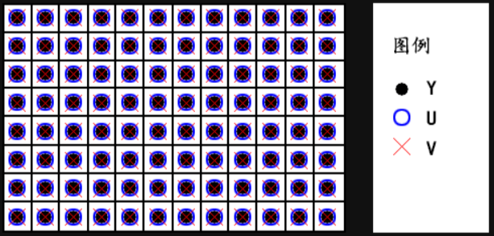
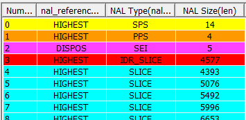

**海思**

___

[TOC]

___

## 一、基础知识

光线进入镜头，经过镜头折射进入 sensor，sensor 进行光电转换，sensor 将光信号转为模拟信号，ADC 再将模拟信号转为数字信号（二进制），此时数字信号也称为 rawRGB，最后将原始电信号数据传入主芯片，此时原始图片可能会变暗或者各种瑕疵，主芯片会将原始数据进行 ISP 处理调整，最后将处理后的图片进行编码压缩 IPC 会将编码后的视频通过网络传输到服务器，客户端从服务器下载视频流，然后将视频流解码并播放

CPU 为什么要对视频流先编码再传输，而不传送源数据？
答: sensor 收集的信息量太多了，`http` 或 `rtsp` 网络带宽不够，所以需要压缩后再传输（HI3518E的主要作用就是视频编码）

海思媒体处理平台内部处理流程图

典型的公共视频缓存池数据流图

VI、VPSS、GROUP关系图（每个group只能有一个输入源，dev和group可以有多个channel，但每个channel只能固定输出一路）

- 24 帧视频即每秒钟24张图片
- fps (frame per second) 帧率
- `MJPEG`也是一种压缩算法，但比较简单，压缩比低，商业使用少
- `H.264`即视频编码格式（压缩算法）
- 视频存储: 一般将 H.264 流打包成 MP4 格式存储
- 图片压缩很耗 CPU，HI3518E 内置了一个 `DSP` 来专门运算处理图片
- DSP: digital signal processing 数字信号处理，用来处理`ISP`
- ISP: image signal processing 图像信号处理
- WDR: wide dynamic range 宽动态。将一帧照片中非常暗的区域曝光度高，非常亮的区域曝光度低，以达到画面清晰的效果
- `hardware`: 硬件
- `software`: 软件
- VB: video buffer 视频缓存池。有A、B、C等多个内存池。A内存池中有 n 个内存块，每个块的长度等于每帧的长度
- 视频流传输使用`http`或`rtsp`
- `HI3518E` 配置为 `CPU(arm9) + DSP + 内置64MB内存 + 外置16MB SPIFlash`（存 uboot, kernel, rootfs, app）
- sensor 接口用的是并行接口（mipi csi是串口）
- 我们的开发板是在官方的开发板的基础上简化而来的（企业也是这样做的）
- 模拟信号: 用电信号去模拟自然事物。优点为连续性，精度无限, 但是抗干扰能力差, 传输不便
- 数字信号: 将连续的模拟信号用有限的数字表示。优点为抗干扰能力强, 便于传输, 但是精度不高
- 自然事物——电信号——模拟信号——数字信号（二进制）
- pitch: 像素间距。指相邻两个象素点中心之间的距离（我们说间距时，像素点之间是没有缝隙的）
- sensor接口: MIPI、LVDS、DC
- 3A: `auto exposure` `auto white balance` `auto focus`
- channel: 其它通道为普通通道。但是仅 VPSS GROUP 通道分为 2 种，物理通道和扩展通道。物理通道具有缩放、裁剪等功能。扩展通道具备缩放功能，它通过绑定物理通道，将物理通道输出作为自己的输入，把图像缩放成用户设置的目标分辨率输出。VPSS GROUP 的每个通道号都有其特性，需查看手册。输入通道和输出通道是两个不同的通道
- GROUP: VPSS 只有一个，VPSS里有多个 group，每个 GROUP 组的输入源只有一个，但可以有多个 channel 通道输出（group的输入通道和输出通道是两个不同的通道）
- VI: VI 由 dev 和 channel 组成。一个 dev 可以连接多个 channel，多个 channel 就可以输出多路不同分辨率的图像数据。离线模式是指 VI 写出数据到 DDR，然后与之绑定的模块从 DDR 读取数据。在线模式是指 VI 与VPSS 之间的在线数据流传输，VI 不会写出数据到 DDR，而是直接把数据流送给 VPSS。
- VPSS: Video Process Sub-System 视频处理子系统。支持对一幅输入图像进行统一预处理，如去噪、去隔行、翻转等，然后再对各通道分别进行缩放、锐化等处理，最后输出多种（多路）不同分辨率的图像。
- BMP: Bit Map 位图
- 码率: 又称比特率Bitrate，单位为bps（bit per second），是指单位时间内传送的数据量。对于每帧都变化的场景，若图像质量稳定则编码码率波动大；若编码码率稳定则图像质量波动大
- CBR和VBR: 恒定码率和可变码率。当场景静止时CBR和VBR数值一样。当场景变化大时CBR数值稳定，而VBR数值较大
- 按包获取码流时，获取的可能不是一个完整帧（前一次API被取走一部分）
- 按帧获取码流时，获取的是一个完整帧（多个包）
RTSP：（Real-Time Transport Streaming Protocol）实时传输流协议 
RTCP：（Real-time Transport Control Protocol）实时传输控制协议 
RTP：（Real-time Transport Protocol）实时传输协议

___

## 二、RGB

raw[rɔː] adj: 原始的

rawRGB: 由 ADC 将模拟信号转为数字信号，此时图像数据为 rawRGB，rawRGB不能直接显示，需要经过 ISP 计算转化为 RGB 数据，最后将 RGB 数据转化为 YUV 存储（rgb bayer）

RGB 的本质是将一个颜色拆分为 R、G、B 三个颜色，然后用数字表示这三个颜色的亮度。例如 0x070809，07、08、09分别表示 R、G、B 的亮度

> 注意: RGB 里面存的是颜色的亮度值，而不是色度值

## 三、YUV

RGB 和 YUV 是两种像素格式，YUV 都要转化为 RGB 才能在设备上显示，两者可以通过固定公式来转换

YUV 比 RGB 格式最大的好处是可以做到在保持图像质量降低不明显的前提下，减小文件大小。这是因为 YUV 进行了采样操作

YUV 本质是将一个颜色拆分为 Y、U、V 三个分量。Y 表示亮度 (灰度值)，U 和 V 表示色度 (颜色值)。

YCbCr： `Y` 是指亮度分量，`Cb` 指蓝色色度分量，`Cr` 指红色色度分量。在 YUV 家族中，YCbCr 是在计算机系统中应用最多的成员，H264/H265、JPEG、MPEG 均采用此格式。一般人们所讲的 YUV 大多是指 YCbCr。YCbCr 有许多取样格式，如 4:4:4、4:2:2、4:1:1、4:2:0

我们一般不会将所有 rawRGB 数据进行传输保存，而是进行部分采样，采样方式有 YUV444、YUV422、YUV420 等

将 rawRGB 数据进行采样后就需要将采样后的数据进行存储。YUV 存储格式可以分为两种：packed（打包）格式和 planar（平面）格式。packed 将 YUV 分量全部存放在同一个数组中；planar 使用三个数组分开存放 YUV 三个分量，先存储所有的 Y 分量，再存储所有的 U 分量，再存储所有的 V 分量

### YUV444采样方式和存储格式

**YUV444 采样**

完全取样，每个像素都有独立的Y/U/V值，都是 8 位

每个像素所占 bit 为 （Y + U + V）* 8 = 24 bit，即 3 字节

<!--  -->

<table>
  <tr>
    <td align="center">Y0 U0 V0</td> <td align="center">Y1 U1 V1</td>
    <td align="center">Y2 U2 V2</td> <td align="center">Y3 U3 V3</td>
  </tr>
  <tr>
    <td align="center">Y4 U4 V4</td> <td align="center">Y5 U5 V5</td>
    <td align="center">Y6 U6 V6</td> <td align="center">Y7 U7 V7</td>
  </tr>
  <tr>
    <td align="center">Y8 U8 V8</td> <td align="center">Y9 U9 V9</td>
    <td align="center">Y10 U10 V10</td> <td align="center">Y11 U11 V11</td>
  </tr>
</table>

**YUV444 packed 格式存储**

<table>
  <tr>
    <td bgcolor="00B0F0" align="center">Y0</td> <td bgcolor="E98532" align="center">U0</td>
    <td bgcolor="green" align="center">V0</td> <td bgcolor="00B0F0" align="center">Y1</td>
    <td bgcolor="E98532" align="center">U1</td> <td bgcolor="green" align="center">V1</td>
    <td bgcolor="00B0F0" align="center">Y2</td> <td bgcolor="E98532" align="center">U2</td>
    <td bgcolor="green" align="center">V2</td> <td bgcolor="00B0F0" align="center">…</td>
    <td bgcolor="E98532" align="center">…</td> <td bgcolor="green" align="center">…</td>
    <td bgcolor="00B0F0" align="center">Y11</td> <td bgcolor="E98532" align="center">U11</td>
    <td bgcolor="green" align="center">V11</td>
  </tr>
</table>

**YUV444 planar 格式存储**

<table>
  <tr>
    <td bgcolor="00B0F0" align="center">Y0</td> <td bgcolor="00B0F0" align="center">Y1</td>
    <td bgcolor="00B0F0" align="center">Y2</td> <td bgcolor="00B0F0" align="center">…</td>
    <td bgcolor="00B0F0" align="center">Y11</td> <td bgcolor="E98532" align="center">U0</td>
    <td bgcolor="E98532" align="center">U1</td> <td bgcolor="E98532" align="center">U2</td>
    <td bgcolor="E98532" align="center">…</td> <td bgcolor="E98532" align="center">U11</td>
    <td bgcolor="green" align="center">V0</td> <td bgcolor="green" align="center">V1</td>
    <td bgcolor="green" align="center">V2</td> <td bgcolor="green" align="center">…</td>
    <td bgcolor="green" align="center">V11</td>
  </tr>
</table>

### YUV422采样方式和存储格式

**YUV422 采样**

YUV422 采样可节省 1/3 的存储空间和数据传输量。Y 分量和 UV 分量按照 2:1 的比例采样。每个像素点的 Y 分量都采集，而每间隔一个像素则同时采集一对 UV 分量，这样就每 2 个 Y 共用一对 UV 值

每两个像素所占 bit 为 2Y + U + V = （2 + 1 + 1）* 8 = 32 bit，故一个像素所占 bit 为 32 / 2 = 16 bit，即 2 字节

以下表格中每个格子表示一个像素，浅色 UV 字体表示丢弃原有的 UV 值，而采用相邻的 UV 值，每相邻 1 个像素共用一个 UV 值，这就是采样

<!--  -->

<table>
  <tr>
    <td align="center">Y0 U0 V0</td>
    <td align="center">Y1 U0 V0</td>
    <td align="center">Y2 U2 V2</td>
    <td align="center">Y3 U2 V2</td>
  </tr>
  <tr>
    <td align="center">Y4 U4 V4</td>
    <td align="center">Y5 U4 V4</td>
    <td align="center">Y6 U6 V6</td>
    <td align="center">Y7 U6 V6</td>
  </tr>
  <tr>
    <td align="center">Y8 U8 V8</td>
    <td align="center">Y9 U8 V8</td>
    <td align="center">Y10 U10 V10</td>
    <td align="center">Y11 U10 V10</td>
  </tr>
</table>

**YUV422 packed 格式存储**

<table>
  <tr>
    <td bgcolor="00B0F0" align="center">Y0</td> <td bgcolor="E98532" align="center">U0</td>
    <td bgcolor="00B0F0" align="center">Y1</td> <td bgcolor="green" align="center">V0</td>
    <td bgcolor="00B0F0" align="center">Y2</td> <td bgcolor="E98532" align="center">U2</td>
    <td bgcolor="00B0F0" align="center">Y3</td> <td bgcolor="green" align="center">V2</td>
    <td bgcolor="00B0F0" align="center">…</td> <td bgcolor="E98532" align="center">…</td>
    <td bgcolor="00B0F0" align="center">…</td> <td bgcolor="green" align="center">…</td>
    <td bgcolor="00B0F0" align="center">Y10</td> <td bgcolor="E98532" align="center">U10</td>
    <td bgcolor="00B0F0" align="center">Y11</td> <td bgcolor="green" align="center">V10</td>
  </tr>
</table>

**YUV422 planar 格式存储 （YUV422P 又称为 I422）**

<table>
  <tr>
    <td bgcolor="00B0F0" align="center">Y0</td> <td bgcolor="00B0F0" align="center">Y1</td>
    <td bgcolor="00B0F0" align="center">Y2</td> <td bgcolor="00B0F0" align="center">…</td>
    <td bgcolor="00B0F0" align="center">Y11</td> <td bgcolor="E98532" align="center">U0</td>
    <td bgcolor="E98532" align="center">U2</td> <td bgcolor="E98532" align="center">U4</td>
    <td bgcolor="E98532" align="center">…</td> <td bgcolor="E98532" align="center">U10</td>
    <td bgcolor="green" align="center">V0</td> <td bgcolor="green" align="center">V2</td>
    <td bgcolor="green" align="center">V4</td> <td bgcolor="green" align="center">…</td>
    <td bgcolor="green" align="center">V10</td>
  </tr>
</table>

**YUV422 semi-planar 格式存储（YUV422SP）**

<table>
  <tr>
    <td bgcolor="00B0F0" align="center">Y0</td> <td bgcolor="00B0F0" align="center">Y1</td>
    <td bgcolor="00B0F0" align="center">Y2</td> <td bgcolor="00B0F0" align="center">…</td>
    <td bgcolor="00B0F0" align="center">Y11</td> <td bgcolor="E98532" align="center">U0</td>
    <td bgcolor="green" align="center">V0</td> <td bgcolor="E98532" align="center">U2</td>
    <td bgcolor="green" align="center">V2</td> <td bgcolor="E98532" align="center">U4</td>
    <td bgcolor="green" align="center">V4</td> <td bgcolor="E98532" align="center">…</td>
    <td bgcolor="green" align="center">…</td> <td bgcolor="E98532" align="center">U10</td>
    <td bgcolor="green" align="center">V10</td>
  </tr>
</table>

### YUV420采样方式和存储格式

**YUV420采样方式**

YUV420 采样，可节省 1/2 的存储空间和数据传输量。YUV420 采样是指在每一行扫描时，只扫描一种色度分量（U或者V），和 Y 分量按照 2:1 的方式采样。比如，第一行扫描时，YU 按照 2:1 的方式采样，那么第二行扫描时，YV 分量按照 2:1 的方式采样。对于每个色度分量来说，它的水平方向和竖直方向的采样和 Y 分量相比都是 2:1

YUV420 采样最终是四个 Y 分量共用一套 UV 分量，且是按照 2*2 的小方格的形式分布的

每四个像素所占 bit 为 4Y + U + V = （4 + 1 + 1）* 8 = 48 bit，故一个像素所占 bit 为 48 / 4 = 12 bit，即 1.5 字节

YUV420 采样每 4 个 Y 共用一个 U/V 值。如下表格，每个格子表示一个像素，浅色 UV 字体表示丢弃原有的 UV 值，而采用相邻的 UV 值，每相邻 2*2 个像素共用一个 UV 值，这就是采样

<!--  -->

<table>
  <tr>
    <td align="center">Y0 U0 V4</td>
    <td align="center">Y1 U0 V4</td>
    <td align="center">Y2 U2 V6</td>
    <td align="center">Y3 U2 V6</td>
  </tr>
  <tr>
    <td align="center">Y4 U0 V4</td>
    <td align="center">Y5 U0 V4</td>
    <td align="center">Y6 U2 V6</td>
    <td align="center">Y7 U2 V6</td>
  </tr>
  <tr>
    <td align="center">Y8 U8 V12</td>
    <td align="center">Y9 U8 V12</td>
    <td align="center">Y10 U10 V14</td>
    <td align="center">Y11 U10 V14</td>
  </tr>
  <tr>
    <td align="center">Y12 U8 V12</td>
    <td align="center">Y13 U8 V12</td>
    <td align="center">Y14 U10 V14</td>
    <td align="center">Y15 U10 V14</td>
  </tr>
</table>

**YUV420 planar 存储格式（YUV420P 又称为 I420）**

<table>
  <tr>
    <td bgcolor="00B0F0" align="center">Y0</td> <td bgcolor="00B0F0" align="center">Y1</td>
    <td bgcolor="00B0F0" align="center">Y2</td> <td bgcolor="00B0F0" align="center">…</td>
    <td bgcolor="00B0F0" align="center">Y15</td> <td bgcolor="E98532" align="center">U0</td>
    <td bgcolor="E98532" align="center">U2</td> <td bgcolor="E98532" align="center">U8</td>
    <td bgcolor="E98532" align="center">U10</td> <td bgcolor="green" align="center">V4</td>
    <td bgcolor="green" align="center">V6</td> <td bgcolor="green" align="center">V12</td>
    <td bgcolor="green" align="center">V14</td>
  </tr>
</table>

**YUV420 semi-planar 存储格式（YUV420SP）**

<table>
  <tr>
    <td bgcolor="00B0F0" align="center">Y0</td> <td bgcolor="00B0F0" align="center">Y1</td>
    <td bgcolor="00B0F0" align="center">Y2</td> <td bgcolor="00B0F0" align="center">…</td>
    <td bgcolor="00B0F0" align="center">Y15</td> <td bgcolor="E98532" align="center">U0</td>
    <td bgcolor="green" align="center">V4</td> <td bgcolor="E98532" align="center">U2</td>
    <td bgcolor="green" align="center">V6</td> <td bgcolor="E98532" align="center">U8</td>
    <td bgcolor="green" align="center">V12</td> <td bgcolor="E98532" align="center">U10</td>
    <td bgcolor="green" align="center">V14</td>
  </tr>
</table>

___

## 四、ORTP

RTMP：（Real Time Message Protocol）实时信息传输协议 
RTSP：（Real-Time Streaming Protocol）实时流协议 
RTCP：（Real-Time Transport Control Protocol）实时控制协议 
RTP：（Real-Time Transport Protocol）实时传输协议
ORTP：（Open Real-Time Transport Protocol）开源实时传输协议

开源库只会给调用者提供一些功能函数，只有在测试案例中才会有main函数

### ORTP库交叉编译及开发板运行

编译ORTP库前，由于库本身的问题，需要在ORTP库中`avprofile.c`里的`av_profile_init()`添加一行`rtp_profile_set_payload(profile,96,&payload_type_h264);`

海思应用程序调用ORTP库需要做的代码修改在`./file/sample_comm_venc.c`路径中，自行和原文件对比差异

#### ORTP交叉编译

1. sudo apt-get install libtool*
1. sudo apt-get install m4
1. sudo apt-get install automake
1. ./autogen.sh
1. ./configure --prefix=/home/k/samba/ortp-master/install --host=arm-hisiv300-linux
1. make && make install

#### ORTP开发板运行

1. 将编译后ORTP的头文件目录拷贝到 `mpp/inlcude/` 路径下（因为是include路径，所以可以这样包含`#include <ortp/ortp.h>`）
1. 将编译后ORTP的lib目录拷贝到 `mpp/lib/rtp_lib/` 路径下
1. 修改`mpp/sample/venc/Makefile`，添加库名`-lortp`和库路径`-L../../lib/ortp_lib`
    Makefile编译器参数添加 ortp 头文件(编译时用到)：`CFLAGS += -I ../../include/ortp`
    Makefile链接器参数添加 ortp 库名和路径(链接时用到)：`LDFLAGS += -lortp -L../../lib/ortp_lib`
1. 编译出`sample_venc`应用程序
1. 将`libortp.so` `libortp.so.9` `libortp.so.9.0.0`拷贝到开发板的`/usr/lib`目录中（这个是系统链接库）
1. 开发板中运行`sample_venc`应用程序

> 注意拷贝的是一个目录，而非多个文件
> 注意动态库才需要拷贝到开发板，静态库不需要，因为静态库已经编译进应用程序里了

___

## 五、H.264

图像冗余信息：空间冗余、时间冗余
视频编码关键点：压缩比、算法复杂度、还原度
H.264的组成：VCL 和 NAL。VCL负责视频压缩，NAL负责网络传输
H.264编码相关信息
1. 像素 -> 宏块 MB(macroblock) -> 片(slice) -> 帧 frame（I帧、P帧、B帧） -> 序列 -> 码流
1. 帧率

SODB(string of data bits)纯视频数据
RBSP(raw byte sequence payload)
NALU(network abstraction layer units) 网络抽象单元

头bit + SODB + 尾bit = RBSP
NAL header(1 byte) + RBSP = NALU
一段码流由一个一个的NALU序列组成

### NAL

当设置为30帧时，则一秒钟一个序列，一个序列30帧，h.264会在每个30帧前增加SPS、PPS、SEI这3帧数据，这3帧数据都以`0x 00 00 00 01`作为开头标识，开头标识是无效的不属于任何部分，此后才是有效SPS、PPS、SEI数据

一个序列由 1个SPS帧、1个PPS帧、1个SEI帧、1个I帧、( fps-1 )个P帧、(fps-1)B帧组成，每个帧的第1字节为帧头信息, 帧头中`bit7`表示此帧是否有效即forbidden_zero_bit(0为有效果)， `bit5-bit6`表示此帧的重要性即nal_reference_idc（当需要丢帧时可将重要性低的丢弃）, `bit0-bit4`表示此帧类型即nal_unit_type（type:5 I帧；type:7 序列参数集SPS；type:8 图像参数集PPS；type:6 补充增强信息单元SEI；）

SPS、PPS、SEI、描述该序列sequence的图像信息，这些信息有利于网络传输和解码

## 参考资料

- [YUV 格式详解1](https://blog.csdn.net/xkuzhang/article/details/115423061)
- [YUV 格式详解2](https://blog.csdn.net/qq_29575685/article/details/103954096)

