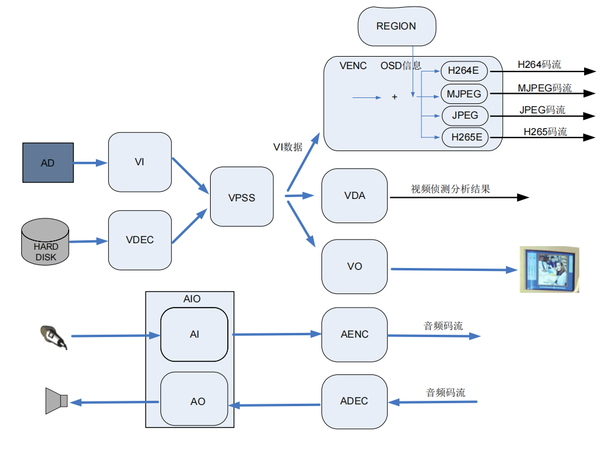

**海思**

___

[TOC]

___

## 一、基础知识

光线进入镜头，经过镜头折射进入 sensor，sensor 进行光电转换，sensor 将光信号转为模拟信号，ADC 再将模拟信号转为数字信号（二进制），此时数字信号也称为 rawRGB，最后将原始电信号数据传入主芯片，此时原始图片可能会变暗或者各种瑕疵，主芯片会将原始数据进行 ISP 处理调整，最后将处理后的图片进行编码压缩 IPC 会将编码后的视频通过网络传输到服务器，客户端从服务器下载视频流，然后将视频流解码并播放

CPU 为什么要对视频流先编码再传输，而不传送源数据？
答: sensor 收集的信息量太多了，`http` 或 `rtsp` 网络带宽不够，所以需要压缩后再传输（HI3518E的主要作用就是视频编码）

海思媒体处理平台内部处理流程图

典型的公共视频缓存池数据流图

VI、VPSS、GROUP关系图（每个group只能有一个输入源，dev和group可以有多个channel，但每个channel只能固定输出一路）

- 24 帧视频即每秒钟24张图片
- fps (frame per second) 帧率
- `MJPEG`也是一种压缩算法，但比较简单，压缩比低，商业使用少
- `H.264`即视频编码格式（压缩算法）
- 视频存储: 一般将 H.264 流打包成 MP4 格式存储
- 图片压缩很耗 CPU，HI3518E 内置了一个 `DSP` 来专门运算处理图片
- DSP: digital signal processing 数字信号处理，用来处理`ISP`
- ISP: image signal processing 图像信号处理
- WDR: wide dynamic range 宽动态。将一帧照片中非常暗的区域曝光度高，非常亮的区域曝光度低，以达到画面清晰的效果
- `hardware`: 硬件
- `software`: 软件
- VB: video buffer 视频缓存池。有A、B、C等多个内存池。A内存池中有 n 个内存块，每个块的长度等于每帧的长度
- 视频流传输使用`http`或`rtsp`
- `HI3518E` 配置为 `CPU(arm9) + DSP + 内置64MB内存 + 外置16MB SPIFlash`（存 uboot, kernel, rootfs, app）
- sensor 接口用的是并行接口（mipi csi是串口）
- 我们的开发板是在官方的开发板的基础上简化而来的（企业也是这样做的）
- 模拟信号: 用电信号去模拟自然事物。优点为连续性，精度无限, 但是抗干扰能力差, 传输不便
- 数字信号: 将连续的模拟信号用有限的数字表示。优点为抗干扰能力强, 便于传输, 但是精度不高
- pitch: 像素间距。指相邻两个象素点中心之间的距离（我们说间距时，像素点之间是没有缝隙的）
- sensor接口: MIPI、LVDS、DC
- 3A: `auto exposure` `auto white balance` `auto focus`
- channel: 其它通道为普通通道。但是仅 VPSS GROUP 通道分为 2 种，物理通道和扩展通道。物理通道具有缩放、裁剪等功能。扩展通道具备缩放功能，它通过绑定物理通道，将物理通道输出作为自己的输入，把图像缩放成用户设置的目标分辨率输出。VPSS GROUP 的每个通道号都有其特性，需查看手册。输入通道和输出通道是两个不同的通道
- GROUP: VPSS 只有一个，VPSS里有多个 group，每个 GROUP 组的输入源只有一个，但可以有多个 channel 通道输出（group的输入通道和输出通道是两个不同的通道）
- VI: VI 由 dev 和 channel 组成。一个 dev 可以连接多个 channel，多个 channel 就可以输出多路不同分辨率的图像数据。离线模式是指 VI 写出数据到 DDR，然后与之绑定的模块从 DDR 读取数据。在线模式是指 VI 与VPSS 之间的在线数据流传输，VI 不会写出数据到 DDR，而是直接把数据流送给 VPSS。
- VPSS: Video Process Sub-System 视频处理子系统。支持对一幅输入图像进行统一预处理，如去噪、去隔行、翻转等，然后再对各通道分别进行缩放、锐化等处理，最后输出多种（多路）不同分辨率的图像。
- BMP: Bit Map 位图
- 码率: 又称比特率Bitrate，单位为bps（bit per second），是指单位时间内传送的数据量。对于每帧都变化的场景，若图像质量稳定则编码码率波动大；若编码码率稳定则图像质量波动大
- 按包获取码流时，获取的可能不是一个完整帧（前一次API被取走一部分）
- 按帧获取码流时，获取的是一个完整帧（多个包）
RTSP：（Real-Time Transport Streaming Protocol）实时传输流协议 
RTCP：（Real-time Transport Control Protocol）实时传输控制协议 
RTP：（Real-time Transport Protocol）实时传输协议

___

## 二、RGB

raw[rɔː] adj: 原始的

rawRGB: 由 ADC 将模拟信号转为数字信号，此时图像数据为 rawRGB，rawRGB不能直接显示，需要经过 ISP 计算转化为 RGB 数据，最后将 RGB 数据转化为 YUV 存储（rgb bayer）

RGB 的本质是将一个颜色拆分为 R、G、B 三个颜色，然后用数字表示这三个颜色的亮度。例如 0x070809，07、08、09分别表示 R、G、B 的亮度

> 注意: RGB 里面存的是颜色的亮度值，而不是色度值

## 三、YUV

RGB 和 YUV 是两种像素格式，YUV 都要转化为 RGB 才能在设备上显示，两者可以通过固定公式来转换

YUV 比 RGB 格式最大的好处是可以做到在保持图像质量降低不明显的前提下，减小文件大小。这是因为 YUV 进行了采样操作

YUB: 本质是将一个颜色拆分为 Y、U、V 三个分量。Y 表示亮度 (灰度值)，U 和 V 表示色度 (颜色值)。

YCbCr: `Y` 是指亮度分量，`Cb` 指蓝色色度分量，`Cr` 指红色色度分量。在 YUV 家族中，YCbCr 是在计算机系统中应用最多的成员，H264/H265、JPEG、MPEG 均采用此格式。一般人们所讲的 YUV 大多是指 YCbCr。YCbCr 有许多取样格式，如 4:4:4、4:2:2、4:1:1、4:2:0

### YUV采样方式

我们一般不会将所有 rawRGB 数据进行传输保存，而是进行部分采样。采样方式有 YUV444、YUV422、YUV420 等

#### YUV422 采样

YUV422采样可节省 1/3 存储空间和 1/3 的数据传输量。Y 分量和 UV 分量按照 2:1 的比例采样。如果水平方向有10个像素点，那么就采样10个 Y 分量，且只采样5个 UV 分量。其中，每个像素点的 Y 分量都采集，而每间隔一个像素时同时采集一对 uv 分量，这样就每2个 Y 共用一对 U/V 值。

4:2:2 表示 2:1 的水平取样，垂直完全采样。每2个 Y 共用一对 U/V 值。如下图

|Y50 U80 V90|Y30 U80 V90|Y20 U60 V50|Y10 U60 V50|Y11 U10 V20|Y61 U10 V20|
|:---:|:---:|:---:|:---:|:---:|:---:|
|**Y44 U33 V32**|**Y32 U33 V32**|**Y65 U76 V56**|**Y81 U76 V56**|**Y34 U45 V87**|**Y41 U45 V87**|
|**Y67 U35 V37**|**Y98 U35 V37**|**Y45 U28 V27**|**Y95 U28 V27**|**Y65 U64 V63**|**Y34 U64 V63**|
|**Y35 U39 V54**|**Y76 U39 V54**|**Y24 U76 V87**|**Y58 U76 V87**|**Y35 U45 V66**|**Y49 U45 V66**|

> YUV422，每个格子表示一个像素，水平上每 2 个像素共用一个 UV 值

#### YUV420 采样

YUV420 采样，可节省 1/2 存储空间和 1/2 的数据传输量。YUV420 采样，并不是指只采样 U 分量而不采样 V 分量。而是指在每一行扫描时，只扫描一种色度分量（U或者V），和 Y 分量按照 2:1 的方式采样。比如，第一行扫描时，YU 按照 2:1的方式采样，那么第二行扫描时，YV 分量按照 2:1 的方式采样。对于每个色度分量来说，它的水平方向和竖直方向的采样和Y分量相比都是2:1 。

4:2:0 表示 2:1 的水平取样，垂直 2:1 采样。每 4 个 Y 共用一个 U/V 值。如下图

|Y50 U80 V90|Y30 U80 V90|Y20 U60 V50|Y10 U60 V50|Y11 U10 V20|Y61 U10 V20|
|:---:|:---:|:---:|:---:|:---:|:---:|
|**Y44 U80 V90**|**Y32 U80 V90**|**Y65 U60 V50**|**Y81 U60 V50**|**Y34 U10 V20**|**Y41 U10 V20**|
|**Y67 U35 V37**|**Y98 U35 V37**|**Y45 U28 V27**|**Y95 U28 V27**|**Y65 U64 V63**|**Y34 U64 V63**|
|**Y35 U35 V37**|**Y76 U35 V37**|**Y24 U28 V27**|**Y58 U28 V27**|**Y35 U64 V63**|**Y49 U64 V63**|

> YUV420，每个格子表示一个像素，每相邻 4 个像素共用一个 UV 值

### YUV存储格式

将 rawRGB 数据进行 YUV 采样后就需要将采样后的数据进行存储。YUV 存储格式可以分为两种：packed（打包）、planar（平面）。packed 将 YUV 分量存放在同一个数组中；planar 使用三个数组分开存放三个分量

#### packed

YUV422 packed 格式又分两种：YUYV 和 UYVY。对于 8*2 像素 YUYV 的存储方式为  

|0 ~ 7|Y~0~|U~0~|Y~1~|V~0~|Y~2~|U~2~|Y~3~|V~2~|
|:---:|:---:|:---:|:---:|:---:|:---:|:---:|:---:|:---:|
|**8 ~ 15**|**Y~4~**|**U~4~**|**Y~5~**|**V~4~**|**Y~6~**|**U~6~**|**Y~7~**|**V~6~**|
|**16 ~ 23**|**Y~8~**|**U~8~**|**Y~9~**|**V~8~**|**Y~10~**|**U~10~**|**Y~11~**|**V~10~**|
|**24 ~ 31**|**Y~12~**|**U~12~**|**Y~13~**|**V~12~**|**Y~14~**|**U~14~**|**Y~15~**|**V~14~**|

#### planar

YUV422P，又称为 I422，采用的是平面格式进行存储，先存储所有的 Y 分量，再存储所有的 U 分量，再存储所有的 V 分量。对于 8*2 像素 YUV422p 的存储方式为

|0 ~ 7|Y~0~|Y~1~|Y~2~|Y~3~|Y~4~|Y~5~|Y~6~|Y~7~|
|:---:|:---:|:---:|:---:|:---:|:---:|:---:|:---:|:---:|
|**8 ~ 15**|**Y~8~**|**Y~9~**|**Y~10~**|**Y~11~**|**Y~12~**|**Y~13~**|**Y~14~**|**Y~15~**|
|**16 ~ 23**|**U~0~**|**U~2~**|**U~4~**|**U~6~**|**U~8~**|**U~10~**|**U~12~**|**U~14~**|
|**24 ~ 31**|**V~0~**|**V~2~**|**V~4~**|**V~6~**|**V~8~**|**V~10~**|**V~12~**|**V~14~**|

YUV420P，又称为 I420，采用的是平面格式进行存储，先存储所有的 Y 分量，再存储所有的 U 分量，再存储所有的 V 分量。对于 8*2 像素 YUV420p 的存储方式为

|0 ~ 7|Y~0~|Y~1~|Y~2~|Y~3~|Y~4~|Y~5~|Y~6~|Y~7~|
|:---:|:---:|:---:|:---:|:---:|:---:|:---:|:---:|:---:|
|**8 ~ 15**|**Y~8~**|**Y~9~**|**Y~10~**|**Y~11~**|**Y~12~**|**Y~13~**|**Y~14~**|**Y~15~**|
|**16 ~ 23**|**U~0~**|**U~2~**|**U~4~**|**U~6~**|**V~8~**|**V~10~**|**V~12~**|**V~14~**|

> YUV420p: [Y~0~ Y~1~ Y~2~ ... Y~15~]，[U~0~ U~2~ U~4~ U~6~]，[V~0~ V~2~ V~4~ V~6~]

#### semi-planar

YUV422SP。对于 8*2 像素的存储方式为

|0 ~ 7|Y~0~|Y~1~|Y~2~|Y~3~|Y~4~|Y~5~|Y~6~|Y~7~|
|:---:|:---:|:---:|:---:|:---:|:---:|:---:|:---:|:---:|
|**8 ~ 15**|**Y~8~**|**Y~9~**|**Y~10~**|**Y~11~**|**Y~12~**|**Y~13~**|**Y~14~**|**Y~15~**|
|**16 ~ 23**|**U~0~**|**V~0~**|**U~2~**|**V~2~**|**U~4~**|**V~4~**|**U~6~**|**V~6~**|
|**24 ~ 31**|**U~8~**|**V~8~**|**U~10~**|**V~10~**|**U~12~**|**V~12~**|**U~14~**|**V~14~**|

YUV420SP。对于 8*2 像素的存储方式为

|0 ~ 7|Y~0~|Y~1~|Y~2~|Y~3~|Y~4~|Y~5~|Y~6~|Y~7~|
|:---:|:---:|:---:|:---:|:---:|:---:|:---:|:---:|:---:|
|**8 ~ 15**|**Y~8~**|**Y~9~**|**Y~10~**|**Y~11~**|**Y~12~**|**Y~13~**|**Y~14~**|**Y~15~**|
|**16 ~ 23**|**U~0~**|**V~8~**|**U~2~**|**V~10~**|**U~4~**|**V~12~**|**U~6~**|**V~14~**|

> YUV420sp: [Y~0~ Y~1~ Y~2~ ... Y~15~]，[U~0~ V~8~]，[U~2~ V~10~]，[U~4~ V~12~]，[U~6~ V~14~]

> 后缀 p 表示 plannar，后缀 sp 表示 semi-planar

### YUV大小计算

YUV422 每个像素占用的大小为 2 字节。4 个像素中有4个Y、2个U、2个V， 共占8字节，所以每个像素占用大小为8/4=2字节

YUV420 每个像素占用的大小为 1.5 字节。4 个像素中有4个Y、2个U（或V）， 共占6字节，所以每个像素占用大小为6/4=1.5字节

___

## 四、ORTP

RTMP：（Real Time Message Protocol）实时信息传输协议 
RTSP：（Real-Time Streaming Protocol）实时流协议 
RTCP：（Real-Time Control Protocol）实时控制协议 
RTP：（Real-Time Transport Protocol）实时传输协议
ORTP：（Open Real-Time Transport Protocol）开源实时传输协议

### ORTP库交叉编译及开发板运行

编译ORTP库前，由于库本身的问题，需要在ORTP库中`avprofile.c`里的`av_profile_init()`添加一行`rtp_profile_set_payload(profile,96,&payload_type_h264);`

海思应用程序调用ORTP库需要做的代码修改在`./file/sample_comm_venc.c`路径中，自行和原文件对比差异

#### ORTP交叉编译

1. sudo apt-get install libtool*
1. sudo apt-get install m4
1. sudo apt-get install automake
1. ./autogen.sh
1. ./configure --prefix=/home/k/samba/ortp-master/install --host=arm-hisiv300-linux
1. make && make install

#### ORTP开发板运行

1. 将编译后ORTP的头文件目录拷贝到 `mpp/inlcude/` 路径下（注意拷贝的是一整个目录，而非多个文件）
1. 将编译后ORTP的lib目录拷贝到 `mpp/lib/rtp_lib/` 路径下
1. 修改`mpp/sample/venc/Makefile`，添加库名`-lortp`和库路径`-L../../lib/ortp_lib`
1. 编译出`sample_venc`应用程序
1. 将`libortp.so` `libortp.so.9` `libortp.so.9.0.0`拷贝到开发板的`/usr/lib`目录中
1. 开发板中运行`sample_venc`应用程序

> 注意拷贝的是一个目录，而非多个文件

## 参考资料

- [YUV 格式详解1](https://blog.csdn.net/xkuzhang/article/details/115423061)
- [YUV 格式详解2](https://blog.csdn.net/qq_29575685/article/details/103954096)

